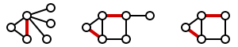
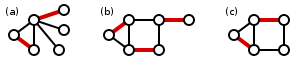

In terms of the bipartite graph representing the member's selections, this means that we are looking for a set of edges such that there is only one edge for each vertex. Mathematically speaking, this is called a matching. A matching of a graph is a set of edges in the graph in which no two edges share a vertex. That is, each vertex has only one edge connected to it in a matching.

Furthermore, when a matching is such that if we were to try to add an edge to it, then it would no longer be a matching, then we call it a maximum matching. A maximum matching is a matching with the maximum number of edges included. It's important to note that a graph can have more than one maximum matching. Therefore, we are looking for a maximum matching in our bipartite graph in order to match up everyone in such a way that they all end up with someone they said they would be happy with. Hmmm...let's try to figure this out.

# Matching

- Given a graph G = (V,E), a matching M in G is a set of pairwise non-adjacent edges, none of which are loops; that is, no two edges share a common vertex.
- A vertex is matched (or saturated) if it is an endpoint of one of the edges in the matching. Otherwise the vertex is unmatched.
- See <https://en.wikipedia.org/wiki/Matching_(graph_theory)> for detail.

## Maximal matching

- A maximal matching is a matching M of a graph G with the property that if any edge not in M is added to M, it is no longer a matching, that is, M is maximal if it is not a subset of any other matching in graph G.
- In other words, a matching M of a graph G is maximal if every edge in G has a non-empty intersection with at least one edge in M.
- Algorithms used:
  - Maximum maximal matching: Greedy algorithm.
  - Minimum maximal matching (Maximal matching with the smallest possible number of edges): No polynomial solution!

## Maximum matching

- A maximum-cardinality matching is a matching that contains the largest possible number of edges.
- There may be many maximum matchings.
- Note that every maximum matching is maximal, but not every maximal matching is a maximum matching.
- Algorithms used:
 - **Unweighted bipartite graph (Maximum bipartite matching)**: Micali and Vazirani's matching algorithm.
 - **Weighted bipartite graph (Maximum bipartite weight matching / Assignment problem)**: Hungarian algorithm.
 - **Unweighted non-bipartite graph (Maximum weight matching)**: Edmond's blossom algorithm.
 - Ford Fulkerson and Hopcraft-Karp are also related somehow.

## Perfect matching

- Perfect matching is a matching which matches all vertices of the graph.
- That is, every vertex of the graph is incident to exactly one edge of the matching.
- Every perfect matching is maximum and hence maximal.
- In some literature, the term complete matching is used.
- A perfect matching can only occur when the graph has an even number of vertices.

## Near-perfect matching

- A near-perfect matching is one in which exactly one vertex is unmatched.
- This can only occur when the graph has an odd number of vertices, and such a matching must be maximum.

# Algorithms

