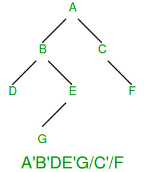

# Binary Search Tree
Either preorder or postorder.

# Complete Binary Tree
If all levels are completely filled except possibly the last level and all nodes of last level are as left as possible (Binary Heaps for instance).
Level-order is enough.

# Full Binary Tree
Every node has either 0 or 2 children.
We can simply store preorder traversal and store a bit with every node to indicate whether the node is an internal node or a leaf node.

# Perfect Binary Tree
Every internal node has 2 children. Every leaf is at the same depth.
Same as complete binary tree.

# General Binary Tree
- Both Inorder and Preorder. Requires space twice the size of tree.
- Preorder with marker for NULL nodes. Requires n+1 markers for n keys. Still better than above as keys take up more size than the marker.
- Preorder, but dont store null children of leaves. Use NULL only if its a child of an internal node. Will have to mark internal nodes using an extra bit.  
  

# N-ary Tree
- Store an ‘end of children’ marker with every node.  
  
