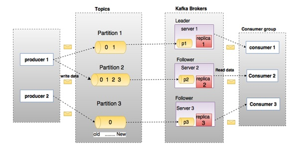

  
  
  
  
  

- Kafka contains **topics**.
- Each topic has multiple **partitions**.
- Each partition can be called as a queue.
- A partition can be associated with only one consumer.
- Each partition has its own partition **offset**.
- Offset means the index of the entry that is to be read next.
- One consumer can be associated with multiple partitions.
- A partition is the smallest unit of parallelism.
- Every message is also persisted to disk.
- Use cases:
  - Metric monitoring.
  - Log aggregation.
  - Stream processing (along with Apache Storm).
- **Replication factor**: If replication factor is 3, then kafka will create 3 identical copies of each topic.
- **Brokers** are responsible for storing one or more partitions.
- Each broker can be thought of as an individual node, deployed on a unique URL (hostname-port pair).
- Every partition has a **leader** node/broker responsible for all reads and writes.
- The **followers** act as simple consumers and keep themselves up to date with leader.
- The consumers never interact with the followers.
- Reads and writes both are served by the leader of a partition.
- Brokers are stateless and are managed using zookeeper.
- Since brokers are stateless, the partition offset info is stored by Zookeeper.
- Consumers can rewind the offset to read old data too!
- Lets say 2 messages arrive from producers; kafka will try to load balance by assigning messages to 2 partitions of that topic if available.
- If the number of consumers is more than number of partitions, then extra consumers will not get any messages.
- Kafka stores basic metadata in Zookeeper such as information about topics, brokers, consumer offsets (queue readers) and so on.
- Since all the critical information is stored in the Zookeeper and it normally replicates this data across its ensemble, failure of Kafka broker / Zookeeper does not affect the state of the Kafka cluster.
- Kafka will restore the state, once the Zookeeper restarts. This gives zero downtime for Kafka.
- The leader election between the Kafka brokers is also done by using Zookeeper in the event of leader failure.
- **Election mechanism**:
  - **Controller**: The replica which is responsible for leader election.
  - Kafka uses Zookeeper for replica management, when we set up a Kafka cluster, every node in the cluster requests an ephemeral node to zookeeper to be controller.
  - The ephemeral node is a temporary node that exists until the session that created node is active.
  - In Kafka case, all of the nodes in the cluster try to create an ephemeral node to zookeeper, since in one cluster we should have only one controller when one node created this ephemeral node, other nodes get an exception.
  - When we setup cluster for the first time, leaders for every partition chosen by round robin algorithm. In this way, the load is balanced over all of the brokers.
  - Whenever one broker leaves the cluster (in any reason), controller figures it out by watching list of nodes in zookeeper path. The controller should select another leader for that partitions that does not have a leader. The controller simply selects the next replica in the replica list and also notifies both new leader and other brokers in the cluster.
  - Another responsibility that controller has is when one broker joins to cluster. In this case, the controller notifies existing brokers and also new broker to know who is the leader.
- A message is ‘committed’ when all in sync replicas have applied it to their log.
- Any message is made available to the consumer only after it has been committed.
- Any committed message will not be lost, as long as at least one in sync replica is alive.
- Note that consumers need to pull from the queue; there is no `push` model.
- A partition is stored completely in one machine.
- Kafka uses Zookeeper to manage service discovery for Kafka Brokers that form the cluster.
- Zookeeper sends changes of the topology to Kafka, so each node in the cluster knows when a new broker joined, a Broker died, a topic was removed or a topic was added, etc.
- Zookeeper provides an in-sync view of Kafka Cluster configuration.