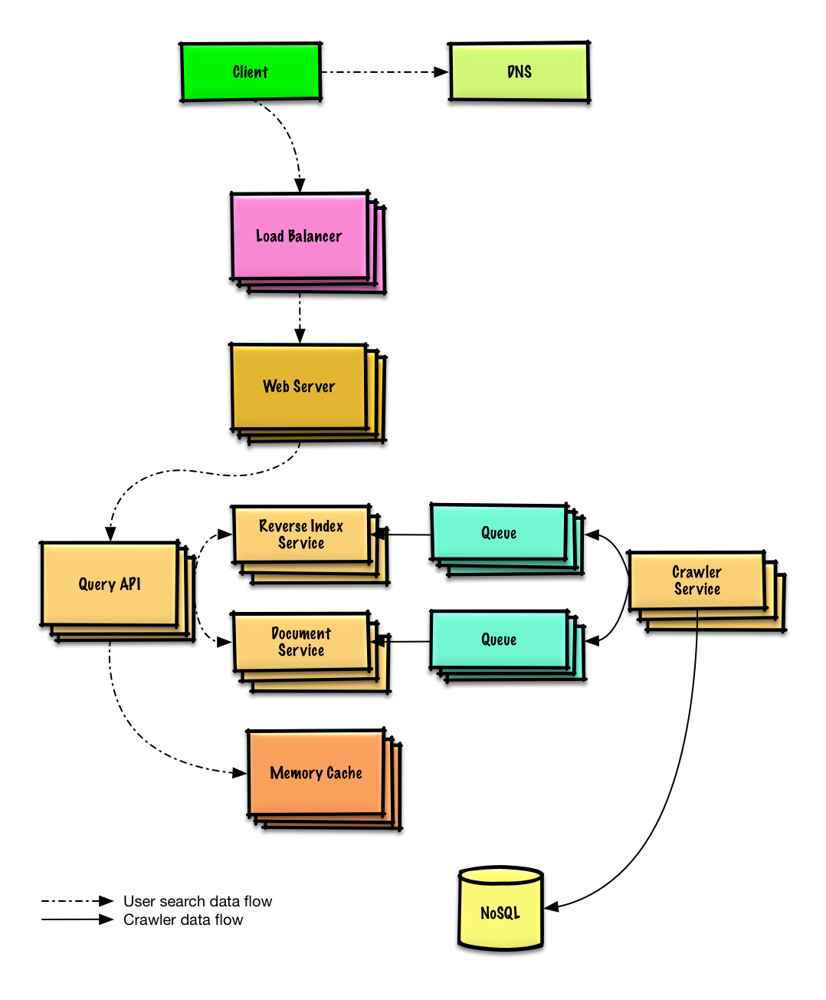

# Features
- Crawl a website.
- Search indexing.

# Basics
- The crawler service will keep on parsing URL's recursively.
- Crawler will send results to **Search Service** and **Document Service**.
- The Document service's job is to parse a page and generate a title and description.
- Maintain 2 tables `Crawled Lists` and `List to Crawl` in a NoSQL like Redis.
- Have to prevent cycles.
- We can have multiple crawlers with their own queues (like a BFS).
- But we can have a common hashset(redis) to know which websites are visited (or added to any of the queues).
- As soon as a crawler visits a website, it will check the hashset if it has that website or not.
- All the visited sites will be added to a processing queue.
- Multiple worker nodes will fetch from the processing queue and preprocess it before sending to elastic search.
- If yes, then skip it.
- Else, add it to its own personal queue. And add it to the common hashset at the same time.

  
  