# Scalability basics

- Web hosts - Bluehost, GoDaddy etc.
- Shared hosts vs VPS(**Virtual Private Server**):
  - In shared hosts, you have to share an OS on a machine with others.
  - In VPS, you get a dedicated virtual machine on some server, with fixed allocation of RAM, CPU etc.
  - Example of VPS - **Amazon EC2**; allows you to start/stop more virtual machines dynamically based on real-time server load.
- Types of scaling:
  - **Vertical scaling**:
    - Add more CPU to the server.
    - Not feasible due to real-life constraints (one server cannot have more than, say 128 GB).
  - **Horizontal scaling**:
    - Use cheaper hardware, but more of them.
    - So need **load balancing**.
    - Load balancer will have the public IP, not the internal multiple servers.
    - Should we duplicate data on all servers??
    - Maybe we can use one server for images, one for videos, one for music etc.
    - But the problem with that is that this does not solve the scalability problem at all. If all the user are just loading php files, then we are back at the original problem.
    - We can load balance based on the server load; the next request will be sent to the server with the least load.
    - Or we can round-robin simply.
    - We can also set the DNS server to return the internal IP names in round-robin.
    - If a power user connects to IP1, he will not be assigned to IP2 for the second request because of OS/browser-level **caching**.
    - Note that we need to allocate a machine specifically for **user session files**.
    - Because lets say the user adds product A while being connected to IP1, and adds product B while on IP2. So no consistency.
    - We could use just one server for all the data, including session variables, but what if that machine goes down??
    - For redundancy, we could use **RAID**.
    - Or we could just use a distributed database.
    - We can also use cookies to store the IP of the server they were on. So that they always get connected to the same server.  
      This way no way to sync session variables at all.
    - Rather than storing data in the cookie, we can just store a random user-id in that cookie. This is so that cookies do not expose any internals.
    - The random-id will be remembered by the load balancer.
    - If the user disables cookies, then we are in trouble!

# Scalability vs Performance

- A service is said to be scalable if when we increase the resources in a system, it results in increased performance in a manner proportional to resources added.
- Increasing performance in general means serving more units of work, but it can also be to handle larger units of work, such as when datasets grow.
- In distributed systems there are other reasons for adding resources to a system; for example to improve the **reliability** of the offered service.
- Introducing redundancy is an important first line of defense against failures.
- An always-on service is said to be scalable if adding resources to facilitate redundancy does not result in a loss of performance.

## Why is scalability so hard?

- Because **scalability cannot be an after-thought**.  
  It requires applications and platforms to be designed with scaling in mind, such that adding resources actually results in improving the performance or that if redundancy is introduced the system performance is not adversely affected.
- A second problem area is that growing a system through scale-out generally results in a system that has to come to terms with **heterogeneity**.  
  Resources in the system increase in diversity as next generations of hardware come on line, as bigger or more powerful resources become more cost-effective or when some resources are placed further apart.  
  Heterogeneity means that some nodes will be able to process faster or store more data than other nodes in a system and algorithms that rely on uniformity either break down under these conditions or underutilize the newer resources.

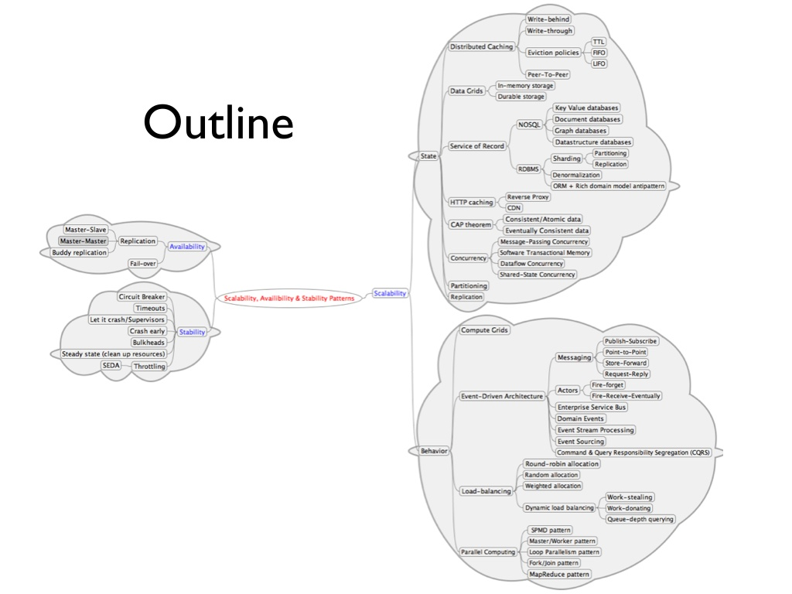

## General recommendations:

- Immutability as the default.
- Referential transparency.
- Laziness.
- Think about your data! (Different data need different guarantees)

---

# Replication

## Master-Slave

- Operations done on master replicated on all the slaves. Each machine is completely independent having its own db etc.
- Algorithms that elect a slave to a master on master failure.
- We can also load-balance the read queries by redirecting the read queries to the slaves.
- Problem is that if master dies, writes will fail till the election is complete.  
  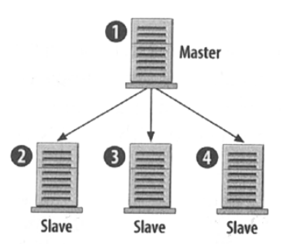

## Master-Master

- 2 masters and multiple slaves for each master.  
  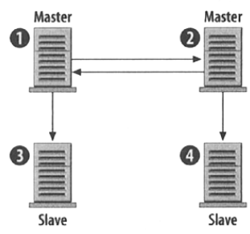

## Buddy replication

- What me and my flatmates do with our room keys.  
  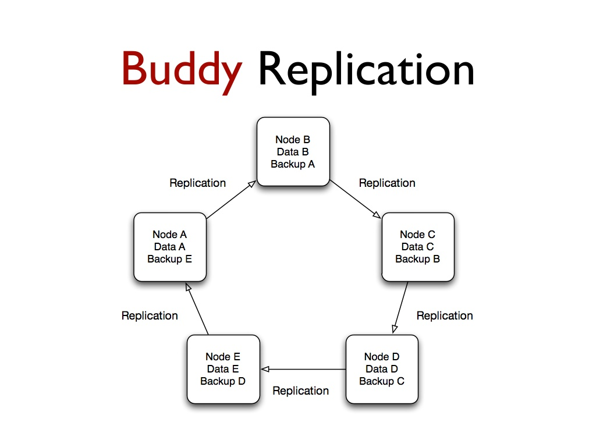  
  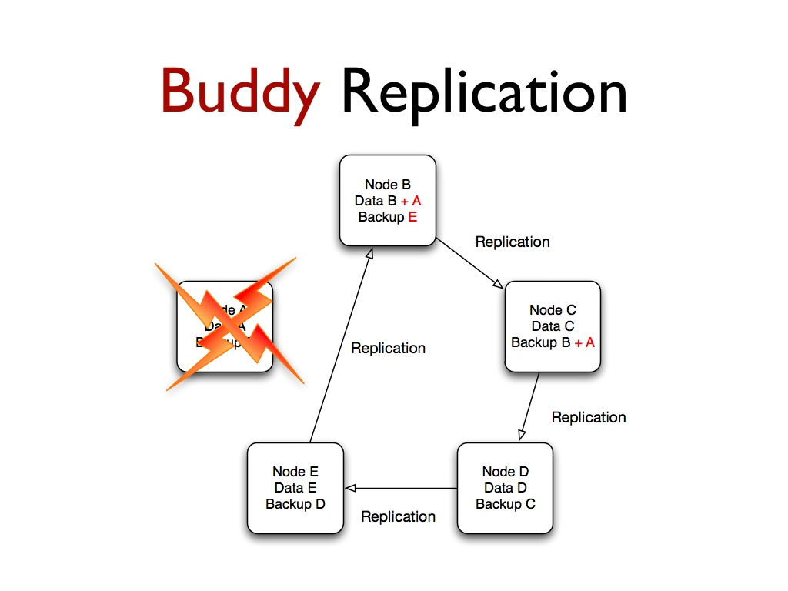

## Multi-tier load balancing + replication

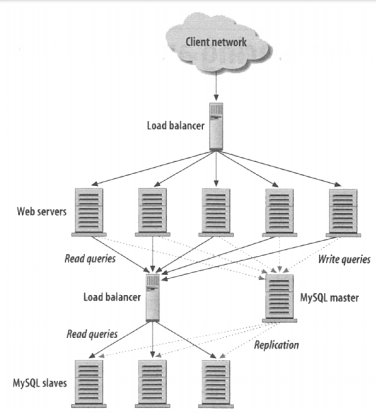

- Point of failure: Load balancer itself.
- Solution - Make a master-master design from 2 load balancers :p

## Partitioning

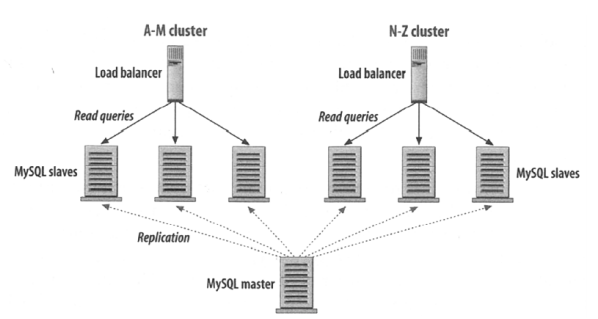

- If user's name starts with A-M, send them to partition 1, else partition 2.  
  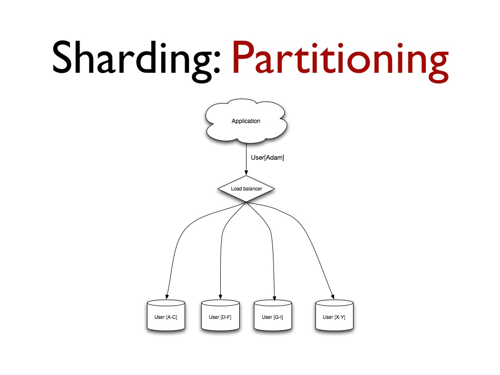  
  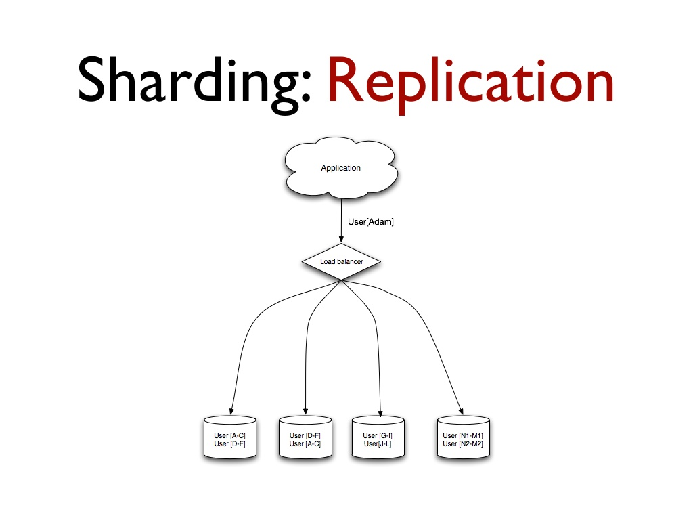

## High Availability

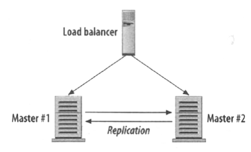

- If one master dies, the other takes over.

# Consistency patterns

With multiple copies of the same data, we are faced with options on how to synchronize them so clients have a consistent view of the data.  
Recall the definition of consistency from the CAP theorem - **Every read receives the most recent write or an error**.

## Weak consistency

- After a write, reads may or may not see it. A best effort approach is taken.
- This approach is seen in systems such as memcached.
- Weak consistency works well in real time use cases such as VoIP, video chat, and realtime multiplayer games.
- For example, if you are on a phone call and lose reception for a few seconds, when you regain connection you do not hear what was spoken during connection loss.

## Eventual consistency

- After a write, reads will eventually see it (typically within milliseconds). Data is replicated asynchronously.
- This approach is seen in systems such as DNS and email. Eventual consistency works well in highly available systems.

## Strong consistency

- After a write, reads will see it. Data is replicated synchronously.
- This approach is seen in file systems and RDBMSes. Strong consistency works well in systems that need transactions.

# Availability patterns

There are two main patterns to support high availability: **fail-over** and **replication**.

## Fail-over

### Active-passive

- Heartbeats are sent between the active and the passive server on standby.
- If the heartbeat is interrupted, the passive server takes over the active's IP address and resumes service.

### Active-active

- Both servers are managing traffic, spreading the load between them.

### Limitations of failover

- Fail-over adds more hardware and additional complexity.
- There is a potential for loss of data if the active system fails before any newly written data can be replicated to the passive.

---

# Load balancer

**Uses**:

- Preventing requests from going to unhealthy servers.
- Preventing overloading resources.
- Helping eliminate single points of failure.
- SSL termination - Decrypt incoming requests and encrypt server responses so backend servers do not have to perform these potentially expensive operations.
  Removes the need to install X.509 certificates on each server
- Session persistence - Issue cookies and route a specific client's requests to same instance if the web apps do not keep track of sessions

To protect against failures, it's common to set up multiple load balancers, either in _active-passive_ or _active-active_ mode.
A load balancer is also a kind of **reverse-proxy**.

## Limitations of load balancer

- The load balancer can become a performance bottleneck if it does not have enough resources or if it is not configured properly.
- A single load balancer is a single point of failure, configuring multiple load balancers further increases complexity.

## Reverse-proxy vs Forward-proxy

- Forward proxy is installed in the front of the client machine.
- Reverse proxy is installed in front of the servers.

---

# DNS (Domain Name System)

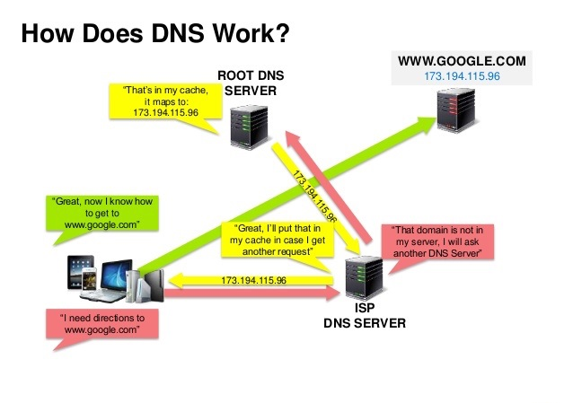

# Miscellaneous

## Partition tolerance strategies.
- Lets say the cluster had 10 servers.
- 1 server crashed leading to 2 connected graphs of size 7 and 2.
- If we let all the remaining nodes be alive and serving requests, it can lead to inconsistency.
- Now, we can let the smaller cluster deactivate itself entirely and let the bigger one run, so that atleast the system is functional and consistent.
- But how do we know which cluster is smaller or larger?
- Note that there is no centralized coordinator over here.
- One solution is that every node will ping every other node.
- If the number of acks is >= n/2, then that means the current node is in the majority cluster and should be kept alive.
- Otherwise, the current node is in the minority cluster and should be deactivated.
- But there is a problem in this strategy. What if there are multiple partitions, and none of the subgraphs are of atleast n/2 size.
- In this case the whole system gets deactivated.
- By the way this is called a quorum.
- Source - <https://www.youtube.com/channel/UC-X5TC3ir8_8pi0ElvVXnFQ>.

## Types of Failures
- Crash (or even worse; crashloop).
- Data corruption.
- Dependent service dead suddenly.
- DDOS attack.
- Cascading failure (thundering herd).
- Testing (Heisenbug).
- Natual disaster.
- Someone with root access does something stupid.
- Network failure -> Handled by TCP-IP.

### Single Node failures

#### Fail stop
- Crash
- Power outage.
- Hardware failure.
- Disk/memory full.

**Solutions:**
- Checkpoint state and restart -> High latency.
- Replicate state and fail-over -> Costly (Requires multiple servers).

#### Byzantine Failures
- Everything that is not fail-stop.
- Bit flip in memory.
- Node starts running malicious code deployed by rogue employee.
- Too many failures -> solution impossible.
- Goal is to turn it into fail-stop state using checksums, assertions, timeouts etc.
- Handling byzantine failures are extremely hard.
- Most systems do not need to worry about these.
- Most common failure -> Flaky/Malicious node is sending wrong/conflicting messages.
- Examples: Bitcoin and flight controls.
- Watch [this](https://www.youtube.com/watch?v=_e4wNoTV3Gw) to learn more.

# Measuring reliability and performance.

- **SLI (Service Level Indicator)**: What are we measuring (Query response for example)??
- **SLI (Service Level Objective)**: How well we want to do the SLI?? (99.5% request served within 1.5 ms).
- **SLA (Service Level Agreement)**: Consequences on failing SLI (penalty fees).