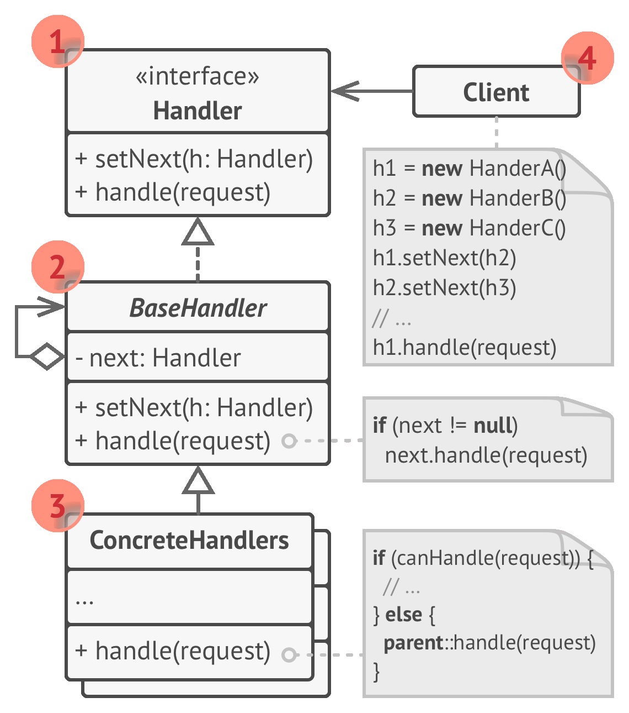
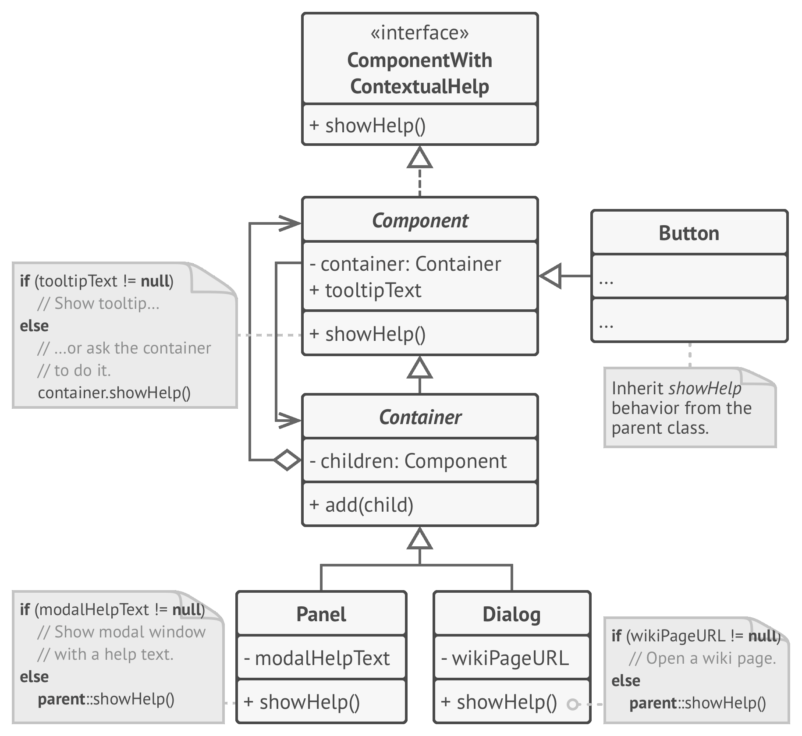

# 🔗 Chain of Responsibility

Real world example

> For example, you have three payment methods (`A`, `B` and `C`) setup in your account; each having a different amount in it. `A` has 100 USD, `B` has 300 USD and `C` having 1000 USD and the preference for payments is chosen as `A` then `B` then `C`. You try to purchase something that is worth 210 USD. Using Chain of Responsibility, first of all account `A` will be checked if it can make the purchase, if yes purchase will be made and the chain will be broken. If not, request will move forward to account `B` checking for amount if yes chain will be broken otherwise the request will keep forwarding till it finds the suitable handler. Here `A`, `B` and `C` are links of the chain and the whole phenomenon is Chain of Responsibility.

In plain words

> It helps building a chain of objects. Request enters from one end and keeps going from object to object till it finds the suitable handler.

Wikipedia says

> In object-oriented design, the chain-of-responsibility pattern is a design pattern consisting of a source of command objects and a series of processing objects. Each processing object contains logic that defines the types of command objects that it can handle; the rest are passed to the next processing object in the chain.

**Programmatic Example**

Translating our account example above. First of all we have a base account having the logic for chaining the accounts together and some accounts

```php
abstract class Account
{
    protected $successor;
    protected $balance;

    public function setNext(Account $account)
    {
        $this->successor = $account;
    }

    public function pay(float $amountToPay)
    {
        if ($this->canPay($amountToPay)) {
            echo sprintf('Paid %s using %s' . PHP_EOL, $amountToPay, get_called_class());
        } elseif ($this->successor) {
            echo sprintf('Cannot pay using %s. Proceeding ..' . PHP_EOL, get_called_class());
            $this->successor->pay($amountToPay);
        } else {
            throw new Exception('None of the accounts have enough balance');
        }
    }

    public function canPay($amount): bool
    {
        return $this->balance >= $amount;
    }
}

class Bank extends Account
{
    protected $balance;

    public function __construct(float $balance)
    {
        $this->balance = $balance;
    }
}

class Paypal extends Account
{
    protected $balance;

    public function __construct(float $balance)
    {
        $this->balance = $balance;
    }
}

class Bitcoin extends Account
{
    protected $balance;

    public function __construct(float $balance)
    {
        $this->balance = $balance;
    }
}
```

Now let's prepare the chain using the links defined above (i.e. Bank, Paypal, Bitcoin)

```php
// Let's prepare a chain like below
//      $bank->$paypal->$bitcoin
//
// First priority bank
//      If bank can't pay then paypal
//      If paypal can't pay then bit coin

$bank = new Bank(100);          // Bank with balance 100
$paypal = new Paypal(200);      // Paypal with balance 200
$bitcoin = new Bitcoin(300);    // Bitcoin with balance 300

$bank->setNext($paypal);
$paypal->setNext($bitcoin);

// Let's try to pay using the first priority i.e. bank
$bank->pay(259);

// Output will be
// ==============
// Cannot pay using bank. Proceeding ..
// Cannot pay using paypal. Proceeding ..:
// Paid 259 using Bitcoin!
```

<br>


```python
"""
Chain of Responsibility Design Pattern

Intent: Lets you pass requests along a chain of handlers. Upon receiving a
request, each handler decides either to process the request or to pass it to the
next handler in the chain.
"""

from __future__ import annotations
from abc import ABC, abstractmethod
from typing import Any, Optional


class Handler(ABC):
    """
    The Handler interface declares a method for building the chain of handlers.
    It also declares a method for executing a request.
    """

    @abstractmethod
    def set_next(self, handler: Handler) -> Handler:
        pass

    @abstractmethod
    def handle(self, request) -> Optional[str]:
        pass


class AbstractHandler(Handler):
    """
    The default chaining behavior can be implemented inside a base handler
    class.
    """

    _next_handler: Handler = None

    def set_next(self, handler: Handler) -> Handler:
        self._next_handler = handler
        # Returning a handler from here will let us link handlers in a
        # convenient way like this:
        # monkey.set_next(squirrel).set_next(dog)
        return handler

    @abstractmethod
    def handle(self, request: Any) -> str:
        if self._next_handler:
            return self._next_handler.handle(request)

        return None


"""
All Concrete Handlers either handle a request or pass it to the next handler in
the chain.
"""


class MonkeyHandler(AbstractHandler):
    def handle(self, request: Any) -> str:
        if request == "Banana":
            return f"Monkey: I'll eat the {request}"
        else:
            return super().handle(request)


class SquirrelHandler(AbstractHandler):
    def handle(self, request: Any) -> str:
        if request == "Nut":
            return f"Squirrel: I'll eat the {request}"
        else:
            return super().handle(request)


class DogHandler(AbstractHandler):
    def handle(self, request: Any) -> str:
        if request == "MeatBall":
            return f"Dog: I'll eat the {request}"
        else:
            return super().handle(request)


def client_code(handler: Handler) -> None:
    """
    The client code is usually suited to work with a single handler. In most
    cases, it is not even aware that the handler is part of a chain.
    """

    for food in ["Nut", "Banana", "Cup of coffee"]:
        print(f"\nClient: Who wants a {food}?")
        result = handler.handle(food)
        if result:
            print(f"  {result}", end="")
        else:
            print(f"  {food} was left untouched.", end="")


if __name__ == "__main__":
    monkey = MonkeyHandler()
    squirrel = SquirrelHandler()
    dog = DogHandler()

    monkey.set_next(squirrel).set_next(dog)

    # The client should be able to send a request to any handler, not just the
    # first one in the chain.
    print("Chain: Monkey > Squirrel > Dog")
    client_code(monkey)
    print("\n")

    print("Subchain: Squirrel > Dog")
    client_code(squirrel)
```

# Examples:

- Help menu for a graphic window(button -> dialog -> window)

```python
from abc import ABC, abstractmethod


class Graphic(ABC):
    def __init__(self, position, help_text):
        self.position = position
        self.help_text = help_text
        self.next = None

    def show_help(self, mouse_coordinates):
        if self.can_show_help(mouse_coordinates):
            print(self.help_text)
            return
        if self.next is not None:
            self.next.show_help(mouse_coordinates)
            return
        print("No help possible")

    def can_show_help(self, mouse_coordinates):
        return mouse_coordinates < self.position

    def set_next(self, next):
        self.next = next
        return self.next


class Button(Graphic):
    pass


class Dialog(Graphic):
    pass


class Window(Graphic):
    pass


def main():
    button = Button(5, 'Help for button')
    dialog = Dialog(10, 'Help for dialog')
    window = Window(15, 'Help for window')
    button.set_next(dialog).set_next(window)
    button.show_help(13)
```
