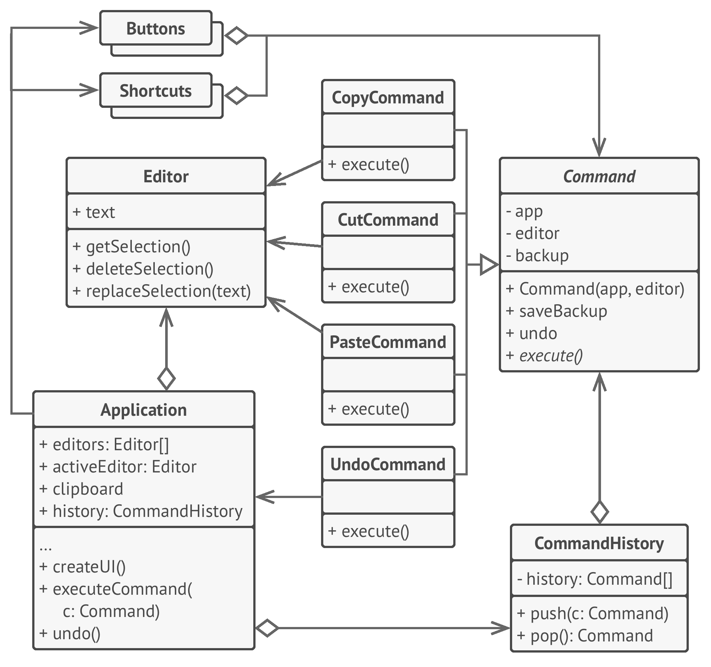

# 👮 Command

Real world example

> A generic example would be you ordering food at a restaurant. You (i.e. `Client`) ask the waiter (i.e. `Invoker`) to bring some food (i.e. `Command`) and waiter simply forwards the request to Chef (i.e. `Receiver`) who has the knowledge of what and how to cook. Another example would be you (i.e. `Client`) switching on (i.e. `Command`) the television (i.e. `Receiver`) using a remote control (`Invoker`).

In plain words

> Allows you to encapsulate actions in objects. The key idea behind this pattern is to provide the means to decouple client from receiver.

Wikipedia says

> In object-oriented programming, the command pattern is a behavioral design pattern in which an object is used to encapsulate all information needed to perform an action or trigger an event at a later time. This information includes the method name, the object that owns the method and values for the method parameters.

**Programmatic Example**

First of all we have the receiver that has the implementation of every action that could be performed

```php
// Receiver
class Bulb
{
    public function turnOn()
    {
        echo "Bulb has been lit";
    }

    public function turnOff()
    {
        echo "Darkness!";
    }
}
```

then we have an interface that each of the commands are going to implement and then we have a set of commands

```php
interface Command
{
    public function execute();
    public function undo();
    public function redo();
}

// Command
class TurnOn implements Command
{
    protected $bulb;

    public function __construct(Bulb $bulb)
    {
        $this->bulb = $bulb;
    }

    public function execute()
    {
        $this->bulb->turnOn();
    }

    public function undo()
    {
        $this->bulb->turnOff();
    }

    public function redo()
    {
        $this->execute();
    }
}

class TurnOff implements Command
{
    protected $bulb;

    public function __construct(Bulb $bulb)
    {
        $this->bulb = $bulb;
    }

    public function execute()
    {
        $this->bulb->turnOff();
    }

    public function undo()
    {
        $this->bulb->turnOn();
    }

    public function redo()
    {
        $this->execute();
    }
}
```

Then we have an `Invoker` with whom the client will interact to process any commands

```php
// Invoker
class RemoteControl
{
    public function submit(Command $command)
    {
        $command->execute();
    }
}
```

Finally let's see how we can use it in our client

```php
$bulb = new Bulb();

$turnOn = new TurnOn($bulb);
$turnOff = new TurnOff($bulb);

$remote = new RemoteControl();
$remote->submit($turnOn); // Bulb has been lit!
$remote->submit($turnOff); // Darkness!
```

Command pattern can also be used to implement a transaction based system. Where you keep maintaining the history of commands as soon as you execute them. If the final command is successfully executed, all good otherwise just iterate through the history and keep executing the `undo` on all the executed commands.

<br>
<br>
<br>
<br>
<br>
<br>


```python
"""
Command Design Pattern

Intent: Turns a request into a stand-alone object that contains all information
about the request. This transformation lets you parameterize methods with
different requests, delay or queue a request's execution, and support undoable
operations.
"""


from __future__ import annotations
from abc import ABC, abstractmethod


class Command(ABC):
    """
    The Command interface declares a method for executing a command.
    """

    @abstractmethod
    def execute(self) -> None:
        pass


class SimpleCommand(Command):
    """
    Some commands can implement simple operations on their own.
    """

    def __init__(self, payload: str) -> None:
        self._payload = payload

    def execute(self) -> None:
        print(f"SimpleCommand: See, I can do simple things like printing"
              f"({self._payload})")


class ComplexCommand(Command):
    """
    However, some commands can delegate more complex operations to other
    objects, called "receivers."
    """

    def __init__(self, receiver: Receiver, a: str, b: str) -> None:
        """
        Complex commands can accept one or several receiver objects along with
        any context data via the constructor.
        """

        self._receiver = receiver
        self._a = a
        self._b = b

    def execute(self) -> None:
        """
        Commands can delegate to any methods of a receiver.
        """

        print("ComplexCommand: Complex stuff should be done by a receiver object", end="")
        self._receiver.do_something(self._a)
        self._receiver.do_something_else(self._b)


class Receiver:
    """
    The Receiver classes contain some important business logic. They know how to
    perform all kinds of operations, associated with carrying out a request. In
    fact, any class may serve as a Receiver.
    """

    def do_something(self, a: str) -> None:
        print(f"\nReceiver: Working on ({a}.)", end="")

    def do_something_else(self, b: str) -> None:
        print(f"\nReceiver: Also working on ({b}.)", end="")


class Invoker:
    """
    The Invoker is associated with one or several commands. It sends a request
    to the command.
    """

    _on_start = None
    _on_finish = None

    """
    Initialize commands.
    """

    def set_on_start(self, command: Command):
        self._on_start = command

    def set_on_finish(self, command: Command):
        self._on_finish = command

    def do_something_important(self) -> None:
        """
        The Invoker does not depend on concrete command or receiver classes. The
        Invoker passes a request to a receiver indirectly, by executing a
        command.
        """

        print("Invoker: Does anybody want something done before I begin?")
        if isinstance(self._on_start, Command):
            self._on_start.execute()

        print("Invoker: ...doing something really important...")

        print("Invoker: Does anybody want something done after I finish?")
        if isinstance(self._on_finish, Command):
            self._on_finish.execute()


if __name__ == "__main__":
    """
    The client code can parameterize an invoker with any commands.
    """

    invoker = Invoker()
    invoker.set_on_start(SimpleCommand("Say Hi!"))
    receiver = Receiver()
    invoker.set_on_finish(ComplexCommand(
        receiver, "Send email", "Save report"))

    invoker.do_something_important()
```

## Examples

- Editor commands - copy/cut/paste being called from various buttons.

```python
from abc import ABC, abstractmethod


class Editor:
    def __init__(self, text):
        self.text

    def copy(self, idx1, idx2):
        pass

    def paste(self, pos1, content):
        pass

    def cut(self, idx1, idx2):
        pass


class CommandInvoker:
    def execute(command):
        # Can optionally add it to the buffer and execute in batches.
        # Can also optionally do some access/sanity checks etc.
        # Can also log it somewhere.
        # Many possible uses.
        command.execute()


class Command(ABC):
    def __init__(self, id, receiver, args=None):
        self.id = id
        self.receiver = receiver
        self.args = args
        self.status = None

    @abstractmethod
    def execute(self):
        pass


class CopyCommand(Command):
    def __init__(self, id, receiver, args=None):
        self.id = id
        self.receiver = receiver
        self.args = args
        self.status = None

    def execute(self):
        self.receiver.copy(self.args[0], self.args[1])


class CutCommand(Command):
    def __init__(self, receiver, args=None):
        self.id = id
        self.receiver = receiver
        self.args = args
        self.status = None

    def execute(self):
        self.receiver.cut(self.args[0], self.args[1])


class PasteCommand(Command):
    def __init__(self, receiver, args=None):
        self.id = id
        self.receiver = receiver
        self.args = args
        self.status = None

    def execute(self):
        self.receiver.paste(self.args[0], self.args[1])


class UiPanelCopyButton():
    def __init__(self, editor, invoker):
        self.editor = editor
        self.invoker = invoker

    def on_click(self, *args):
        cmd = CopyCommand(self.editor, args)
        self.invoker.execute(cmd)


class KeyboardShortcutCopyButton():
    def __init__(self, editor, invoker):
        self.editor = editor
        self.invoker = invoker

    def on_press(self, *args):
        cmd = CopyCommand(self.editor, args)
        self.invoker.execute(cmd)


class MenuCopyButton():
    def __init__(self, editor, invoker):
        self.editor = editor
        self.invoker = invoker

    def on_click(self, *args):
        cmd = CopyCommand(self.editor, args)
        self.invoker.execute(cmd)


def main():
    editor = Editor()
    invoker = CommandInvoker()
    button = MenuCopyButton(editor, invoker)
    button.on_click()
```
