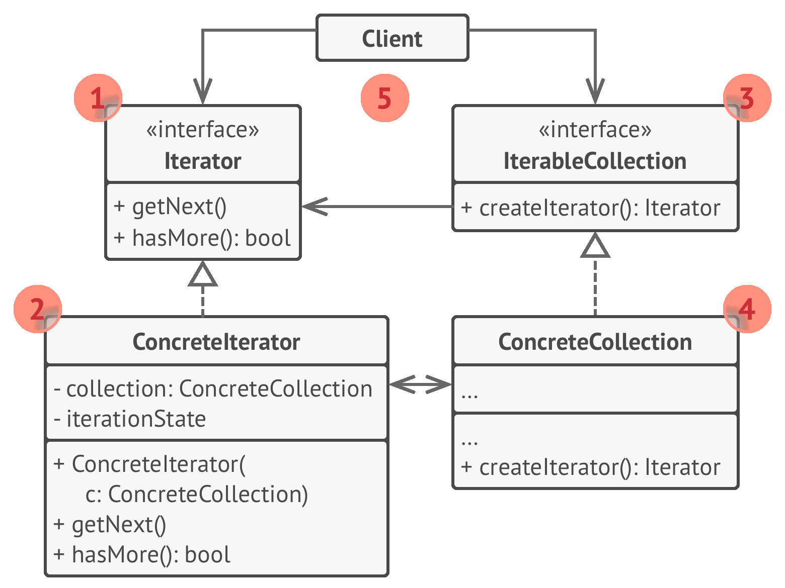
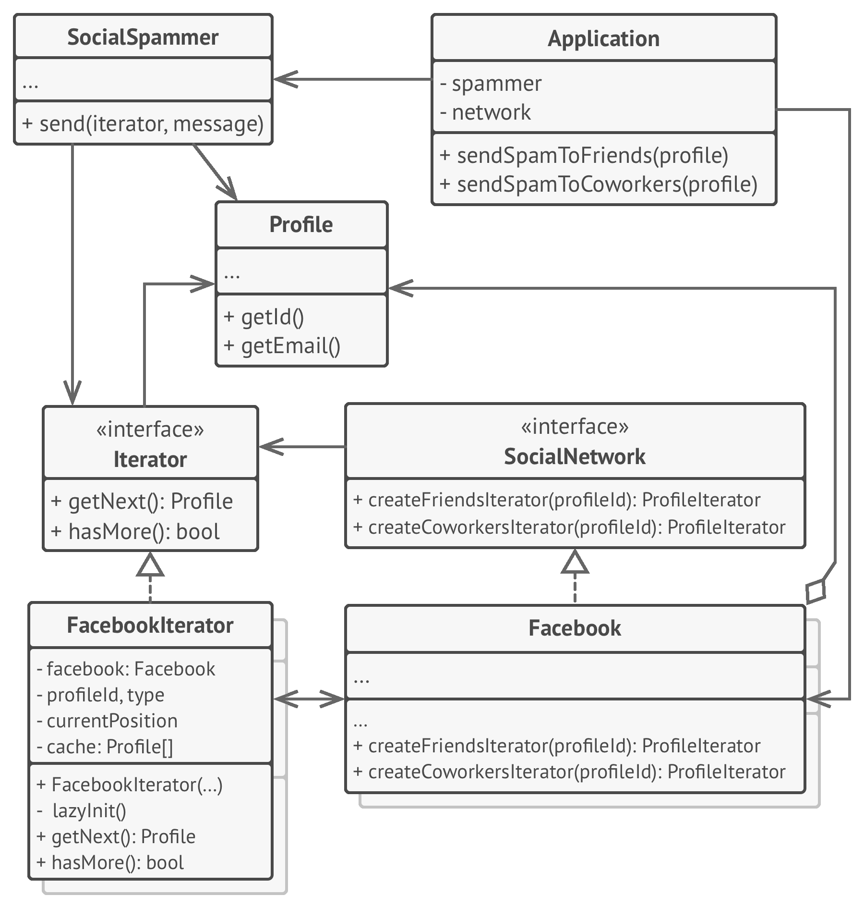

# ➿ Iterator

Real world example

> An old radio set will be a good example of iterator, where user could start at some channel and then use next or previous buttons to go through the respective channels. Or take an example of MP3 player or a TV set where you could press the next and previous buttons to go through the consecutive channels or in other words they all provide an interface to iterate through the respective channels, songs or radio stations.

In plain words

> It presents a way to access the elements of an object without exposing the underlying presentation.

Wikipedia says

> In object-oriented programming, the iterator pattern is a design pattern in which an iterator is used to traverse a container and access the container's elements. The iterator pattern decouples algorithms from containers; in some cases, algorithms are necessarily container-specific and thus cannot be decoupled.

**Programmatic example**

In PHP it is quite easy to implement using SPL (Standard PHP Library). Translating our radio stations example from above. First of all we have `RadioStation`

```php
class RadioStation
{
    protected $frequency;

    public function __construct(float $frequency)
    {
        $this->frequency = $frequency;
    }

    public function getFrequency(): float
    {
        return $this->frequency;
    }
}
```

Then we have our iterator

```php
use Countable;
use Iterator;

class StationList implements Countable, Iterator
{
    /** @var RadioStation[] $stations */
    protected $stations = [];

    /** @var int $counter */
    protected $counter;

    public function addStation(RadioStation $station)
    {
        $this->stations[] = $station;
    }

    public function removeStation(RadioStation $toRemove)
    {
        $toRemoveFrequency = $toRemove->getFrequency();
        $this->stations = array_filter($this->stations, function (RadioStation $station) use ($toRemoveFrequency) {
            return $station->getFrequency() !== $toRemoveFrequency;
        });
    }

    public function count(): int
    {
        return count($this->stations);
    }

    public function current(): RadioStation
    {
        return $this->stations[$this->counter];
    }

    public function key()
    {
        return $this->counter;
    }

    public function next()
    {
        $this->counter++;
    }

    public function rewind()
    {
        $this->counter = 0;
    }

    public function valid(): bool
    {
        return isset($this->stations[$this->counter]);
    }
}
```

And then it can be used as

```php
$stationList = new StationList();

$stationList->addStation(new RadioStation(89));
$stationList->addStation(new RadioStation(101));
$stationList->addStation(new RadioStation(102));
$stationList->addStation(new RadioStation(103.2));

foreach($stationList as $station) {
    echo $station->getFrequency() . PHP_EOL;
}

$stationList->removeStation(new RadioStation(89)); // Will remove station 89
```

<br>
<br>


```python
"""
Iterator Design Pattern

Intent: Lets you traverse elements of a collection without exposing its
underlying representation (list, stack, tree, etc.).
"""


from __future__ import annotations
from collections.abc import Iterable, Iterator
from typing import Any, List


"""
To create an iterator in Python, there are two abstract classes from the built-
in `collections` module - Iterable,Iterator. We need to implement the
`__iter__()` method in the iterated object (collection), and the `__next__ ()`
method in theiterator.
"""


class AlphabeticalOrderIterator(Iterator):
    """
    Concrete Iterators implement various traversal algorithms. These classes
    store the current traversal position at all times.
    """

    """
    `_position` attribute stores the current traversal position. An iterator may
    have a lot of other fields for storing iteration state, especially when it
    is supposed to work with a particular kind of collection.
    """
    _position: int = None

    """
    This attribute indicates the traversal direction.
    """
    _reverse: bool = False

    def __init__(self, collection: WordsCollection, reverse: bool = False) -> None:
        self._collection = collection
        self._reverse = reverse
        self._position = -1 if reverse else 0

    def __next__(self):
        """
        The __next__() method must return the next item in the sequence. On
        reaching the end, and in subsequent calls, it must raise StopIteration.
        """
        try:
            value = self._collection[self._position]
            self._position += -1 if self._reverse else 1
        except IndexError:
            raise StopIteration()

        return value


class WordsCollection(Iterable):
    """
    Concrete Collections provide one or several methods for retrieving fresh
    iterator instances, compatible with the collection class.
    """

    def __init__(self, collection: List[Any] = []) -> None:
        self._collection = collection

    def __iter__(self) -> AlphabeticalOrderIterator:
        """
        The __iter__() method returns the iterator object itself, by default we
        return the iterator in ascending order.
        """
        return AlphabeticalOrderIterator(self._collection)

    def get_reverse_iterator(self) -> AlphabeticalOrderIterator:
        return AlphabeticalOrderIterator(self._collection, True)

    def add_item(self, item: Any):
        self._collection.append(item)


if __name__ == "__main__":
    # The client code may or may not know about the Concrete Iterator or
    # Collection classes, depending on the level of indirection you want to keep
    # in your program.
    collection = WordsCollection()
    collection.add_item("First")
    collection.add_item("Second")
    collection.add_item("Third")

    print("Straight traversal:")
    print("\n".join(collection))
    print("")

    print("Reverse traversal:")
    print("\n".join(collection.get_reverse_iterator()), end="")
```

## Examples

- Tree iterator.
- Graph iterator.

```python
from abc import ABC, abstractmethod


class TreeNode:
    def __init__(self, data, left=None, right=None):
        self.data = data
        self.left = left
        self.right = right


class Tree:
    def __init__(self, root=None):
        self.root = root

    def get_iterator_in_order(self):
        return InOrderIterator(self)

    def get_iterator_pre_order(self):
        pass

    def get_iterator_post_order(self):
        pass


class Iterator(ABC):
    def __init__(self, obj):
        self.obj = obj

    @abstractmethod
    def next(self):
        pass


class InOrderIterator(Iterator):
    def __init__(self, tree):
        self._tree = tree
        self._generator = self._visit(self._tree.root)

    def _visit(self, node):
        if node is None:
            return
        yield node.data
        yield from self._visit(node.left)
        yield from self._visit(node.right)

    def next(self):
        return next(self._generator)


def main():
    n4 = TreeNode(4)
    n5 = TreeNode(5)
    n6 = TreeNode(6)
    n7 = TreeNode(7)
    n2 = TreeNode(2, n4, n5)
    n3 = TreeNode(3, n6, n7)
    n1 = TreeNode(1, n2, n3)
    tree = Tree(n1)
    it = tree.get_iterator_in_order()
    while True:
        try:
            elem = it.next()
            print(elem)
        except StopIteration:
            break
```
