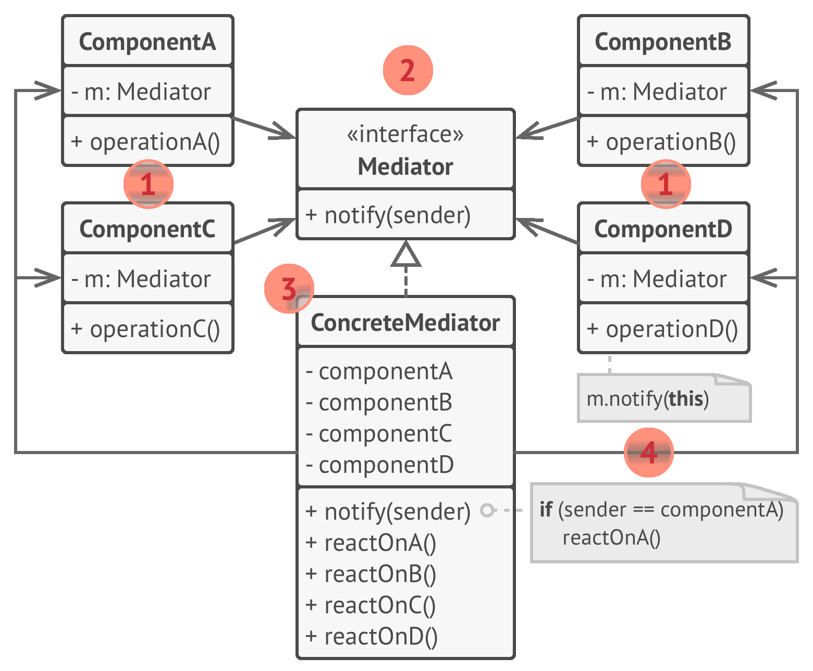
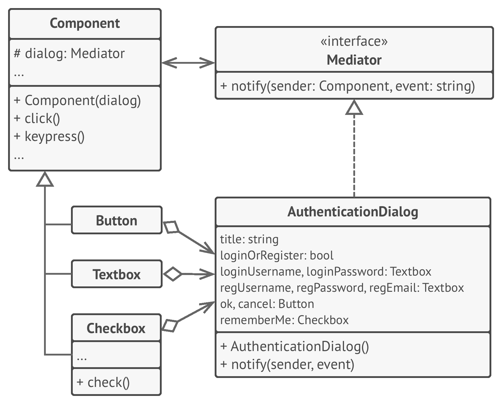

# 👽 Mediator

Real world example

> A general example would be when you talk to someone on your mobile phone, there is a network provider sitting between you and them and your conversation goes through it instead of being directly sent. In this case network provider is mediator.

In plain words

> Mediator pattern adds a third party object (called mediator) to control the interaction between two objects (called colleagues). It helps reduce the coupling between the classes communicating with each other. Because now they don't need to have the knowledge of each other's implementation.

Wikipedia says

> In software engineering, the mediator pattern defines an object that encapsulates how a set of objects interact. This pattern is considered to be a behavioral pattern due to the way it can alter the program's running behavior.

**Programmatic Example**

Here is the simplest example of a chat room (i.e. mediator) with users (i.e. colleagues) sending messages to each other.

First of all, we have the mediator i.e. the chat room

```php
interface ChatRoomMediator 
{
    public function showMessage(User $user, string $message);
}

// Mediator
class ChatRoom implements ChatRoomMediator
{
    public function showMessage(User $user, string $message)
    {
        $time = date('M d, y H:i');
        $sender = $user->getName();

        echo $time . '[' . $sender . ']:' . $message;
    }
}
```

Then we have our users i.e. colleagues

```php
class User {
    protected $name;
    protected $chatMediator;

    public function __construct(string $name, ChatRoomMediator $chatMediator) {
        $this->name = $name;
        $this->chatMediator = $chatMediator;
    }

    public function getName() {
        return $this->name;
    }

    public function send($message) {
        $this->chatMediator->showMessage($this, $message);
    }
}
```

And the usage

```php
$mediator = new ChatRoom();

$john = new User('John Doe', $mediator);
$jane = new User('Jane Doe', $mediator);

$john->send('Hi there!');
$jane->send('Hey!');

// Output will be
// Feb 14, 10:58 [John]: Hi there!
// Feb 14, 10:58 [Jane]: Hey!
```

<br>
<br>

```python
"""
Mediator Design Pattern

Intent: Lets you reduce chaotic dependencies between objects. The pattern
restricts direct communications between the objects and forces them to
collaborate only via a mediator object.
"""


from __future__ import annotations
from abc import ABC


class Mediator(ABC):
    """
    The Mediator interface declares a method used by components to notify the
    mediator about various events. The Mediator may react to these events and
    pass the execution to other components.
    """

    def notify(self, sender: object, event: str) -> None:
        pass


class ConcreteMediator(Mediator):
    def __init__(self, component1: Component1, component2: Component2) -> None:
        self._component1 = component1
        self._component1.mediator = self
        self._component2 = component2
        self._component2.mediator = self

    def notify(self, sender: object, event: str) -> None:
        if event == "A":
            print("Mediator reacts on A and triggers following operations:")
            self._component2.do_c()
        elif event == "D":
            print("Mediator reacts on D and triggers following operations:")
            self._component1.do_b()
            self._component2.do_c()


class BaseComponent:
    """
    The Base Component provides the basic functionality of storing a mediator's
    instance inside component objects.
    """

    def __init__(self, mediator: Mediator = None) -> None:
        self._mediator = mediator

    @property
    def mediator(self) -> Mediator:
        return self._mediator

    @mediator.setter
    def mediator(self, mediator: Mediator) -> None:
        self._mediator = mediator


"""
Concrete Components implement various functionality. They don't depend on other
components. They also don't depend on any concrete mediator classes.
"""


class Component1(BaseComponent):
    def do_a(self) -> None:
        print("Component 1 does A.")
        self.mediator.notify(self, "A")

    def do_b(self) -> None:
        print("Component 1 does B.")
        self.mediator.notify(self, "B")


class Component2(BaseComponent):
    def do_c(self) -> None:
        print("Component 2 does C.")
        self.mediator.notify(self, "C")

    def do_d(self) -> None:
        print("Component 2 does D.")
        self.mediator.notify(self, "D")


if __name__ == "__main__":
    # The client code.
    c1 = Component1()
    c2 = Component2()
    mediator = ConcreteMediator(c1, c2)

    print("Client triggers operation A.")
    c1.do_a()

    print("\n", end="")

    print("Client triggers operation D.")
    c2.do_d()
```
