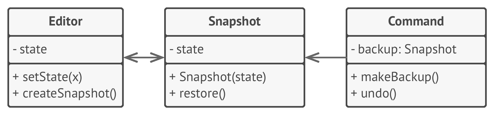

# 💾 Memento

Real world example

> Take the example of calculator (i.e. originator), where whenever you perform some calculation the last calculation is saved in memory (i.e. memento) so that you can get back to it and maybe get it restored using some action buttons (i.e. caretaker).

In plain words

> Memento pattern is about capturing and storing the current state of an object in a manner that it can be restored later on in a smooth manner.

Wikipedia says

> The memento pattern is a software design pattern that provides the ability to restore an object to its previous state (undo via rollback).

Usually useful when you need to provide some sort of undo functionality.

**Programmatic Example**

Lets take an example of text editor which keeps saving the state from time to time and that you can restore if you want.

First of all we have our memento object that will be able to hold the editor state

```php
class EditorMemento
{
    protected $content;

    public function __construct(string $content)
    {
        $this->content = $content;
    }

    public function getContent()
    {
        return $this->content;
    }
}
```

Then we have our editor i.e. originator that is going to use memento object

```php
class Editor
{
    protected $content = '';

    public function type(string $words)
    {
        $this->content = $this->content . ' ' . $words;
    }

    public function getContent()
    {
        return $this->content;
    }

    public function save()
    {
        return new EditorMemento($this->content);
    }

    public function restore(EditorMemento $memento)
    {
        $this->content = $memento->getContent();
    }
}
```

And then it can be used as

```php
$editor = new Editor();

// Type some stuff
$editor->type('This is the first sentence.');
$editor->type('This is second.');

// Save the state to restore to : This is the first sentence. This is second.
$saved = $editor->save();

// Type some more
$editor->type('And this is third.');

// Output: Content before Saving
echo $editor->getContent(); // This is the first sentence. This is second. And this is third.

// Restoring to last saved state
$editor->restore($saved);

$editor->getContent(); // This is the first sentence. This is second.
```

<br>

```python
"""
Memento Design Pattern

Intent: Lets you save and restore the previous state of an object without
revealing the details of its implementation.
"""


from __future__ import annotations
from abc import ABC, abstractmethod
from datetime import datetime
from random import sample
from string import ascii_letters, digits


class Originator():
    """
    The Originator holds some important state that may change over time. It also
    defines a method for saving the state inside a memento and another method
    for restoring the state from it.
    """

    _state = None
    """
    For the sake of simplicity, the originator's state is stored inside a single
    variable.
    """

    def __init__(self, state: str) -> None:
        self._state = state
        print(f"Originator: My initial state is: {self._state}")

    def do_something(self) -> None:
        """
        The Originator's business logic may affect its internal state.
        Therefore, the client should backup the state before launching methods
        of the business logic via the save() method.
        """

        print("Originator: I'm doing something important.")
        self._state = self._generate_random_string(30)
        print(f"Originator: and my state has changed to: {self._state}")

    def _generate_random_string(self, length: int = 10) -> None:
        return "".join(sample(ascii_letters, length))

    def save(self) -> Memento:
        """
        Saves the current state inside a memento.
        """

        return ConcreteMemento(self._state)

    def restore(self, memento: Memento) -> None:
        """
        Restores the Originator's state from a memento object.
        """

        self._state = memento.get_state()
        print(f"Originator: My state has changed to: {self._state}")


class Memento(ABC):
    """
    The Memento interface provides a way to retrieve the memento's metadata,
    such as creation date or name. However, it doesn't expose the Originator's
    state.
    """

    @abstractmethod
    def get_name(self) -> str:
        pass

    @abstractmethod
    def get_date(self) -> str:
        pass


class ConcreteMemento(Memento):
    def __init__(self, state: str) -> None:
        self._state = state
        self._date = str(datetime.now())[:19]

    def get_state(self) -> str:
        """
        The Originator uses this method when restoring its state.
        """
        return self._state

    def get_name(self) -> str:
        """
        The rest of the methods are used by the Caretaker to display metadata.
        """

        return f"{self._date} / ({self._state[0:9]}...)"

    def get_date(self) -> str:
        return self._date


class Caretaker():
    """
    The Caretaker doesn't depend on the Concrete Memento class. Therefore, it
    doesn't have access to the originator's state, stored inside the memento. It
    works with all mementos via the base Memento interface.
    """

    def __init__(self, originator: Originator) -> None:
        self._mementos = []
        self._originator = originator

    def backup(self) -> None:
        print("\nCaretaker: Saving Originator's state...")
        self._mementos.append(self._originator.save())

    def undo(self) -> None:
        if not len(self._mementos):
            return

        memento = self._mementos.pop()
        print(f"Caretaker: Restoring state to: {memento.get_name()}")
        try:
            self._originator.restore(memento)
        except Exception:
            self.undo()

    def show_history(self) -> None:
        print("Caretaker: Here's the list of mementos:")
        for memento in self._mementos:
            print(memento.get_name())


if __name__ == "__main__":
    originator = Originator("Super-duper-super-puper-super.")
    caretaker = Caretaker(originator)

    caretaker.backup()
    originator.do_something()

    caretaker.backup()
    originator.do_something()

    caretaker.backup()
    originator.do_something()

    print()
    caretaker.show_history()

    print("\nClient: Now, let's rollback!\n")
    caretaker.undo()

    print("\nClient: Once more!\n")
    caretaker.undo()
```

## Examples:

- Calculator undo.
- Editor undo.
- Paint undo.

```python
class CalculatorMemento:
    def __init__(self, state):
        self._state = state

    def __repr__(self):
        return str(self._state)


class Calculator:
    def __init__(self):
        self.result = 0
        self.history = []
        self.history_pointer = -1
        self.backup()

    def add(self, first, second):
        self.result = first + second
        self.backup()

    def subtract(self, first, second):
        self.result = first - second
        self.backup()

    def backup(self):
        self.history_pointer += 1
        self.history.append(CalculatorMemento(self.result))

    def restore(self, memento):
        self.result = memento._state

    def undo(self):
        self.history_pointer -= 1
        self.restore(self.history[-1])

    def redo(self):
        self.history_pointer += 1
        self.restore(self.history[self.history_pointer])
```
