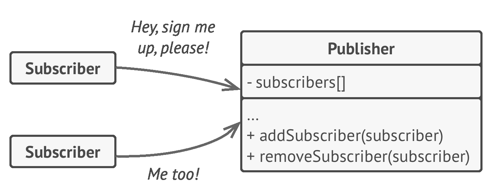
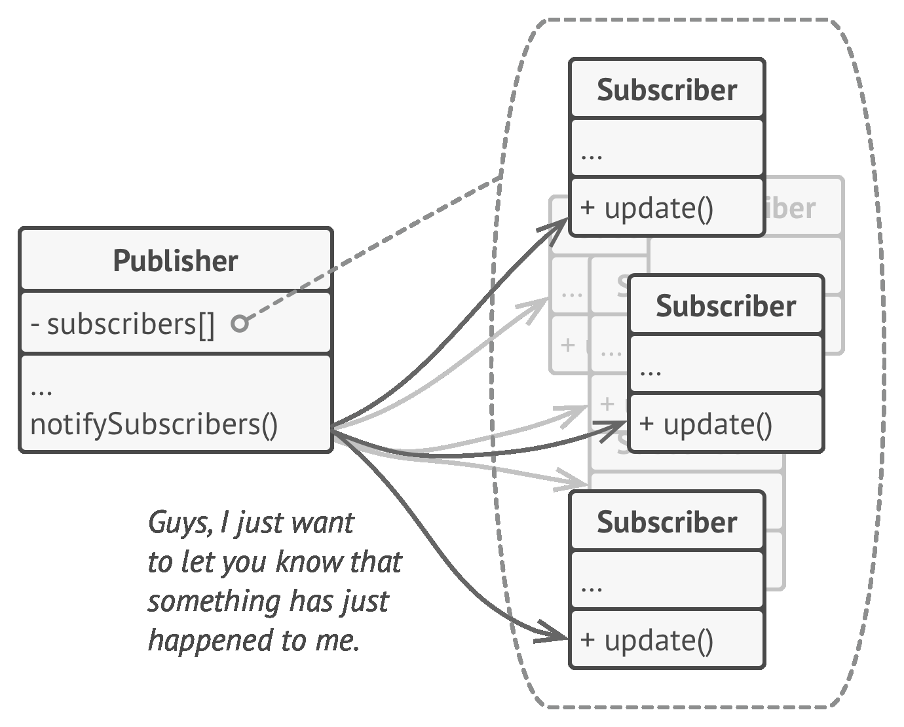
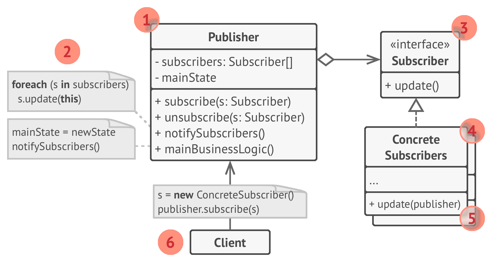
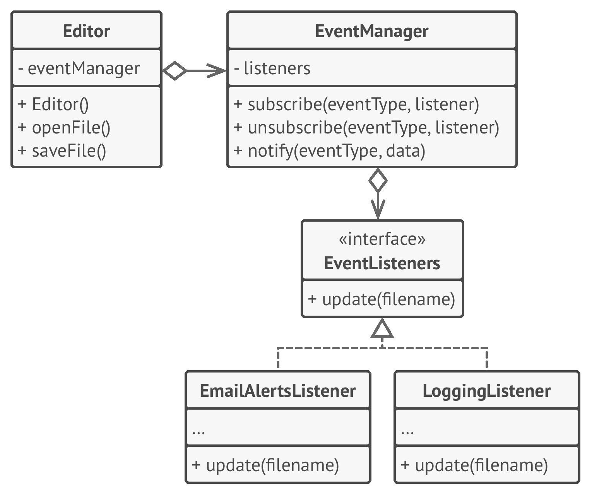

# 😎 Observer

Real world example

> A good example would be the job seekers where they subscribe to some job posting site and they are notified whenever there is a matching job opportunity.

In plain words

> Defines a dependency between objects so that whenever an object changes its state, all its dependents are notified.

Wikipedia says

> The observer pattern is a software design pattern in which an object, called the subject, maintains a list of its dependents, called observers, and notifies them automatically of any state changes, usually by calling one of their methods.

**Programmatic example**

Translating our example from above. First of all we have job seekers that need to be notified for a job posting

```php
class JobPost
{
    protected $title;

    public function __construct(string $title)
    {
        $this->title = $title;
    }

    public function getTitle()
    {
        return $this->title;
    }
}

class JobSeeker implements Observer
{
    protected $name;

    public function __construct(string $name)
    {
        $this->name = $name;
    }

    public function onJobPosted(JobPost $job)
    {
        // Do something with the job posting
        echo 'Hi ' . $this->name . '! New job posted: '. $job->getTitle();
    }
}
```

Then we have our job postings to which the job seekers will subscribe

```php
class EmploymentAgency implements Observable
{
    protected $observers = [];

    protected function notify(JobPost $jobPosting)
    {
        foreach ($this->observers as $observer) {
            $observer->onJobPosted($jobPosting);
        }
    }

    public function attach(Observer $observer)
    {
        $this->observers[] = $observer;
    }

    public function addJob(JobPost $jobPosting)
    {
        $this->notify($jobPosting);
    }
}
```

Then it can be used as

```php
// Create subscribers
$johnDoe = new JobSeeker('John Doe');
$janeDoe = new JobSeeker('Jane Doe');

// Create publisher and attach subscribers
$jobPostings = new EmploymentAgency();
$jobPostings->attach($johnDoe);
$jobPostings->attach($janeDoe);

// Add a new job and see if subscribers get notified
$jobPostings->addJob(new JobPost('Software Engineer'));

// Output
// Hi John Doe! New job posted: Software Engineer
// Hi Jane Doe! New job posted: Software Engineer
```

<br>
<br>
<br>
<br>

```python
"""
Observer Design Pattern

Intent: Lets you define a subscription mechanism to notify multiple objects
about any events that happen to the object they're observing.

Note that there's a lot of different terms with similar meaning associated with
this pattern. Just remember that the Subject is also called the Publisher and
the Observer is often called the Subscriber and vice versa. Also the verbs
"observe", "listen" or "track" usually mean the same thing.
"""


from __future__ import annotations
from abc import ABC, abstractmethod
from random import randrange
from typing import List


class Subject(ABC):
    """
    The Subject interface declares a set of methods for managing subscribers.
    """

    @abstractmethod
    def attach(self, observer: Observer) -> None:
        """
        Attach an observer to the subject.
        """
        pass

    @abstractmethod
    def detach(self, observer: Observer) -> None:
        """
        Detach an observer from the subject.
        """
        pass

    @abstractmethod
    def notify(self) -> None:
        """
        Notify all observers about an event.
        """
        pass


class ConcreteSubject(Subject):
    """
    The Subject owns some important state and notifies observers when the state
    changes.
    """

    _state: int = None
    """
    For the sake of simplicity, the Subject's state, essential to all
    subscribers, is stored in this variable.
    """

    _observers: List[Observer] = []
    """
    List of subscribers. In real life, the list of subscribers can be stored
    more comprehensively (categorized by event type, etc.).
    """

    def attach(self, observer: Observer) -> None:
        print("Subject: Attached an observer.")
        self._observers.append(observer)

    def detach(self, observer: Observer) -> None:
        self._observers.remove(observer)

    """
    The subscription management methods.
    """

    def notify(self) -> None:
        """
        Trigger an update in each subscriber.
        """

        print("Subject: Notifying observers...")
        for observer in self._observers:
            observer.update(self)

    def some_business_logic(self) -> None:
        """
        Usually, the subscription logic is only a fraction of what a Subject can
        really do. Subjects commonly hold some important business logic, that
        triggers a notification method whenever something important is about to
        happen (or after it).
        """

        print("\nSubject: I'm doing something important.")
        self._state = randrange(0, 10)

        print(f"Subject: My state has just changed to: {self._state}")
        self.notify()


class Observer(ABC):
    """
    The Observer interface declares the update method, used by subjects.
    """

    @abstractmethod
    def update(self, subject: Subject) -> None:
        """
        Receive update from subject.
        """
        pass


"""
Concrete Observers react to the updates issued by the Subject they had been
attached to.
"""


class ConcreteObserverA(Observer):
    def update(self, subject: Subject) -> None:
        if subject._state < 3:
            print("ConcreteObserverA: Reacted to the event")


class ConcreteObserverB(Observer):
    def update(self, subject: Subject) -> None:
        if subject._state == 0 or subject._state >= 2:
            print("ConcreteObserverB: Reacted to the event")


if __name__ == "__main__":
    # The client code.

    subject = ConcreteSubject()

    observer_a = ConcreteObserverA()
    subject.attach(observer_a)

    observer_b = ConcreteObserverB()
    subject.attach(observer_b)

    subject.some_business_logic()
    subject.some_business_logic()

    subject.detach(observer_a)

    subject.some_business_logic()
```

## Examples:

- News publisher -> SMS, Email subscriber.
- File change publisher -> Email, log subscriber.

```python
from abc import ABC, abstractmethod


class Publisher(ABC):
    def __init__(self):
        self.subscribers = []

    def add_subscriber(self, subscriber):
        self.subscribers += subscriber

    def remove_subscriber(self, subscriber):
        self.subscribers.remove(subscriber)

    def notify_subcribers(self, event, data):
        for sub in subscribers:
            sub.recieve_update(self, event, data)


class NewsPublisher(Publisher):
    def add_new_post(self, post):
        self.state["posts"] += post
        self.notify_subcribers("New post", post)

    def emergency_news(self, emergency):
        self.state["emergency"] += emergency
        self.notify_subcribers("Emergency", emergency)

    def downtime_alert(self):
        self.state["downtime"] += True
        self.notify_subcribers("Downtime", None)


def Subscriber(ABC):
    @abstractmethod
    def recieve_update(self, publisher, event, data):
        pass


def SMSSubscriber(Subscriber):
    def recieve_update(self, publisher, event, data):
        # Send SMS
        pass


def EmailSubscriber(Subscriber):
    def recieve_update(self, publisher, event, data):
        # Send Email
        pass
```
