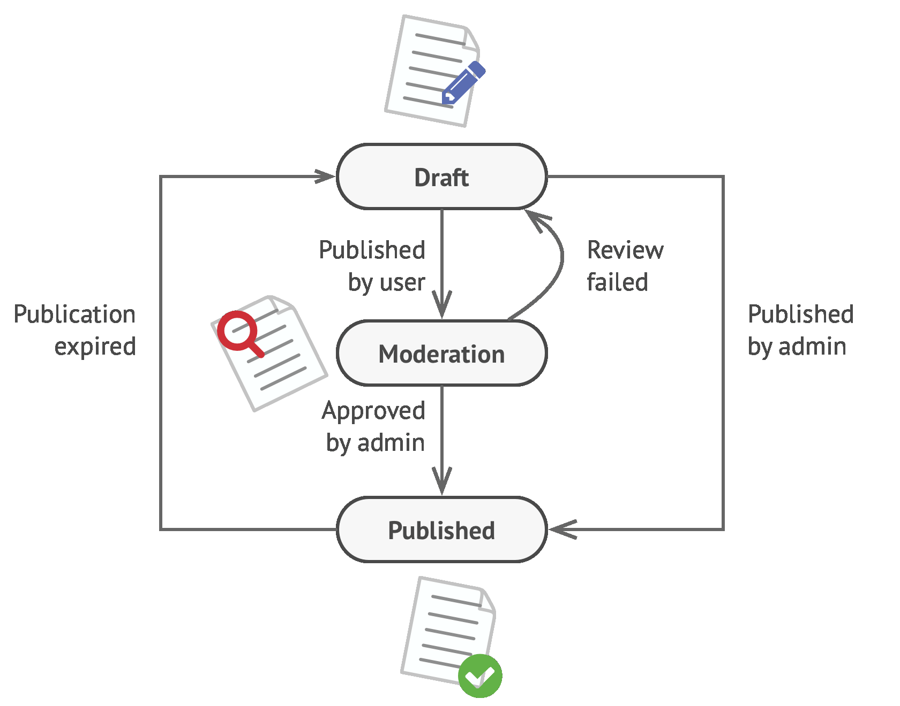
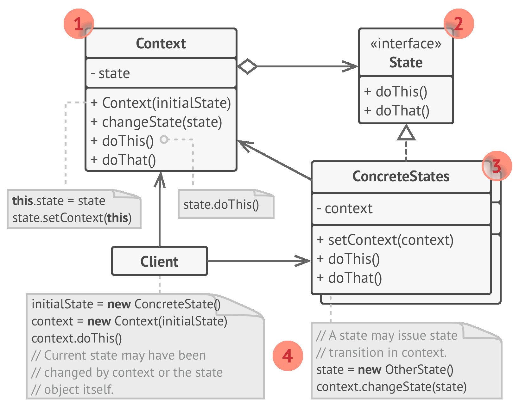
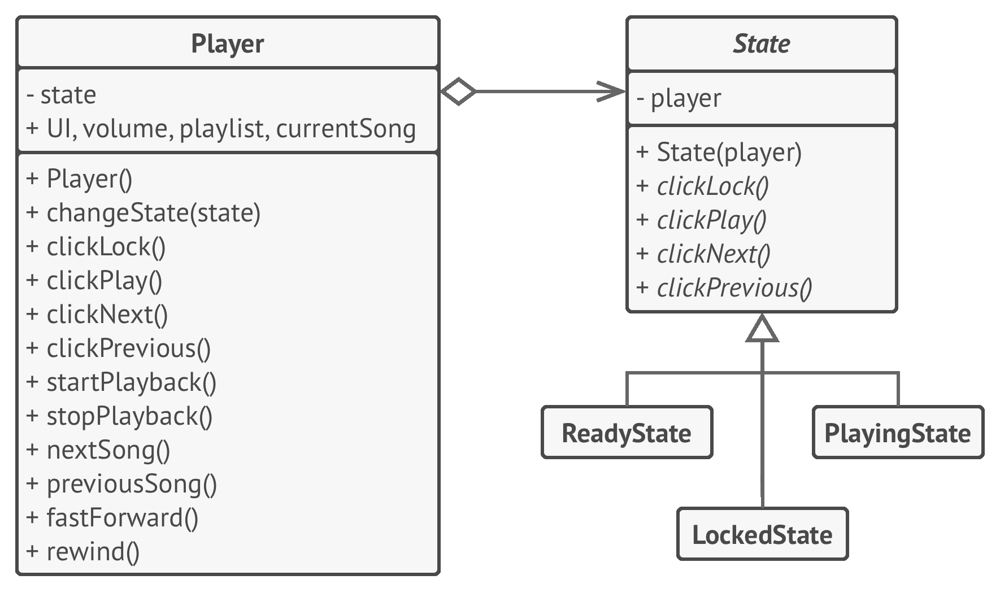

# 💢 State

Real world example

> Imagine you are using some drawing application, you choose the paint brush to draw. Now the brush changes its behavior based on the selected color i.e. if you have chosen red color it will draw in red, if blue then it will be in blue etc.

In plain words

> It lets you change the behavior of a class when the state changes.

Wikipedia says

> The state pattern is a behavioral software design pattern that implements a state machine in an object-oriented way. With the state pattern, a state machine is implemented by implementing each individual state as a derived class of the state pattern interface, and implementing state transitions by invoking methods defined by the pattern's superclass. The state pattern can be interpreted as a strategy pattern which is able to switch the current strategy through invocations of methods defined in the pattern's interface.

**Programmatic example**

Let's take an example of text editor, it lets you change the state of text that is typed i.e. if you have selected bold, it starts writing in bold, if italic then in italics etc.

First of all we have our state interface and some state implementations

```php
interface WritingState
{
    public function write(string $words);
}

class UpperCase implements WritingState
{
    public function write(string $words)
    {
        echo strtoupper($words);
    }
}

class LowerCase implements WritingState
{
    public function write(string $words)
    {
        echo strtolower($words);
    }
}

class DefaultText implements WritingState
{
    public function write(string $words)
    {
        echo $words;
    }
}
```

Then we have our editor

```php
class TextEditor
{
    protected $state;

    public function __construct(WritingState $state)
    {
        $this->state = $state;
    }

    public function setState(WritingState $state)
    {
        $this->state = $state;
    }

    public function type(string $words)
    {
        $this->state->write($words);
    }
}
```

And then it can be used as

```php
$editor = new TextEditor(new DefaultText());

$editor->type('First line');

$editor->setState(new UpperCase());

$editor->type('Second line');
$editor->type('Third line');

$editor->setState(new LowerCase());

$editor->type('Fourth line');
$editor->type('Fifth line');

// Output:
// First line
// SECOND LINE
// THIRD LINE
// fourth line
// fifth line
```

<br>
<br>
<br>
<br>

```python
"""
State Design Pattern

Intent: Lets an object alter its behavior when its internal state changes. It
appears as if the object changed its class.
"""


from __future__ import annotations
from abc import ABC, abstractmethod


class Context(ABC):
    """
    The Context defines the interface of interest to clients. It also maintains
    a reference to an instance of a State subclass, which represents the current
    state of the Context.
    """

    _state = None
    """
    A reference to the current state of the Context.
    """

    def __init__(self, state: State) -> None:
        self.transition_to(state)

    def transition_to(self, state: State):
        """
        The Context allows changing the State object at runtime.
        """

        print(f"Context: Transition to {type(state).__name__}")
        self._state = state
        self._state.context = self

    """
    The Context delegates part of its behavior to the current State object.
    """

    def request1(self):
        self._state.handle1()

    def request2(self):
        self._state.handle2()


class State(ABC):
    """
    The base State class declares methods that all Concrete State should
    implement and also provides a backreference to the Context object,
    associated with the State. This backreference can be used by States to
    transition the Context to another State.
    """

    @property
    def context(self) -> Context:
        return self._context

    @context.setter
    def context(self, context: Context) -> None:
        self._context = context

    @abstractmethod
    def handle1(self) -> None:
        pass

    @abstractmethod
    def handle2(self) -> None:
        pass


"""
Concrete States implement various behaviors, associated with a state of the
Context.
"""


class ConcreteStateA(State):
    def handle1(self) -> None:
        print("ConcreteStateA handles request1.")
        print("ConcreteStateA wants to change the state of the context.")
        self.context.transition_to(ConcreteStateB())

    def handle2(self) -> None:
        print("ConcreteStateA handles request2.")


class ConcreteStateB(State):
    def handle1(self) -> None:
        print("ConcreteStateB handles request1.")

    def handle2(self) -> None:
        print("ConcreteStateB handles request2.")
        print("ConcreteStateB wants to change the state of the context.")
        self.context.transition_to(ConcreteStateA())


if __name__ == "__main__":
    # The client code.

    context = Context(ConcreteStateA())
    context.request1()
    context.request2()
```

## Examples:

- **Music player - stop, start, play, next, previous, rewind, fast-forward, lock.**

```python
from abc import ABC, abstractmethod


class State(ABC):
    def __init__(self, player):
        self.player = player

    def on_state_activate(self, player):
        pass

    @abstractmethod
    def on_lock(self, player):
        pass

    @abstractmethod
    def on_play(self, player):
        pass

    @abstractmethod
    def on_next(self, player):
        pass

    @abstractmethod
    def on_previous(self, player):
        pass


def LockedState(State):
    # Implement methods
    pass


def PlayingState(State):
    # Implement methods
    pass


def ReadyState(State):
    # Implement methods
    pass


def Player():
    def __init__(self, state):
        self.set_state(state)

    def set_state(self, state):
        self.state = state
        state.on_state_activate(self)

    def on_lock(self):
        self.state.on_lock(self)

    def on_play(self):
        self.state.on_play(self)

    def on_next(self):
        self.state.on_next(self)

    def on_previous(self):
        self.state.on_previous(self)
```
