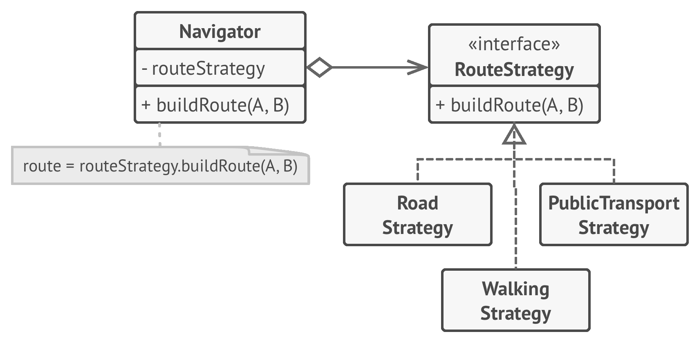
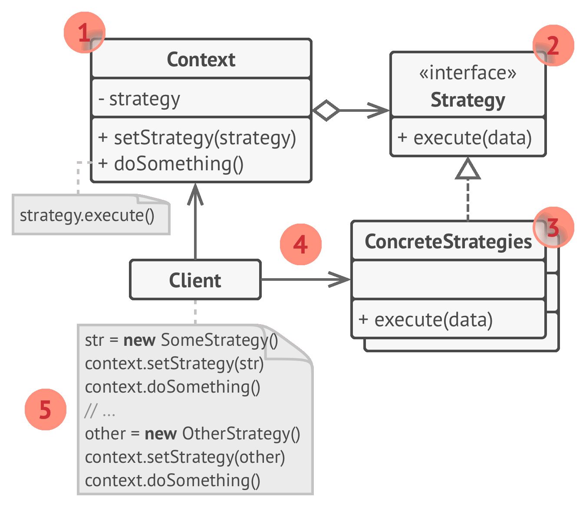

# 💡 Strategy

Real world example

> Consider the example of sorting, we implemented bubble sort but the data started to grow and bubble sort started getting very slow. In order to tackle this we implemented Quick sort. But now although the quick sort algorithm was doing better for large datasets, it was very slow for smaller datasets. In order to handle this we implemented a strategy where for small datasets, bubble sort will be used and for larger, quick sort.

In plain words

> Strategy pattern allows you to switch the algorithm or strategy based upon the situation.

Wikipedia says

> In computer programming, the strategy pattern (also known as the policy pattern) is a behavioural software design pattern that enables an algorithm's behavior to be selected at runtime.

**Programmatic example**

Translating our example from above. First of all we have our strategy interface and different strategy implementations

```php
interface SortStrategy
{
    public function sort(array $dataset): array;
}

class BubbleSortStrategy implements SortStrategy
{
    public function sort(array $dataset): array
    {
        echo "Sorting using bubble sort";

        // Do sorting
        return $dataset;
    }
}

class QuickSortStrategy implements SortStrategy
{
    public function sort(array $dataset): array
    {
        echo "Sorting using quick sort";

        // Do sorting
        return $dataset;
    }
}
```

And then we have our client that is going to use any strategy

```php
class Sorter
{
    protected $sorter;

    public function __construct(SortStrategy $sorter)
    {
        $this->sorter = $sorter;
    }

    public function sort(array $dataset): array
    {
        return $this->sorter->sort($dataset);
    }
}
```

And it can be used as

```php
$dataset = [1, 5, 4, 3, 2, 8];

$sorter = new Sorter(new BubbleSortStrategy());
$sorter->sort($dataset); // Output : Sorting using bubble sort

$sorter = new Sorter(new QuickSortStrategy());
$sorter->sort($dataset); // Output : Sorting using quick sort
```

<br>


```python
"""
Strategy Design Pattern

Intent: Lets you define a family of algorithms, put each of them into a separate
class, and make their objects interchangeable.
"""


from __future__ import annotations
from abc import ABC, abstractmethod
from typing import List


class Context():
    """
    The Context defines the interface of interest to clients.
    """

    def __init__(self, strategy: Strategy) -> None:
        """
        Usually, the Context accepts a strategy through the constructor, but
        also provides a setter to change it at runtime.
        """

        self._strategy = strategy

    @property
    def strategy(self) -> Strategy:
        """
        The Context maintains a reference to one of the Strategy objects. The
        Context does not know the concrete class of a strategy. It should work
        with all strategies via the Strategy interface.
        """

        return self._strategy

    @strategy.setter
    def strategy(self, strategy: Strategy) -> None:
        """
        Usually, the Context allows replacing a Strategy object at runtime.
        """

        self._strategy = strategy

    def do_some_business_logic(self) -> None:
        """
        The Context delegates some work to the Strategy object instead of
        implementing multiple versions of the algorithm on its own.
        """

        # ...

        print("Context: Sorting data using the strategy (not sure how it'll do it)")
        result = self._strategy.do_algorithm(["a", "b", "c", "d", "e"])
        print(",".join(result))

        # ...


class Strategy(ABC):
    """
    The Strategy interface declares operations common to all supported versions
    of some algorithm.

    The Context uses this interface to call the algorithm defined by Concrete
    Strategies.
    """

    @abstractmethod
    def do_algorithm(self, data: List):
        pass


"""
Concrete Strategies implement the algorithm while following the base Strategy
interface. The interface makes them interchangeable in the Context.
"""


class ConcreteStrategyA(Strategy):
    def do_algorithm(self, data: List) -> List:
        return sorted(data)


class ConcreteStrategyB(Strategy):
    def do_algorithm(self, data: List) -> List:
        return reversed(sorted(data))


if __name__ == "__main__":
    # The client code picks a concrete strategy and passes it to the context.
    # The client should be aware of the differences between strategies in order
    # to make the right choice.

    context = Context(ConcreteStrategyA())
    print("Client: Strategy is set to normal sorting.")
    context.do_some_business_logic()
    print()

    print("Client: Strategy is set to reverse sorting.")
    context.strategy = ConcreteStrategyB()
    context.do_some_business_logic()
```

# Examples:

- Graph routing for different modes.
- Sorting using different algorithms.
- Payment using different modes(card/paypal/paytm).

**BEFORE**:

```python
class Graph:
    def compute_path_walking(self, src, dst):
        print("Computing for pedestrians")

    def compute_path_cars(self, src, dst):
        print("Computing for cars")

    def compute_path_flight(self, src, dst):
        print("Computing for planes")

    # ...
    # ...
    # (many more implementations leading to code concentration)


def main():
    g1 = Graph()
    g1.compute_path_flight(1, 2)


if __name__ == "__main__":
    main()
```

**AFTER**:

```python
from abc import ABC, abstractmethod


class Graph:
    def __init__(self, routing_strategy):
        self.routing_strategy = routing_strategy

    def compute_path(self, src, dst):
        return self.routing_strategy.compute_path(self, src, dst)


class RoutingStrategy(ABC):
    @abstractmethod
    def compute_path(self, graph: Graph, src, dst):
        pass


class RoutingStrategyWalking(RoutingStrategy):
    def compute_path(self, graph, src, dst):
        print("Computing for walking")


class RoutingStrategyRoad(RoutingStrategy):
    def compute_path(self, graph, src, dst):
        print("Computing for road")


class RoutingStrategyFlight(RoutingStrategy):
    def compute_path(self, graph, src, dst):
        print("Computing for flights")


def main():
    g1 = Graph(RoutingStrategyFlight())
    g1.compute_path(0, 1)
    g1.routing_strategy = RoutingStrategyRoad()
    g1.compute_path(0, 1)


if __name__ == "__main__":
    main()
```

## Disadvantages

- Client has to be concerned about the strategy classes.
