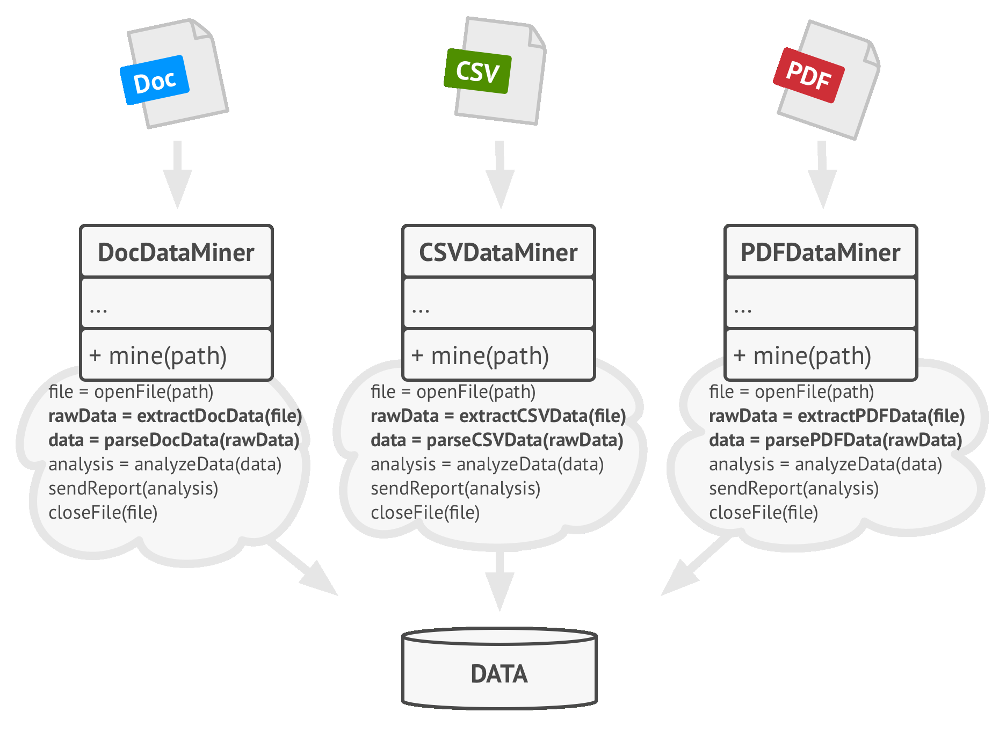
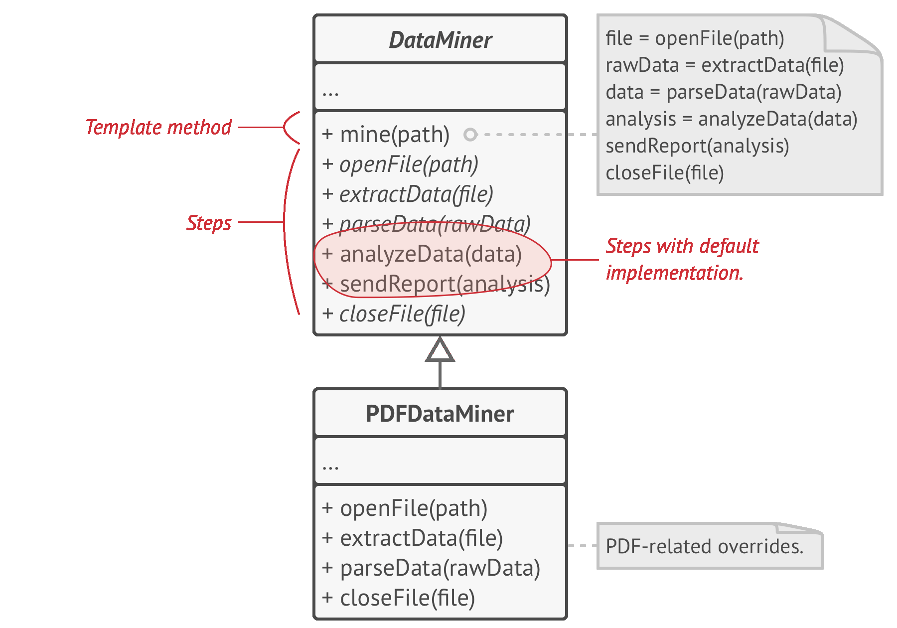
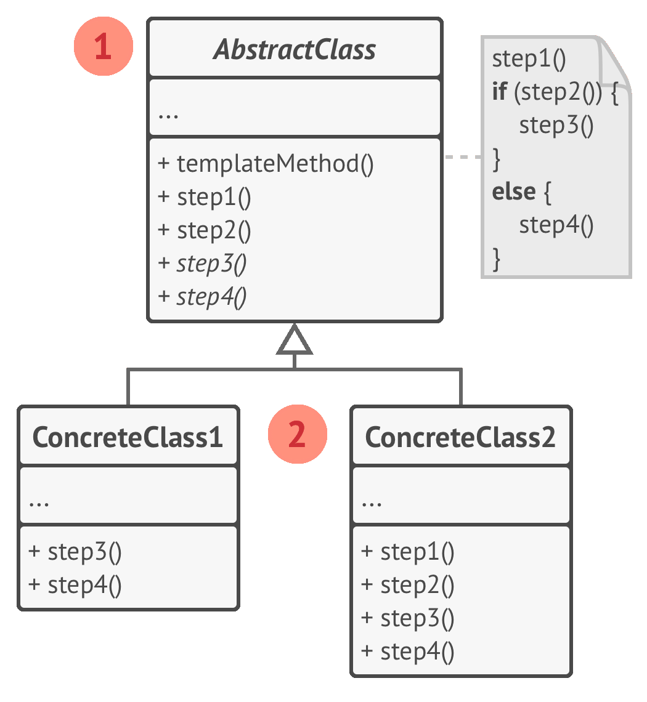
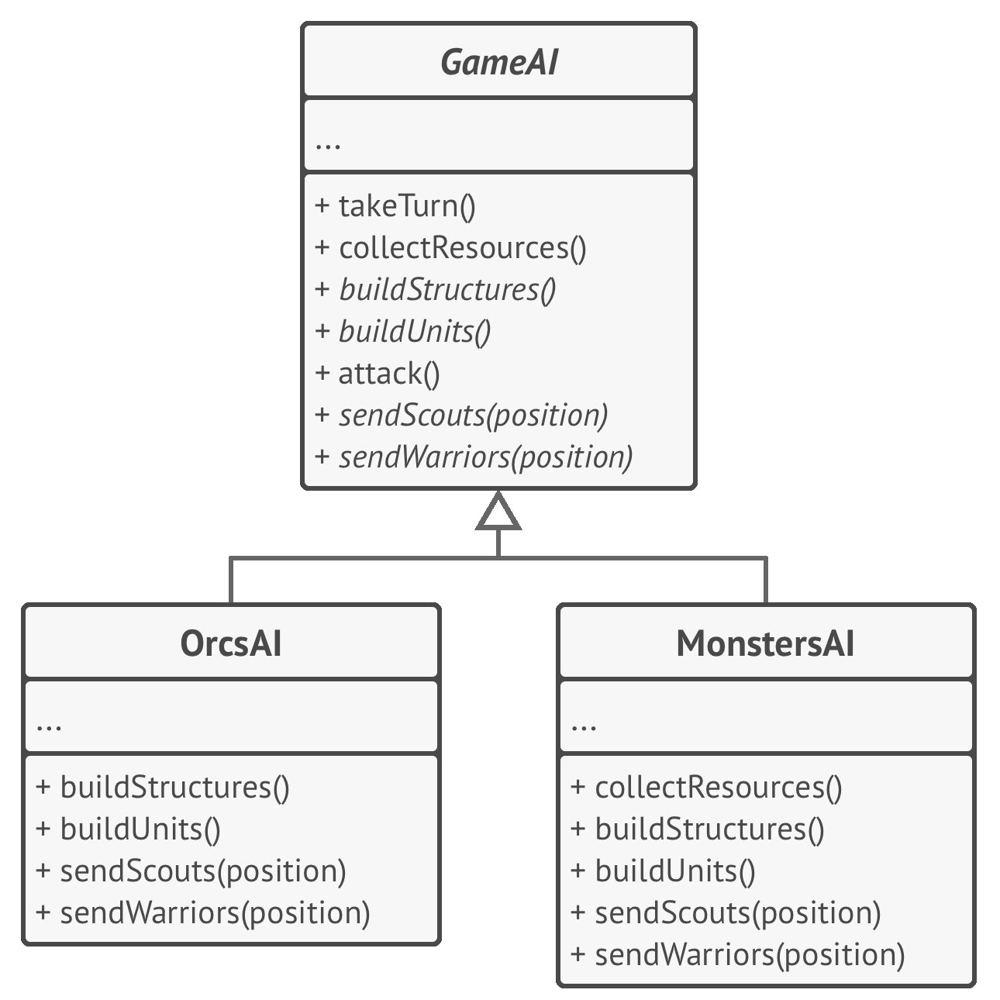

# 📒 Template Method

Real world example

> Suppose we are getting some house built. The steps for building might look like

> - Prepare the base of house
> - Build the walls
> - Add roof
> - Add other floors

> The order of these steps could never be changed i.e. you can't build the roof before building the walls etc but each of the steps could be modified for example walls can be made of wood or polyester or stone.

In plain words

> Template method defines the skeleton of how a certain algorithm could be performed, but defers the implementation of those steps to the children classes.

Wikipedia says

> In software engineering, the template method pattern is a behavioral design pattern that defines the program skeleton of an algorithm in an operation, deferring some steps to subclasses. It lets one redefine certain steps of an algorithm without changing the algorithm's structure.

**Programmatic Example**

Imagine we have a build tool that helps us test, lint, build, generate build reports (i.e. code coverage reports, linting report etc) and deploy our app on the test server.

First of all we have our base class that specifies the skeleton for the build algorithm

```php
abstract class Builder
{

    // Template method
    final public function build()
    {
        $this->test();
        $this->lint();
        $this->assemble();
        $this->deploy();
    }

    abstract public function test();
    abstract public function lint();
    abstract public function assemble();
    abstract public function deploy();
}
```

Then we can have our implementations

```php
class AndroidBuilder extends Builder
{
    public function test()
    {
        echo 'Running android tests';
    }

    public function lint()
    {
        echo 'Linting the android code';
    }

    public function assemble()
    {
        echo 'Assembling the android build';
    }

    public function deploy()
    {
        echo 'Deploying android build to server';
    }
}

class IosBuilder extends Builder
{
    public function test()
    {
        echo 'Running ios tests';
    }

    public function lint()
    {
        echo 'Linting the ios code';
    }

    public function assemble()
    {
        echo 'Assembling the ios build';
    }

    public function deploy()
    {
        echo 'Deploying ios build to server';
    }
}
```

And then it can be used as

```php
$androidBuilder = new AndroidBuilder();
$androidBuilder->build();

// Output:
// Running android tests
// Linting the android code
// Assembling the android build
// Deploying android build to server

$iosBuilder = new IosBuilder();
$iosBuilder->build();

// Output:
// Running ios tests
// Linting the ios code
// Assembling the ios build
// Deploying ios build to server
```

<br>
<br>
<br>
<br>

```python
"""
Template Method Design Pattern

Intent: Defines the skeleton of an algorithm in the superclass but lets
subclasses override specific steps of the algorithm without changing its
structure.
"""


from abc import ABC, abstractmethod


class AbstractClass(ABC):
    """
    The Abstract Class defines a template method that contains a skeleton of
    some algorithm, composed of calls to (usually) abstract primitive
    operations.

    Concrete subclasses should implement these operations, but leave the
    template method itself intact.
    """

    def template_method(self) -> None:
        """
        The template method defines the skeleton of an algorithm.
        """

        self.base_operation1()
        self.required_operations1()
        self.base_operation2()
        self.hook1()
        self.required_operations2()
        self.base_operation3()
        self.hook2()

    # These operations already have implementations.

    def base_operation1(self) -> None:
        print("AbstractClass says: I am doing the bulk of the work")

    def base_operation2(self) -> None:
        print("AbstractClass says: But I let subclasses override some operations")

    def base_operation3(self) -> None:
        print("AbstractClass says: But I am doing the bulk of the work anyway")

    # These operations have to be implemented in subclasses.

    @abstractmethod
    def required_operations1(self) -> None:
        pass

    @abstractmethod
    def required_operations2(self) -> None:
        pass

    # These are "hooks." Subclasses may override them, but it's not mandatory
    # since the hooks already have default (but empty) implementation. Hooks
    # provide additional extension points in some crucial places of the
    # algorithm.

    def hook1(self) -> None:
        pass

    def hook2(self) -> None:
        pass


class ConcreteClass1(AbstractClass):
    """
    Concrete classes have to implement all abstract operations of the base
    class. They can also override some operations with a default implementation.
    """

    def required_operations1(self) -> None:
        print("ConcreteClass1 says: Implemented Operation1")

    def required_operations2(self) -> None:
        print("ConcreteClass1 says: Implemented Operation2")


class ConcreteClass2(AbstractClass):
    """
    Usually, concrete classes override only a fraction of base class'
    operations.
    """

    def required_operations1(self) -> None:
        print("ConcreteClass2 says: Implemented Operation1")

    def required_operations2(self) -> None:
        print("ConcreteClass2 says: Implemented Operation2")

    def hook1(self) -> None:
        print("ConcreteClass2 says: Overridden Hook1")


def client_code(abstract_class: AbstractClass) -> None:
    """
    The client code calls the template method to execute the algorithm. Client
    code does not have to know the concrete class of an object it works with, as
    long as it works with objects through the interface of their base class.
    """

    # ...
    abstract_class.template_method()
    # ...


if __name__ == "__main__":
    print("Same client code can work with different subclasses:")
    client_code(ConcreteClass1())
    print("")

    print("Same client code can work with different subclasses:")
    client_code(ConcreteClass2())
```

**Examples:**

- Build tool.
- Data parser tool.

```python
from abc import ABC, abstractmethod


class BuildTool(ABC):
    def build(self):
        # Some complex code regarding the 4 functions.
        result = self.test()
        if result:
            result = self.lint()
        if result:
            result = self.compile()
        if result:
            result = self.deploy()
        return result

    @abstractmethod
    def test(self):
        pass

    @abstractmethod
    def lint(self):
        pass

    @abstractmethod
    def compile(self):
        pass

    @abstractmethod
    def deploy(self):
        pass


class BuildToolAndroid(BuildTool):
    # Implement abstract methods for Android.
    pass


class BuildToolIos(BuildTool):
    # Implement abstract methods for IOS.
    pass
```
