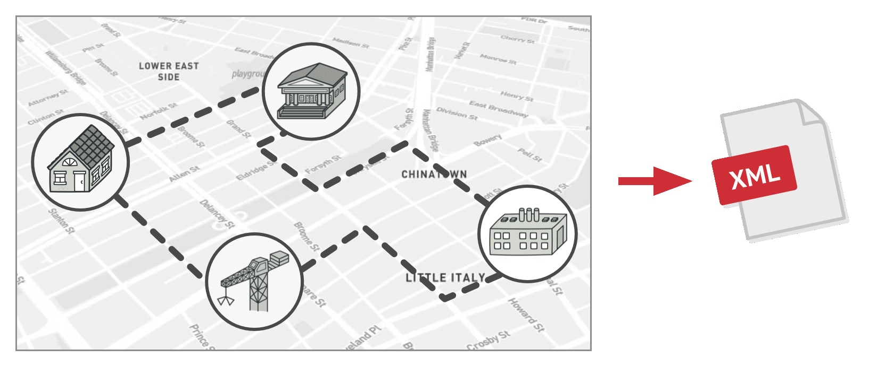
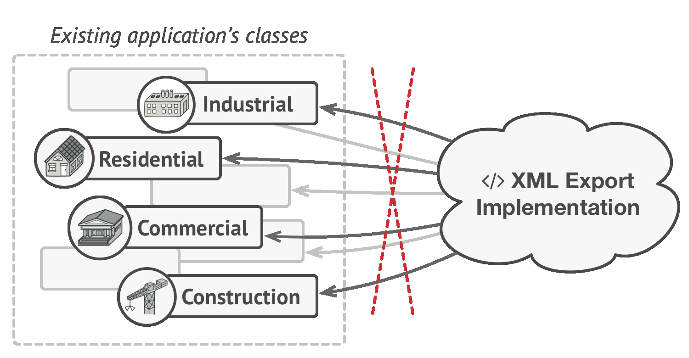
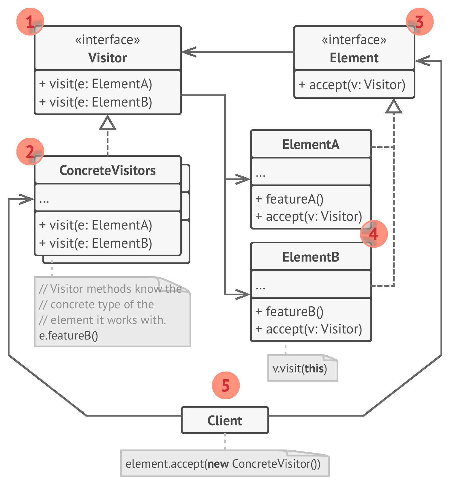
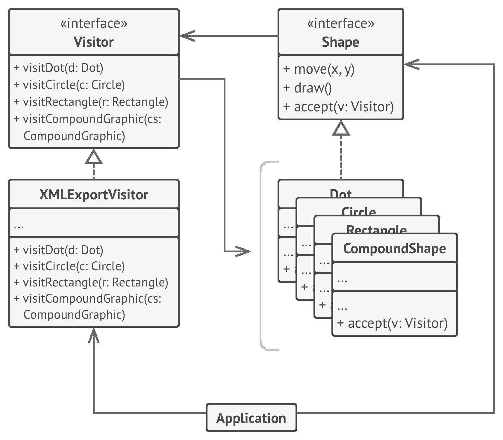

# 🏃 Visitor

Real world example

> Consider someone visiting Dubai. They just need a way (i.e. visa) to enter Dubai. After arrival, they can come and visit any place in Dubai on their own without having to ask for permission or to do some leg work in order to visit any place here; just let them know of a place and they can visit it. Visitor pattern lets you do just that, it helps you add places to visit so that they can visit as much as they can without having to do any legwork.

In plain words

> Visitor pattern lets you add further operations to objects without having to modify them.

Wikipedia says

> In object-oriented programming and software engineering, the visitor design pattern is a way of separating an algorithm from an object structure on which it operates. A practical result of this separation is the ability to add new operations to existing object structures without modifying those structures. It is one way to follow the open/closed principle.

**Programmatic example**

Let's take an example of a zoo simulation where we have several different kinds of animals and we have to make them Sound. Let's translate this using visitor pattern

```php
// Visitee
interface Animal
{
    public function accept(AnimalOperation $operation);
}

// Visitor
interface AnimalOperation
{
    public function visitMonkey(Monkey $monkey);
    public function visitLion(Lion $lion);
    public function visitDolphin(Dolphin $dolphin);
}
```

Then we have our implementations for the animals

```php
class Monkey implements Animal
{
    public function shout()
    {
        echo 'Ooh oo aa aa!';
    }

    public function accept(AnimalOperation $operation)
    {
        $operation->visitMonkey($this);
    }
}

class Lion implements Animal
{
    public function roar()
    {
        echo 'Roaaar!';
    }

    public function accept(AnimalOperation $operation)
    {
        $operation->visitLion($this);
    }
}

class Dolphin implements Animal
{
    public function speak()
    {
        echo 'Tuut tuttu tuutt!';
    }

    public function accept(AnimalOperation $operation)
    {
        $operation->visitDolphin($this);
    }
}
```

Let's implement our visitor

```php
class Speak implements AnimalOperation
{
    public function visitMonkey(Monkey $monkey)
    {
        $monkey->shout();
    }

    public function visitLion(Lion $lion)
    {
        $lion->roar();
    }

    public function visitDolphin(Dolphin $dolphin)
    {
        $dolphin->speak();
    }
}
```

And then it can be used as

```php
$monkey = new Monkey();
$lion = new Lion();
$dolphin = new Dolphin();

$speak = new Speak();

$monkey->accept($speak);    // Ooh oo aa aa!    
$lion->accept($speak);      // Roaaar!
$dolphin->accept($speak);   // Tuut tutt tuutt!
```

We could have done this simply by having an inheritance hierarchy for the animals but then we would have to modify the animals whenever we would have to add new actions to animals. But now we will not have to change them. For example, let's say we are asked to add the jump behavior to the animals, we can simply add that by creating a new visitor i.e.

```php
class Jump implements AnimalOperation
{
    public function visitMonkey(Monkey $monkey)
    {
        echo 'Jumped 20 feet high! on to the tree!';
    }

    public function visitLion(Lion $lion)
    {
        echo 'Jumped 7 feet! Back on the ground!';
    }

    public function visitDolphin(Dolphin $dolphin)
    {
        echo 'Walked on water a little and disappeared';
    }
}
```

And for the usage

```php
$jump = new Jump();

$monkey->accept($speak);   // Ooh oo aa aa!
$monkey->accept($jump);    // Jumped 20 feet high! on to the tree!

$lion->accept($speak);     // Roaaar!
$lion->accept($jump);      // Jumped 7 feet! Back on the ground!

$dolphin->accept($speak);  // Tuut tutt tuutt!
$dolphin->accept($jump);   // Walked on water a little and disappeared
```

<br>
<br>
<br>
<br>

```python
"""
Visitor Design Pattern

Intent: Lets you separate algorithms from the objects on which they operate.
"""


from __future__ import annotations
from abc import ABC, abstractmethod
from typing import List


class Component(ABC):
    """
    The Component interface declares an `accept` method that should take the
    base visitor interface as an argument.
    """

    @abstractmethod
    def accept(self, visitor: Visitor) -> None:
        pass


class ConcreteComponentA(Component):
    """
    Each Concrete Component must implement the `accept` method in such a way
    that it calls the visitor's method corresponding to the component's class.
    """

    def accept(self, visitor: Visitor) -> None:
        """
        Note that we're calling `visitConcreteComponentA`, which matches the
        current class name. This way we let the visitor know the class of the
        component it works with.
        """

        visitor.visit_concrete_component_a(self)

    def exclusive_method_of_concrete_component_a(self) -> str:
        """
        Concrete Components may have special methods that don't exist in their
        base class or interface. The Visitor is still able to use these methods
        since it's aware of the component's concrete class.
        """

        return "A"


class ConcreteComponentB(Component):
    """
    Same here: visitConcreteComponentB => ConcreteComponentB
    """

    def accept(self, visitor: Visitor):
        visitor.visit_concrete_component_b(self)

    def special_method_of_concrete_component_b(self) -> str:
        return "B"


class Visitor(ABC):
    """
    The Visitor Interface declares a set of visiting methods that correspond to
    component classes. The signature of a visiting method allows the visitor to
    identify the exact class of the component that it's dealing with.
    """

    @abstractmethod
    def visit_concrete_component_a(self, element: ConcreteComponentA) -> None:
        pass

    @abstractmethod
    def visit_concrete_component_b(self, element: ConcreteComponentB) -> None:
        pass


"""
Concrete Visitors implement several versions of the same algorithm, which can
work with all concrete component classes.

You can experience the biggest benefit of the Visitor pattern when using it with
a complex object structure, such as a Composite tree. In this case, it might be
helpful to store some intermediate state of the algorithm while executing
visitor's methods over various objects of the structure.
"""


class ConcreteVisitor1(Visitor):
    def visit_concrete_component_a(self, element) -> None:
        print(f"{element.exclusive_method_of_concrete_component_a()} + ConcreteVisitor1")

    def visit_concrete_component_b(self, element) -> None:
        print(f"{element.special_method_of_concrete_component_b()} + ConcreteVisitor1")


class ConcreteVisitor2(Visitor):
    def visit_concrete_component_a(self, element) -> None:
        print(f"{element.exclusive_method_of_concrete_component_a()} + ConcreteVisitor2")

    def visit_concrete_component_b(self, element) -> None:
        print(f"{element.special_method_of_concrete_component_b()} + ConcreteVisitor2")


def client_code(components: List[Component], visitor: Visitor) -> None:
    """
    The client code can run visitor operations over any set of elements without
    figuring out their concrete classes. The accept operation directs a call to
    the appropriate operation in the visitor object.
    """

    # ...
    for component in components:
        component.accept(visitor)
    # ...


if __name__ == "__main__":
    components = [ConcreteComponentA(), ConcreteComponentB()]

    print("The client code works with all visitors via the base Visitor interface:")
    visitor1 = ConcreteVisitor1()
    client_code(components, visitor1)

    print("It allows the same client code to work with different types of visitors:")
    visitor2 = ConcreteVisitor2()
    client_code(components, visitor2)
```

## Examples

- **XML/CSV/JSON exporter for graphic image.**
- Employee report generation.

```python
from abc import ABC, abstractmethod


class Visitable(ABC):
    @abstractmethod
    def visit(self, visitor):
        pass


class Visitor(ABC):
    @abstractmethod
    def visit_circle(self, circle):
        pass

    @abstractmethod
    def visit_dot(self, circle):
        pass

    @abstractmethod
    def visit_square(self, circle):
        pass


class Circle(Visitable):
    def visit(self, visitor):
        visitor.visit_circle(self)


class Dot(Visitable):
    def visit(self, visitor):
        visitor.visit_dot(self)


class Square(Visitable):
    def visit(self, visitor):
        visitor.visit_square(self)


class XmlExportVisitor(Visitor):
    # Implement methods for exporting to XML
    pass


class JsonExportVisitor(Visitor):
    # Implement methods for exporting to Json
    pass


class CsvExportVisitor(Visitor):
    # Implement methods for exporting to CSV
    pass


def main():
    image = [Circle(), Square(), Dot()]
    xml_visitor = XmlExportVisitor()
    for element in image:
        element.visit(xml_visitor)

    csv_visitor = CsvExportVisitor()
    for element in image:
        element.visit(csv_visitor)
```
