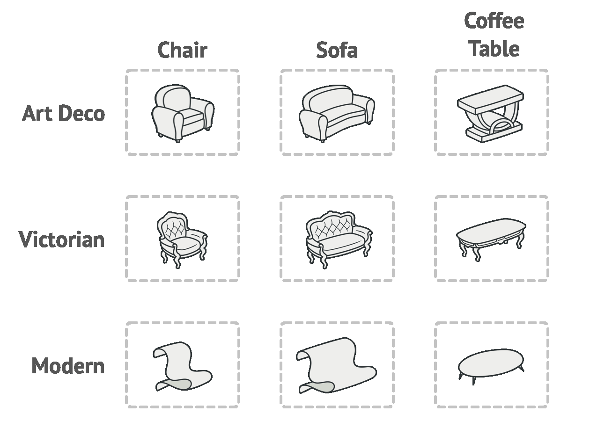
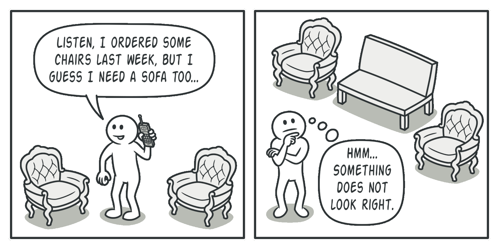
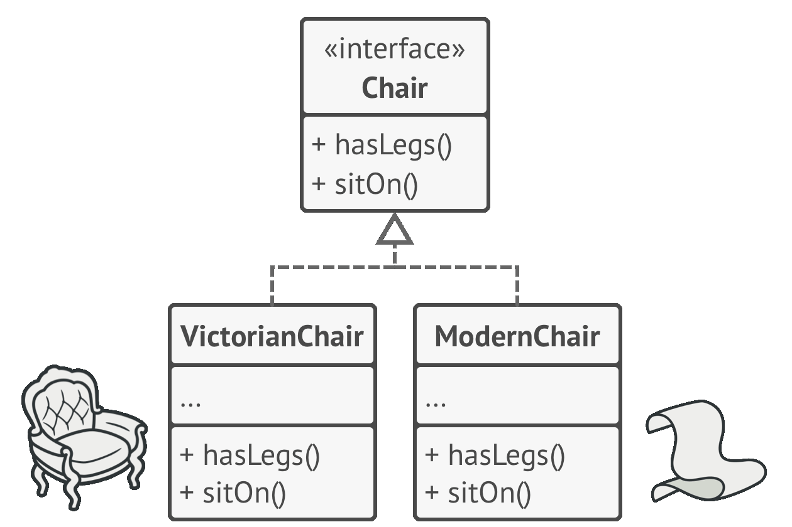
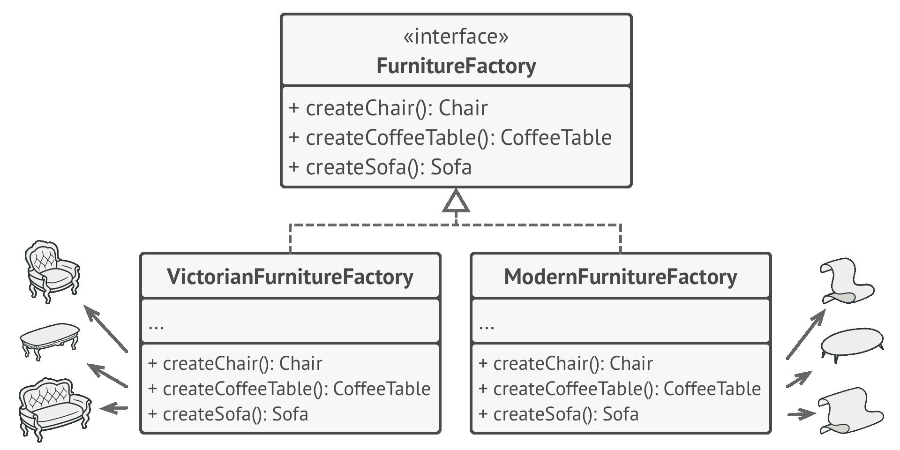
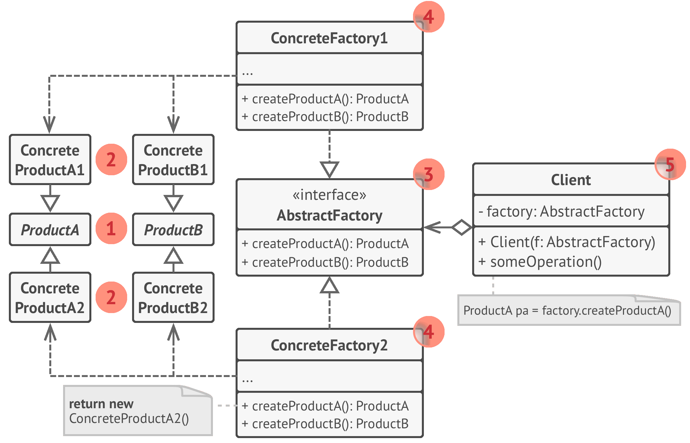
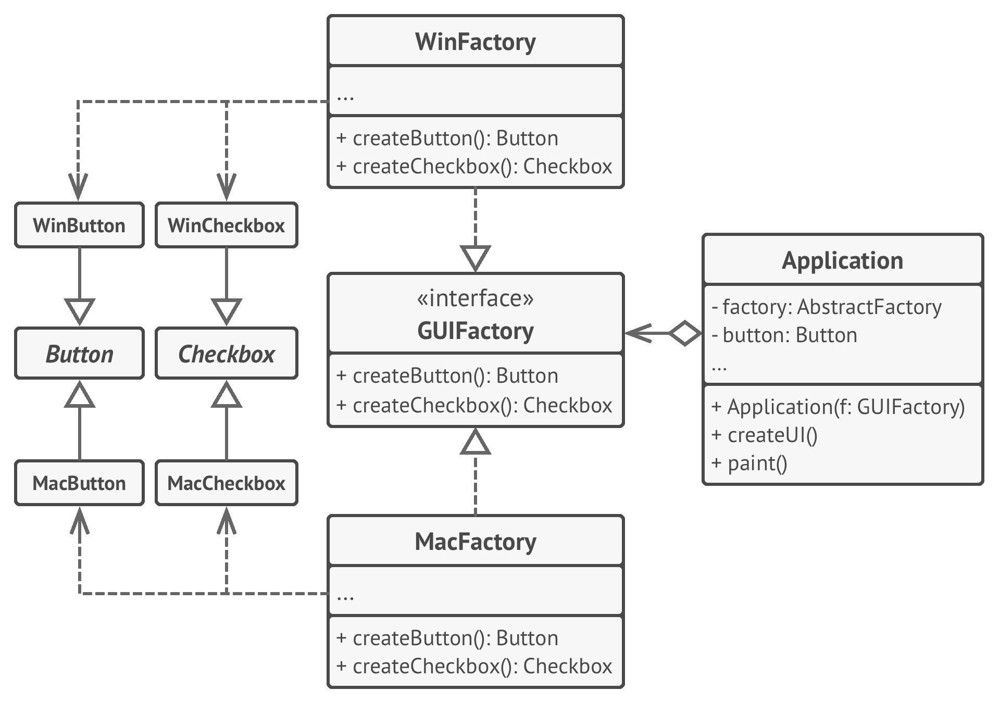

# 🔨 Abstract Factory

Real world example

> Extending our door example from Simple Factory. Based on your needs you might get a wooden door from a wooden door shop, iron door from an iron shop or a PVC door from the relevant shop. Plus you might need a guy with different kind of specialities to fit the door, for example a carpenter for wooden door, welder for iron door etc. As you can see there is a dependency between the doors now, wooden door needs carpenter, iron door needs a welder etc.

In plain words

> A factory of factories; a factory that groups the individual but related/dependent factories together without specifying their concrete classes.

Wikipedia says

> The abstract factory pattern provides a way to encapsulate a group of individual factories that have a common theme without specifying their concrete classes

**Programmatic Example**

Translating the door example above. First of all we have our `Door` interface and some implementation for it

```php
interface Door
{
    public function getDescription();
}

class WoodenDoor implements Door
{
    public function getDescription()
    {
        echo 'I am a wooden door';
    }
}

class IronDoor implements Door
{
    public function getDescription()
    {
        echo 'I am an iron door';
    }
}
```

Then we have some fitting experts for each door type

```php
interface DoorFittingExpert
{
    public function getDescription();
}

class Welder implements DoorFittingExpert
{
    public function getDescription()
    {
        echo 'I can only fit iron doors';
    }
}

class Carpenter implements DoorFittingExpert
{
    public function getDescription()
    {
        echo 'I can only fit wooden doors';
    }
}
```

Now we have our abstract factory that would let us make family of related objects i.e. wooden door factory would create a wooden door and wooden door fitting expert and iron door factory would create an iron door and iron door fitting expert

```php
interface DoorFactory
{
    public function makeDoor(): Door;
    public function makeFittingExpert(): DoorFittingExpert;
}

// Wooden factory to return carpenter and wooden door
class WoodenDoorFactory implements DoorFactory
{
    public function makeDoor(): Door
    {
        return new WoodenDoor();
    }

    public function makeFittingExpert(): DoorFittingExpert
    {
        return new Carpenter();
    }
}

// Iron door factory to get iron door and the relevant fitting expert
class IronDoorFactory implements DoorFactory
{
    public function makeDoor(): Door
    {
        return new IronDoor();
    }

    public function makeFittingExpert(): DoorFittingExpert
    {
        return new Welder();
    }
}
```

And then it can be used as

```php
$woodenFactory = new WoodenDoorFactory();

$door = $woodenFactory->makeDoor();
$expert = $woodenFactory->makeFittingExpert();

$door->getDescription();  // Output: I am a wooden door
$expert->getDescription(); // Output: I can only fit wooden doors

// Same for Iron Factory
$ironFactory = new IronDoorFactory();

$door = $ironFactory->makeDoor();
$expert = $ironFactory->makeFittingExpert();

$door->getDescription();  // Output: I am an iron door
$expert->getDescription(); // Output: I can only fit iron doors
```

As you can see the wooden door factory has encapsulated the `carpenter` and the `wooden door` also iron door factory has encapsulated the `iron door` and `welder`. And thus it had helped us make sure that for each of the created door, we do not get a wrong fitting expert.

**When to use?**

When there are interrelated dependencies with not-that-simple creation logic involved.

<br>
<br>
<br>
<br>
<br>


```python
"""
Abstract Factory Design Pattern

Intent: Lets you produce families of related objects without specifying their
concrete classes.
"""


from __future__ import annotations
from abc import ABC, abstractmethod


class AbstractFactory(ABC):
    """
    The Abstract Factory interface declares a set of methods that return
    different abstract products. These products are called a family and are
    related by a high-level theme or concept. Products of one family are usually
    able to collaborate among themselves. A family of products may have several
    variants, but the products of one variant are incompatible with products of
    another.
    """
    @abstractmethod
    def create_product_a(self) -> AbstractProductA:
        pass

    @abstractmethod
    def create_product_b(self) -> AbstractProductB:
        pass


class ConcreteFactory1(AbstractFactory):
    """
    Concrete Factories produce a family of products that belong to a single
    variant. The factory guarantees that resulting products are compatible. Note
    that signatures of the Concrete Factory's methods return an abstract
    product, while inside the method a concrete product is instantiated.
    """

    def create_product_a(self) -> ConcreteProductA1:
        return ConcreteProductA1()

    def create_product_b(self) -> ConcreteProductB1:
        return ConcreteProductB1()


class ConcreteFactory2(AbstractFactory):
    """
    Each Concrete Factory has a corresponding product variant.
    """

    def create_product_a(self) -> ConcreteProductA2:
        return ConcreteProductA2()

    def create_product_b(self) -> ConcreteProductB2:
        return ConcreteProductB2()


class AbstractProductA(ABC):
    """
    Each distinct product of a product family should have a base interface. All
    variants of the product must implement this interface.
    """

    @abstractmethod
    def useful_function_a(self) -> str:
        pass


"""
Concrete Products are created by corresponding Concrete Factories.
"""


class ConcreteProductA1(AbstractProductA):
    def useful_function_a(self) -> str:
        return "The result of the product A1."


class ConcreteProductA2(AbstractProductA):
    def useful_function_a(self) -> str:
        return "The result of the product A2."


class AbstractProductB(ABC):
    """
    Here's the the base interface of another product. All products can interact
    with each other, but proper interaction is possible only between products of
    the same concrete variant.
    """
    @abstractmethod
    def useful_function_b(self) -> None:
        """
        Product B is able to do its own thing...
        """
        pass

    @abstractmethod
    def another_useful_function_b(self, collaborator: AbstractProductA) -> None:
        """
        ...but it also can collaborate with the ProductA.

        The Abstract Factory makes sure that all products it creates are of the
        same variant and thus, compatible.
        """
        pass


"""
Concrete Products are created by corresponding Concrete Factories.
"""


class ConcreteProductB1(AbstractProductB):
    def useful_function_b(self) -> str:
        return "The result of the product B1."

    """
    The variant, Product B1, is only able to work correctly with the variant,
    Product A1\. Nevertheless, it accepts any instance of AbstractProductA as an
    argument.
    """

    def another_useful_function_b(self, collaborator: AbstractProductA) -> str:
        result = collaborator.useful_function_a()
        return f"The result of the B1 collaborating with the ({result})"


class ConcreteProductB2(AbstractProductB):
    def useful_function_b(self) -> str:
        return "The result of the product B2."

    def another_useful_function_b(self, collaborator: AbstractProductA):
        """
        The variant, Product B2, is only able to work correctly with the
        variant, Product A2\. Nevertheless, it accepts any instance of
        AbstractProductA as an argument.
        """
        result = collaborator.useful_function_a()
        return f"The result of the B2 collaborating with the ({result})"


def client_code(factory: AbstractFactory) -> None:
    """
    The client code works with factories and products only through abstract
    types: AbstractFactory and AbstractProduct. This lets you pass any factory
    or product subclass to the client code without breaking it.
    """
    product_a = factory.create_product_a()
    product_b = factory.create_product_b()

    print(f"{product_b.useful_function_b()}")
    print(f"{product_b.another_useful_function_b(product_a)}", end="")


if __name__ == "__main__":
    """
    The client code can work with any concrete factory class.
    """
    print("Client: Testing client code with the first factory type:")
    client_code(ConcreteFactory1())

    print("\n")

    print("Client: Testing the same client code with the second factory type:")
    client_code(ConcreteFactory2())
```

```python
from abc import ABC, abstractmethod


class GuiFactory(ABC):
    @abstractmethod
    def create_button(self):
        pass

    @abstractmethod
    def create_dialog(self):
        pass

    @abstractmethod
    def create_window(self):
        pass


class WindowsGuiFactory(GuiFactory):
    def create_button(self):
        pass

    def create_dialog(self):
        pass

    def create_window(self):
        pass


class MacGuiFactory(GuiFactory):
    def create_button(self):
        pass

    def create_dialog(self):
        pass

    def create_window(self):
        pass
```
