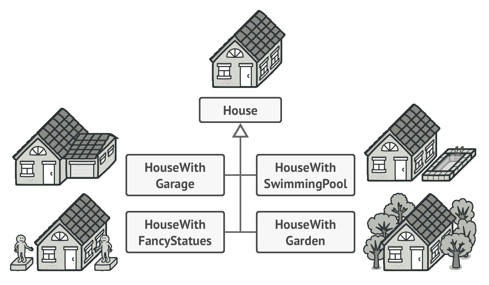
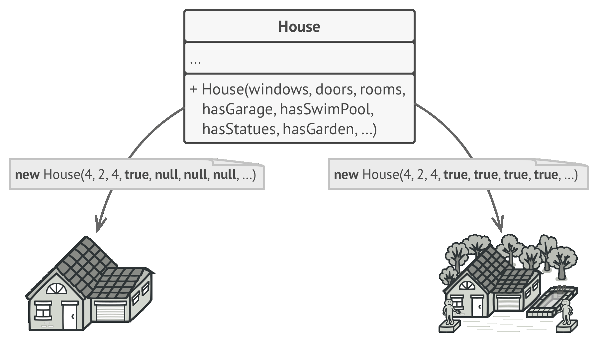
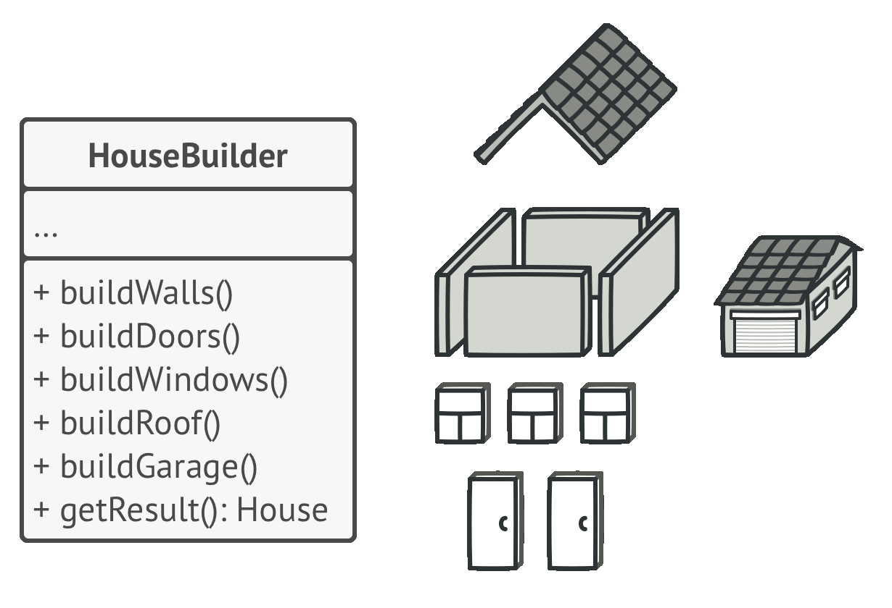
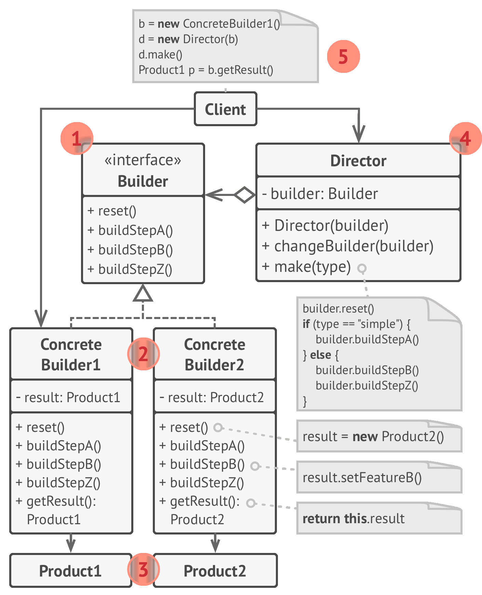
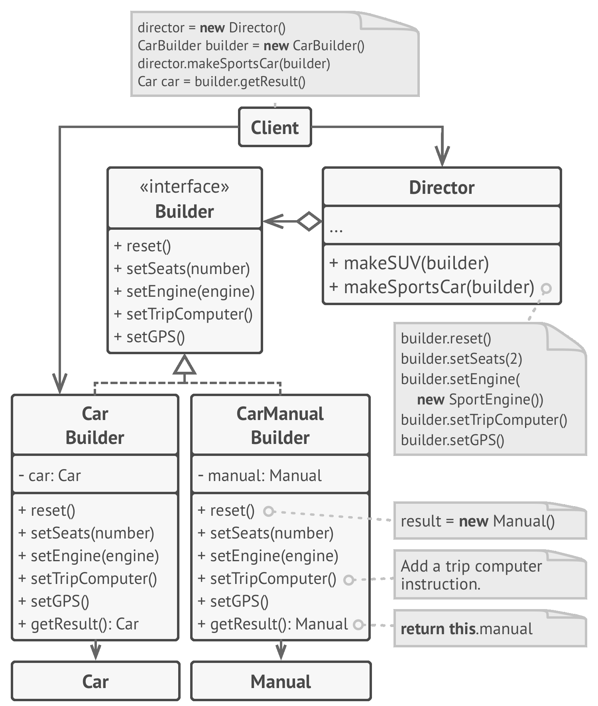

# 👷 Builder

Real world example

> Imagine you are at Hardee's and you order a specific deal, lets say, "Big Hardee" and they hand it over to you without _any questions_; this is the example of simple factory. But there are cases when the creation logic might involve more steps. For example you want a customized Subway deal, you have several options in how your burger is made e.g what bread do you want? what types of sauces would you like? What cheese would you want? etc. In such cases builder pattern comes to the rescue.

In plain words

> Allows you to create different flavors of an object while avoiding constructor pollution. Useful when there could be several flavors of an object. Or when there are a lot of steps involved in creation of an object.

Wikipedia says

> The builder pattern is an object creation software design pattern with the intentions of finding a solution to the telescoping constructor anti-pattern.

Having said that let me add a bit about what telescoping constructor anti-pattern is. At one point or the other we have all seen a constructor like below:

```php
public function __construct($size, $cheese = true, $pepperoni = true, $tomato = false, $lettuce = true)
{
}
```

As you can see; the number of constructor parameters can quickly get out of hand and it might become difficult to understand the arrangement of parameters. Plus this parameter list could keep on growing if you would want to add more options in future. This is called telescoping constructor anti-pattern.

**Programmatic Example**

The sane alternative is to use the builder pattern. First of all we have our burger that we want to make

```php
class Burger
{
    protected $size;

    protected $cheese = false;
    protected $pepperoni = false;
    protected $lettuce = false;
    protected $tomato = false;

    public function __construct(BurgerBuilder $builder)
    {
        $this->size = $builder->size;
        $this->cheese = $builder->cheese;
        $this->pepperoni = $builder->pepperoni;
        $this->lettuce = $builder->lettuce;
        $this->tomato = $builder->tomato;
    }
}
```

And then we have the builder

```php
class BurgerBuilder
{
    public $size;

    public $cheese = false;
    public $pepperoni = false;
    public $lettuce = false;
    public $tomato = false;

    public function __construct(int $size)
    {
        $this->size = $size;
    }

    public function addPepperoni()
    {
        $this->pepperoni = true;
        return $this;
    }

    public function addLettuce()
    {
        $this->lettuce = true;
        return $this;
    }

    public function addCheese()
    {
        $this->cheese = true;
        return $this;
    }

    public function addTomato()
    {
        $this->tomato = true;
        return $this;
    }

    public function build(): Burger
    {
        return new Burger($this);
    }
}
```

And then it can be used as:

```php
$burger = (new BurgerBuilder(14))
                    ->addPepperoni()
                    ->addLettuce()
                    ->addTomato()
                    ->build();
```

**When to use?**

When there could be several flavors of an object and to avoid the constructor telescoping. The key difference from the factory pattern is that; factory pattern is to be used when the creation is a one step process while builder pattern is to be used when the creation is a multi step process.

<br>
<br>
<br>
<br>


```python
"""
Builder Design Pattern

Intent: Lets you construct complex objects step by step. The pattern allows you
to produce different types and representations of an object using the same
construction code.
"""


from __future__ import annotations
from abc import ABC, abstractmethod, abstractproperty
from typing import Any


class Builder(ABC):
    """
    The Builder interface specifies methods for creating the different parts of
    the Product objects.
    """

    @abstractproperty
    def product(self) -> None:
        pass

    @abstractmethod
    def produce_part_a(self) -> None:
        pass

    @abstractmethod
    def produce_part_b(self) -> None:
        pass

    @abstractmethod
    def produce_part_c(self) -> None:
        pass


class ConcreteBuilder1(Builder):
    """
    The Concrete Builder classes follow the Builder interface and provide
    specific implementations of the building steps. Your program may have
    several variations of Builders, implemented differently.
    """

    def __init__(self) -> None:
        """
        A fresh builder instance should contain a blank product object, which is
        used in further assembly.
        """
        self.reset()

    def reset(self) -> None:
        self._product = Product1()

    @property
    def product(self) -> Product1:
        """
        Concrete Builders are supposed to provide their own methods for
        retrieving results. That's because various types of builders may create
        entirely different products that don't follow the same interface.
        Therefore, such methods cannot be declared in the base Builder interface
        (at least in a statically typed programming language).

        Usually, after returning the end result to the client, a builder
        instance is expected to be ready to start producing another product.
        That's why it's a usual practice to call the reset method at the end of
        the `getProduct` method body. However, this behavior is not mandatory,
        and you can make your builders wait for an explicit reset call from the
        client code before disposing of the previous result.
        """
        product = self._product
        self.reset()
        return product

    def produce_part_a(self) -> None:
        self._product.add("PartA1")

    def produce_part_b(self) -> None:
        self._product.add("PartB1")

    def produce_part_c(self) -> None:
        self._product.add("PartC1")


class Product1():
    """
    It makes sense to use the Builder pattern only when your products are quite
    complex and require extensive configuration.

    Unlike in other creational patterns, different concrete builders can produce
    unrelated products. In other words, results of various builders may not
    always follow the same interface.
    """

    def __init__(self) -> None:
        self.parts = []

    def add(self, part: Any) -> None:
        self.parts.append(part)

    def list_parts(self) -> None:
        print(f"Product parts: {', '.join(self.parts)}", end="")


class Director:
    """
    The Director is only responsible for executing the building steps in a
    particular sequence. It is helpful when producing products according to a
    specific order or configuration. Strictly speaking, the Director class is
    optional, since the client can control builders directly.
    """

    def __init__(self) -> None:
        self._builder = None

    @property
    def builder(self) -> Builder:
        return self._builder

    @builder.setter
    def builder(self, builder: Builder) -> None:
        """
        The Director works with any builder instance that the client code passes
        to it. This way, the client code may alter the final type of the newly
        assembled product.
        """
        self._builder = builder

    """
    The Director can construct several product variations using the same
    building steps.
    """

    def build_minimal_viable_product(self) -> None:
        self.builder.produce_part_a()

    def build_full_featured_product(self) -> None:
        self.builder.produce_part_a()
        self.builder.produce_part_b()
        self.builder.produce_part_c()


if __name__ == "__main__":
    """
    The client code creates a builder object, passes it to the director and then
    initiates the construction process. The end result is retrieved from the
    builder object.
    """

    director = Director()
    builder = ConcreteBuilder1()
    director.builder = builder

    print("Standard basic product: ")
    director.build_minimal_viable_product()
    builder.product.list_parts()

    print("\n")

    print("Standard full featured product: ")
    director.build_full_featured_product()
    builder.product.list_parts()

    print("\n")

    # Remember, the Builder pattern can be used without a Director class.
    print("Custom product: ")
    builder.produce_part_a()
    builder.produce_part_b()
    builder.product.list_parts()
```

# Examples:

- SQL Builder -> Fantastic example.
- Car factory.

```python
from abc import ABC, abstractmethod


class SQLQueryBuilder(ABC):
    def __init__(self):
        self.fields = None
        self.table = None
        self.conditions = []
        self.limit_start = None
        self.limit_offset = None

    @abstractmethod
    def select(self, fields, table):
        pass

    @abstractmethod
    def where(self, name, value, operator="="):
        pass

    @abstractmethod
    def limit(self, start, offset):
        pass

    @abstractmethod
    def get_sql(self):
        pass

    # .. Implementing tens of more functions.


class MySQLQueryBuilder(SQLQueryBuilder):
    def select(self, fields, table):
        self.fields, self.table = fields, table
        return self

    def where(self, name, value, operator="="):
        self.conditions.append((name, value, operator))
        return self

    def limit(self, start, offset):
        self.limit_start, self.limit_offset = start, offset
        return self

    def get_sql(self):
        query = f'SELECT {",".join(self.fields)} FROM {self.table} '
        conditions_list = []
        for condition in self.conditions:
            conditions_list.append(f"{condition[0]}{condition[2]}{condition[1]}")
        query += f'WHERE {" AND ".join(conditions_list)} '
        query += f"LIMIT {self.limit_start} {self.limit_offset}"
        return query


def main():
    builder = MySQLQueryBuilder()
    sql = (
        builder.select(["name", "age"], "students")
        .where("name", "Anmol", "=")
        .where("age", "24", "<=")
        .limit(10, 20)
        .get_sql()
    )
    print(sql)


if __name__ == "__main__":
    main()
```

```python
from abc import ABC, abstractmethod


class Car:
    def __init__(self):
        self.engine = None
        self.num_doors = None
        self.color = None

    def __repr__(self):
        return f"{self.engine}-{self.num_doors}-{self.color}"


class CarBuilder(ABC):
    def __init__(self):
        self.car = Car()

    def set_engine(self, engine):
        self.car.engine = engine
        return self

    def set_doors(self, doors):
        self.car.num_doors = doors
        return self

    def set_color(self, color):
        self.car.color = color
        return self


class Director:
    def make_sports_car(self, builder):
        builder.set_doors(2).set_engine("sports-engine-object").set_color("red")

    def make_suv(self, builder):
        builder.set_doors(4).set_engine("suv-engine-object").set_color("black")

    def make_sedan(self, builder):
        builder.set_doors(4).set_engine("sedan-engine-object").set_color("white")


def main():
    builder = CarBuilder()
    director = Director()
    director.make_sports_car(builder)
    car = builder.car
    print(car)
```
