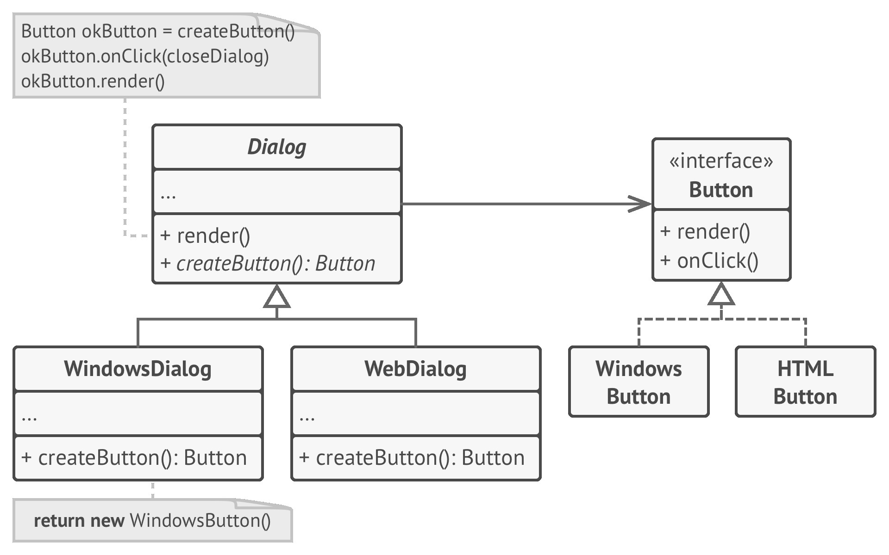
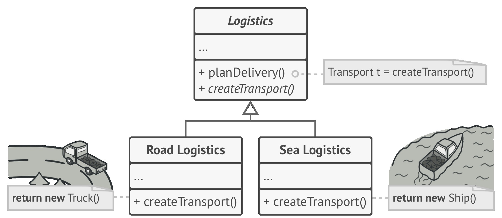
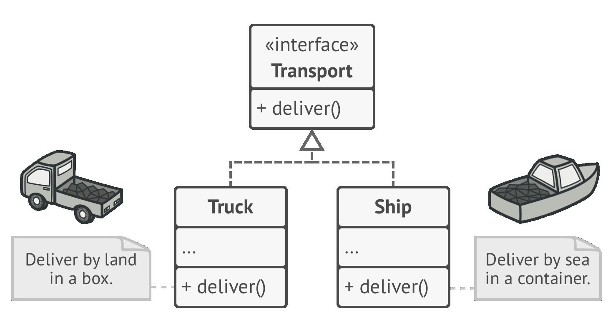
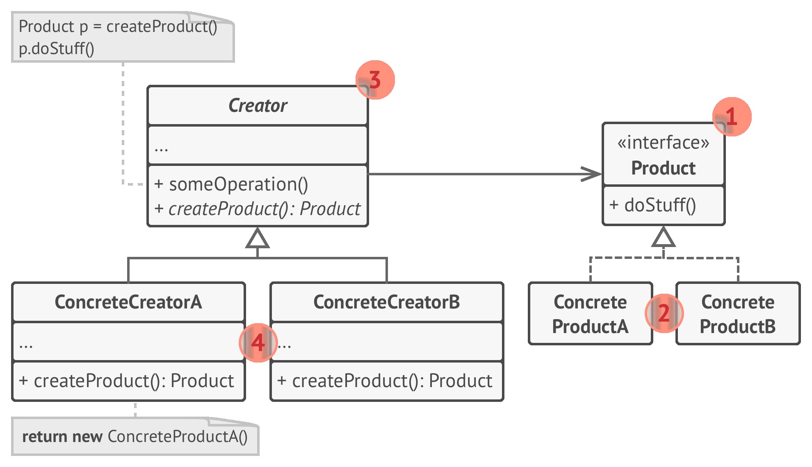

# 🏭 Factory Method

Real world example

> Consider the case of a hiring manager. It is impossible for one person to interview for each of the positions. Based on the job opening, she has to decide and delegate the interview steps to different people.

In plain words

> It provides a way to delegate the instantiation logic to child classes.

Wikipedia says

> In class-based programming, the factory method pattern is a creational pattern that uses factory methods to deal with the problem of creating objects without having to specify the exact class of the object that will be created. This is done by creating objects by calling a factory method--either specified in an interface and implemented by child classes, or implemented in a base class and optionally overridden by derived classes--rather than by calling a constructor.

**Programmatic Example**

Taking our hiring manager example above. First of all we have an interviewer interface and some implementations for it

```php
interface Interviewer
{
    public function askQuestions();
}

class Developer implements Interviewer
{
    public function askQuestions()
    {
        echo 'Asking about design patterns!';
    }
}

class CommunityExecutive implements Interviewer
{
    public function askQuestions()
    {
        echo 'Asking about community building';
    }
}
```

Now let us create our `HiringManager`

```php
abstract class HiringManager
{

    // Factory method
    abstract protected function makeInterviewer(): Interviewer;

    public function takeInterview()
    {
        $interviewer = $this->makeInterviewer();
        $interviewer->askQuestions();
    }
}
```

Now any child can extend it and provide the required interviewer

```php
class DevelopmentManager extends HiringManager
{
    protected function makeInterviewer(): Interviewer
    {
        return new Developer();
    }
}

class MarketingManager extends HiringManager
{
    protected function makeInterviewer(): Interviewer
    {
        return new CommunityExecutive();
    }
}
```

and then it can be used as

```php
$devManager = new DevelopmentManager();
$devManager->takeInterview(); // Output: Asking about design patterns

$marketingManager = new MarketingManager();
$marketingManager->takeInterview(); // Output: Asking about community building.
```

**When to use?**

Useful when there is some generic processing in a class but the required sub-class is dynamically decided at runtime. Or putting it in other words, when the client doesn't know what exact sub-class it might need.









```python
"""
Factory Method Design Pattern

Intent: Provides an interface for creating objects in a superclass, but allows
subclasses to alter the type of objects that will be created.
"""


from __future__ import annotations
from abc import ABC, abstractmethod


class Creator(ABC):
    """
    The Creator class declares the factory method that is supposed to return an
    object of a Product class. The Creator's subclasses usually provide the
    implementation of this method.
    """

    @abstractmethod
    def factory_method(self):
        """
        Note that the Creator may also provide some default implementation of
        the factory method.
        """
        pass

    def some_operation(self) -> str:
        """
        Also note that, despite its name, the Creator's primary responsibility
        is not creating products. Usually, it contains some core business logic
        that relies on Product objects, returned by the factory method.
        Subclasses can indirectly change that business logic by overriding the
        factory method and returning a different type of product from it.
        """

        # Call the factory method to create a Product object.
        product = self.factory_method()

        # Now, use the product.
        result = f"Creator: The same creator's code has just worked with {product.operation()}"

        return result


"""
Concrete Creators override the factory method in order to change the resulting
product's type.
"""


class ConcreteCreator1(Creator):
    """
    Note that the signature of the method still uses the abstract product type,
    even though the concrete product is actually returned from the method. This
    way the Creator can stay independent of concrete product classes.
    """

    def factory_method(self) -> ConcreteProduct1:
        return ConcreteProduct1()


class ConcreteCreator2(Creator):
    def factory_method(self) -> ConcreteProduct2:
        return ConcreteProduct2()


class Product(ABC):
    """
    The Product interface declares the operations that all concrete products
    must implement.
    """

    @abstractmethod
    def operation(self) -> str:
        pass


"""
Concrete Products provide various implementations of the Product interface.
"""


class ConcreteProduct1(Product):
    def operation(self) -> str:
        return "{Result of the ConcreteProduct1}"


class ConcreteProduct2(Product):
    def operation(self) -> str:
        return "{Result of the ConcreteProduct2}"


def client_code(creator: Creator) -> None:
    """
    The client code works with an instance of a concrete creator, albeit through
    its base interface. As long as the client keeps working with the creator via
    the base interface, you can pass it any creator's subclass.
    """

    print(f"Client: I'm not aware of the creator's class, but it still works.\n"
          f"{creator.some_operation()}", end="")


if __name__ == "__main__":
    print("App: Launched with the ConcreteCreator1.")
    client_code(ConcreteCreator1())
    print("\n")

    print("App: Launched with the ConcreteCreator2.")
    client_code(ConcreteCreator2())
```

```python
from abc import ABC, abstractmethod


class Compressor(ABC):
    @abstractmethod
    def compress(self, content):
        pass


class ZipCompressor(Compressor):
    def compress(self, content):
        # Implement
        pass


class RarCompressor(Compressor):
    def compress(self, content):
        # Implement
        pass


class Encryptor(ABC):
    @abstractmethod
    def encrypt(self, content):
        pass


class CaesarEncryptor(Encryptor):
    def encrypt(self, content):
        # Implement
        pass


class AssymetricEncryptor(Encryptor):
    def encrypt(self, content):
        # Implement
        pass


class Writer(ABC):
    def write(self, content, path):
        encryptor = self.create_encryptor()
        compressor = self.create_compressor()
        content = compressor.compress(content)
        content = encryptor.encrypt(content)
        self.write_to_file(content, path)

    def write_to_file(self, content, path):
        # Default implementation
        pass

    @abstractmethod
    def create_encryptor(self):
        pass

    @abstractmethod
    def create_compressor(self):
        pass


class ConcreteWriter1(Writer):
    def create_encryptor(self):
        return AssymetricEncryptor()

    def create_compressor(self):
        return ZipCompressor()


class ConcreteWriter2(Writer):
    def create_encryptor(self):
        return CaesarEncryptor()

    def create_compressor(self):
        return RarCompressor()


class ConcreteWriter3(Writer):
    def create_encryptor(self):
        return AssymetricEncryptor()

    def create_compressor(self):
        return RarCompressor()


def main():
    creator = ConcreteWriter1()
    creator.wr("content", "/root/a.pdf")


if __name__ == "__main__":
    main()
```

```python
from abc import ABC, abstractmethod


class Document(ABC):
    @abstractmethod
    def write_content(self, content):
        pass

    @abstractmethod
    def get_content(self):
        pass


class PdfDocument(Document):
    def write_content(self, content):
        # Some implementation
        pass

    def get_content(self):
        # Some implementation
        pass


class HtmlDocument(Document):
    def write_content(self, content):
        # Some implementation
        pass

    def get_content(self):
        # Some implementation
        pass


class DocumentCreator(ABC):
    def export_doc(self, content, path):
        doc = self.create_doc()
        doc.write_content(content)
        self.write_to_file(doc.get_content())

    @abstractmethod
    def create_doc(self):
        pass


class PdfDocumentCreator(DocumentCreator):
    def create_doc(self, content):
        return PdfDocument(content)


class HtmlDocumentCreator(DocumentCreator):
    def create_doc(self, content):
        return HtmlDocument(content)


def main():
    creator = PdfDocumentCreator()
    creator.export_doc("content", "/root/a.pdf")


if __name__ == "__main__":
    main()
```
