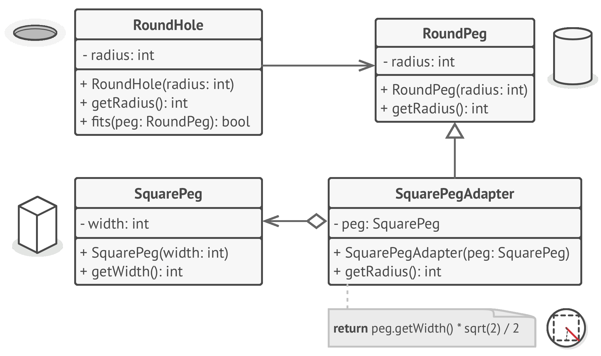

# 🔌 Adapter

Real world example

> Consider that you have some pictures in your memory card and you need to transfer them to your computer. In order to transfer them you need some kind of adapter that is compatible with your computer ports so that you can attach memory card to your computer. In this case card reader is an adapter. Another example would be the famous power adapter; a three legged plug can't be connected to a two pronged outlet, it needs to use a power adapter that makes it compatible with the two pronged outlet. Yet another example would be a translator translating words spoken by one person to another

In plain words

> Adapter pattern lets you wrap an otherwise incompatible object in an adapter to make it compatible with another class.

Wikipedia says

> In software engineering, the adapter pattern is a software design pattern that allows the interface of an existing class to be used as another interface. It is often used to make existing classes work with others without modifying their source code.

**Programmatic Example**

Consider a game where there is a hunter and he hunts lions.

First we have an interface `Lion` that all types of lions have to implement

```php
interface Lion
{
    public function roar();
}

class AfricanLion implements Lion
{
    public function roar()
    {
    }
}

class AsianLion implements Lion
{
    public function roar()
    {
    }
}
```

And hunter expects any implementation of `Lion` interface to hunt.

```php
class Hunter
{
    public function hunt(Lion $lion)
    {
        $lion->roar();
    }
}
```

Now let's say we have to add a `WildDog` in our game so that hunter can hunt that also. But we can't do that directly because dog has a different interface. To make it compatible for our hunter, we will have to create an adapter that is compatible

```php
// This needs to be added to the game
class WildDog
{
    public function bark()
    {
    }
}

// Adapter around wild dog to make it compatible with our game
class WildDogAdapter implements Lion
{
    protected $dog;

    public function __construct(WildDog $dog)
    {
        $this->dog = $dog;
    }

    public function roar()
    {
        $this->dog->bark();
    }
}
```

And now the `WildDog` can be used in our game using `WildDogAdapter`.

```php
$wildDog = new WildDog();
$wildDogAdapter = new WildDogAdapter($wildDog);

$hunter = new Hunter();
$hunter->hunt($wildDogAdapter);
```



```python
"""
Adapter Design Pattern

Intent: Provides a unified interface that allows objects with incompatible
interfaces to collaborate.
"""


class Target():
    """
    The Target defines the domain-specific interface used by the client code.
    """

    def request(self) -> str:
        return "Target: The default target's behavior."


class Adaptee:
    """
    The Adaptee contains some useful behavior, but its interface is incompatible
    with the existing client code. The Adaptee needs some adaptation before the
    client code can use it.
    """

    def specific_request(self) -> str:
        return ".eetpadA eht fo roivaheb laicepS"


class Adapter(Target):
    """
    The Adapter makes the Adaptee's interface compatible with the Target's
    interface.
    """

    def __init__(self, adaptee: Adaptee) -> None:
        self.adaptee = adaptee

    def request(self) -> str:
        return f"Adapter: (TRANSLATED) {self.adaptee.specific_request()[::-1]}"


def client_code(target: Target) -> None:
    """
    The client code supports all classes that follow the Target interface.
    """

    print(target.request(), end="")


if __name__ == "__main__":
    print("Client: I can work just fine with the Target objects:")
    target = Target()
    client_code(target)
    print("\n")

    adaptee = Adaptee()
    print("Client: The Adaptee class has a weird interface. See, I don't understand it:")
    print(f"Adaptee: {adaptee.specific_request()}", end="\n\n")

    print("Client: But I can work with it via the Adapter:")
    adapter = Adapter(adaptee)
    client_code(adapter)
```

```python
from abc import ABC, abstractmethod


class Notification(ABC):
    @abstractmethod
    def send(self, message, title, receiver):
        pass


class EmailNotification(Notification):
    def send(self, message, title, receiver):
        pass


class SlackApi():
    def login(self, user, password):
        pass

    def send_message(self, message, receiver):
        pass


class SlackNotification(Notification):
    def __init__(self, slack_api, user, password):
        self.slack_api = slack_api
        self.user = user
        self.password = password

    def send(self, message, title, receiver):
        self.slack_api.login(self.user, self.password)
        message = title + ": " + message
        self.slack_api.send_message(message, receiver)
```
