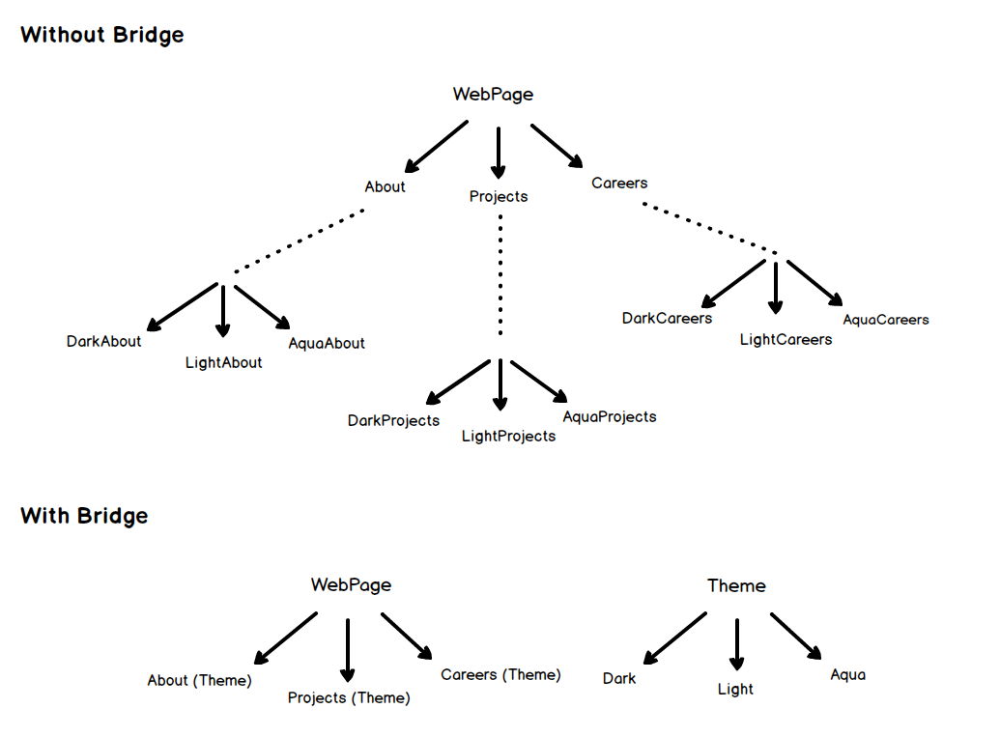
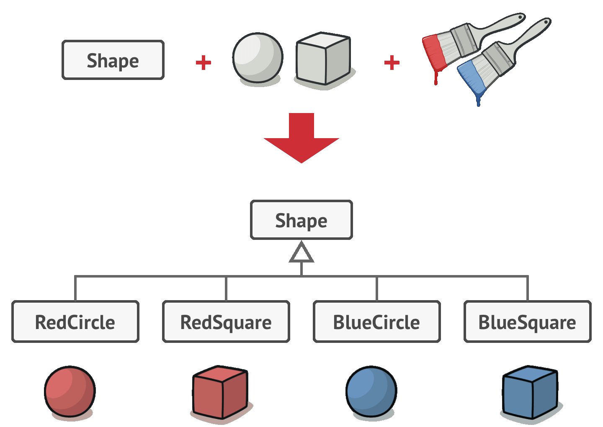
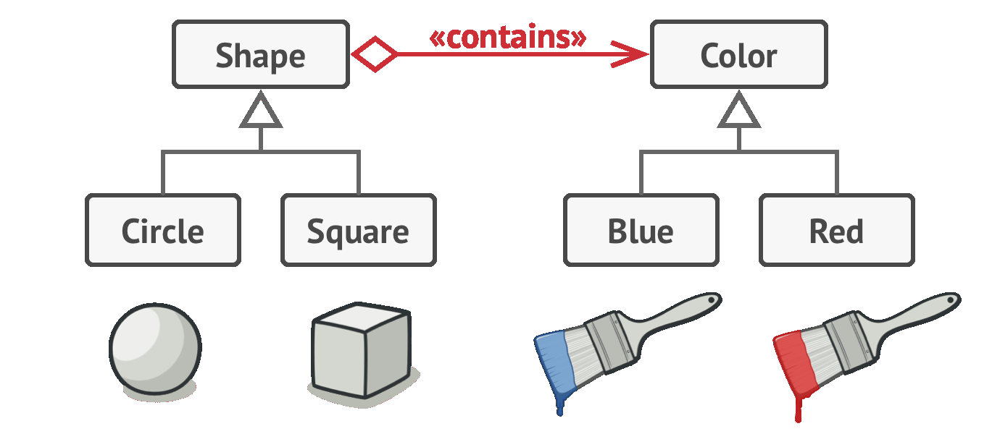
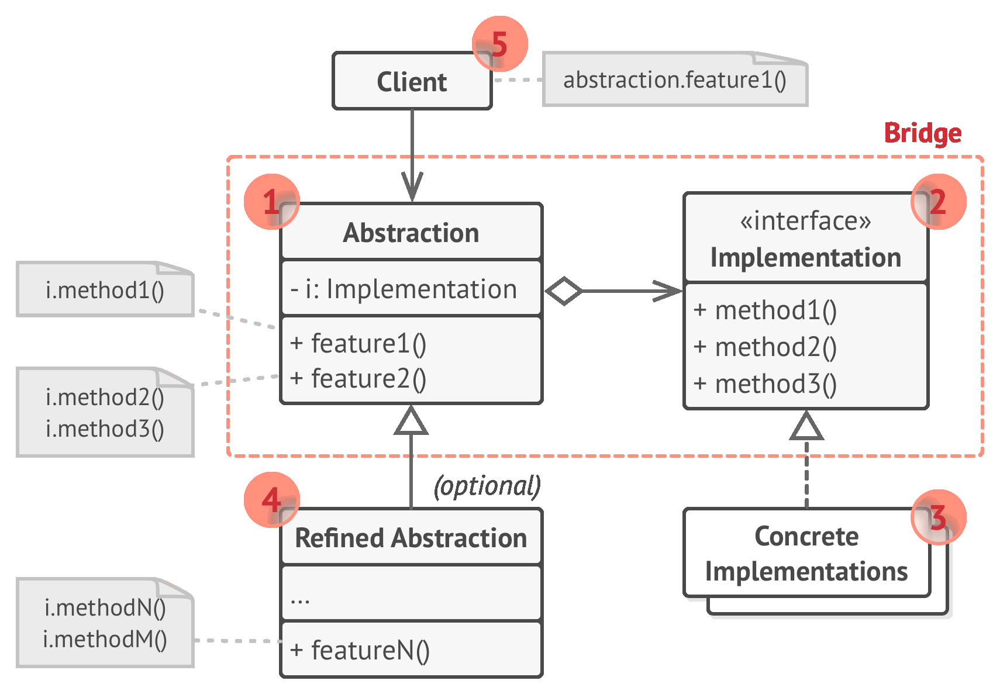
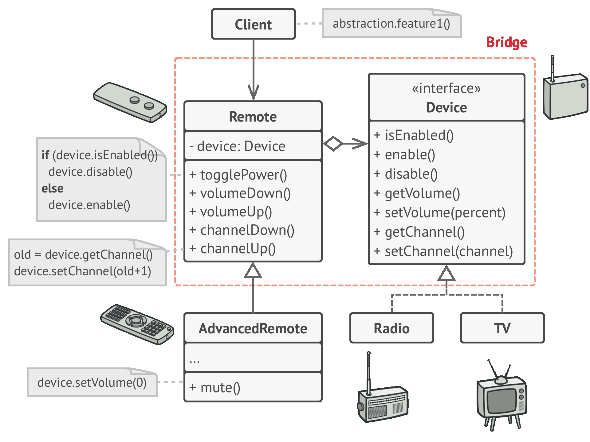

# 🚡 Bridge

Real world example

> Consider you have a website with different pages and you are supposed to allow the user to change the theme. What would you do? Create multiple copies of each of the pages for each of the themes or would you just create separate theme and load them based on the user's preferences? Bridge pattern allows you to do the second i.e.



In Plain Words

> Bridge pattern is about preferring composition over inheritance. Implementation details are pushed from a hierarchy to another object with a separate hierarchy.

Wikipedia says

> The bridge pattern is a design pattern used in software engineering that is meant to "decouple an abstraction from its implementation so that the two can vary independently"

**Programmatic Example**

Translating our WebPage example from above. Here we have the `WebPage` hierarchy

```php
interface WebPage
{
    public function __construct(Theme $theme);
    public function getContent();
}

class About implements WebPage
{
    protected $theme;

    public function __construct(Theme $theme)
    {
        $this->theme = $theme;
    }

    public function getContent()
    {
        return "About page in " . $this->theme->getColor();
    }
}

class Careers implements WebPage
{
    protected $theme;

    public function __construct(Theme $theme)
    {
        $this->theme = $theme;
    }

    public function getContent()
    {
        return "Careers page in " . $this->theme->getColor();
    }
}
```

And the separate theme hierarchy

```php
interface Theme
{
    public function getColor();
}

class DarkTheme implements Theme
{
    public function getColor()
    {
        return 'Dark Black';
    }
}
class LightTheme implements Theme
{
    public function getColor()
    {
        return 'Off white';
    }
}
class AquaTheme implements Theme
{
    public function getColor()
    {
        return 'Light blue';
    }
}
```

And both the hierarchies

```php
$darkTheme = new DarkTheme();

$about = new About($darkTheme);
$careers = new Careers($darkTheme);

echo $about->getContent(); // "About page in Dark Black";
echo $careers->getContent(); // "Careers page in Dark Black";
```

<br>
<br>
<br>


```python
"""
Bridge Design Pattern

Intent: Lets you split a large class or a set of closely related classes into
two separate hierarchies—abstraction and implementation—which can be developed
independently of each other.

              A
           /     \                        A         N
         Aa      Ab        ===>        /     \     / \
        / \     /  \                 Aa(N) Ab(N)  1   2
      Aa1 Aa2  Ab1 Ab2
"""


from __future__ import annotations
from abc import ABC, abstractmethod


class Abstraction:
    """
    The Abstraction defines the interface for the "control" part of the two
    class hierarchies. It maintains a reference to an object of the
    Implementation hierarchy and delegates all of the real work to this object.
    """

    def __init__(self, implementation: Implementation) -> None:
        self.implementation = implementation

    def operation(self) -> str:
        return (f"Abstraction: Base operation with:\n"
                f"{self.implementation.operation_implementation()}")


class ExtendedAbstraction(Abstraction):
    """
    You can extend the Abstraction without changing the Implementation classes.
    """

    def operation(self) -> str:
        return (f"ExtendedAbstraction: Extended operation with:\n"
                f"{self.implementation.operation_implementation()}")


class Implementation(ABC):
    """
    The Implementation defines the interface for all implementation classes. It
    doesn't have to match the Abstraction's interface. In fact, the two
    interfaces can be entirely different. Typically the Implementation interface
    provides only primitive operations, while the Abstraction defines higher-
    level operations based on those primitives.
    """

    @abstractmethod
    def operation_implementation(self) -> str:
        pass


"""
Each Concrete Implementation corresponds to a specific platform and implements
the Implementation interface using that platform's API.
"""


class ConcreteImplementationA(Implementation):
    def operation_implementation(self) -> str:
        return "ConcreteImplementationA: Here's the result on the platform A."


class ConcreteImplementationB(Implementation):
    def operation_implementation(self) -> str:
        return "ConcreteImplementationB: Here's the result on the platform B."


def client_code(abstraction: Abstraction) -> None:
    """
    Except for the initialization phase, where an Abstraction object gets linked
    with a specific Implementation object, the client code should only depend on
    the Abstraction class. This way the client code can support any abstraction-
    implementation combination.
    """

    # ...

    print(abstraction.operation(), end="")

    # ...


if __name__ == "__main__":
    """
    The client code should be able to work with any pre-configured abstraction-
    implementation combination.
    """

    implementation = ConcreteImplementationA()
    abstraction = Abstraction(implementation)
    client_code(abstraction)

    print("\n")

    implementation = ConcreteImplementationB()
    abstraction = ExtendedAbstraction(implementation)
    client_code(abstraction)
```

```python
from abc import ABC, abstractmethod


class Dialog(ABC):
    def __init__(self, theme):
        self.theme = theme

    def render(self, text):
        themed_text = theme.render(text)
        # display(themed_text)


class WindowsDialog(Dialog):
    pass


class MacDialog(Dialog):
    pass


class LinuxDialog(Dialog):
    pass


class Theme(ABC):
    def render(text):
        pass


class ThemeMonokai(Theme):
    pass


class ThemeSunburn(Theme):
    pass


class ThemeDark(Theme):
    pass
```
