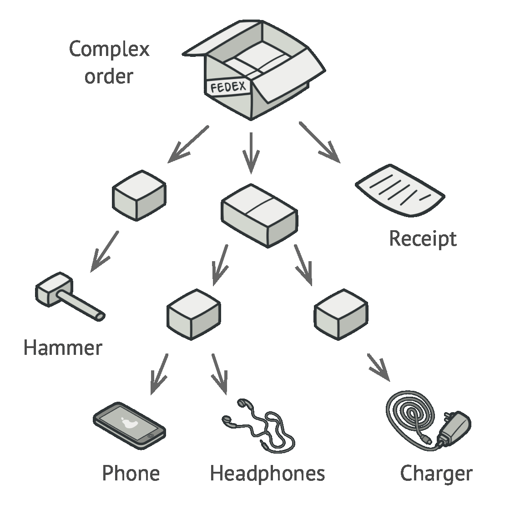
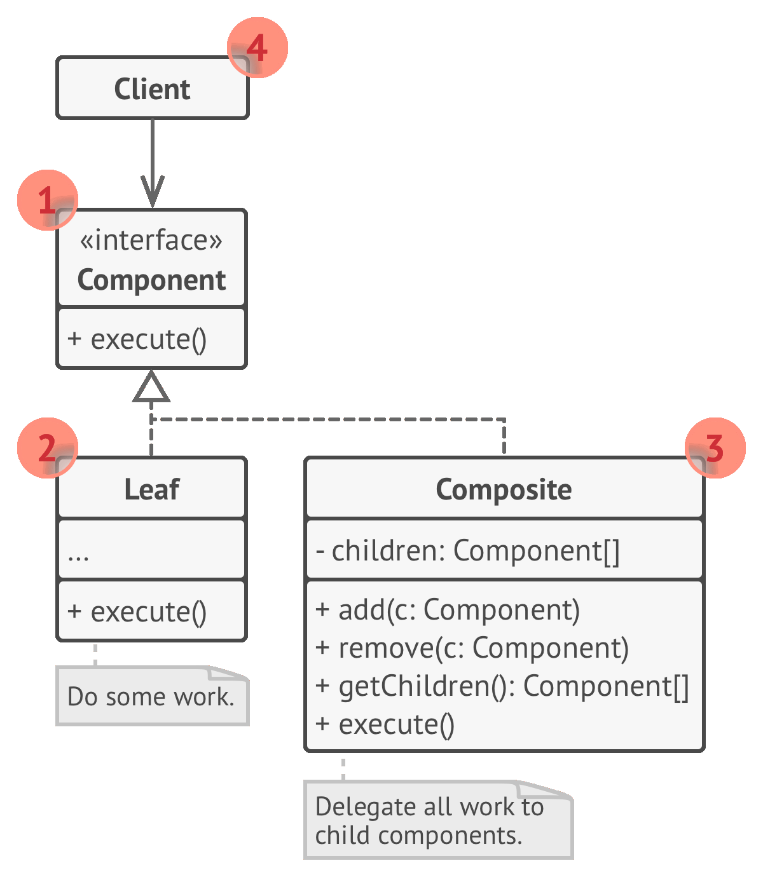
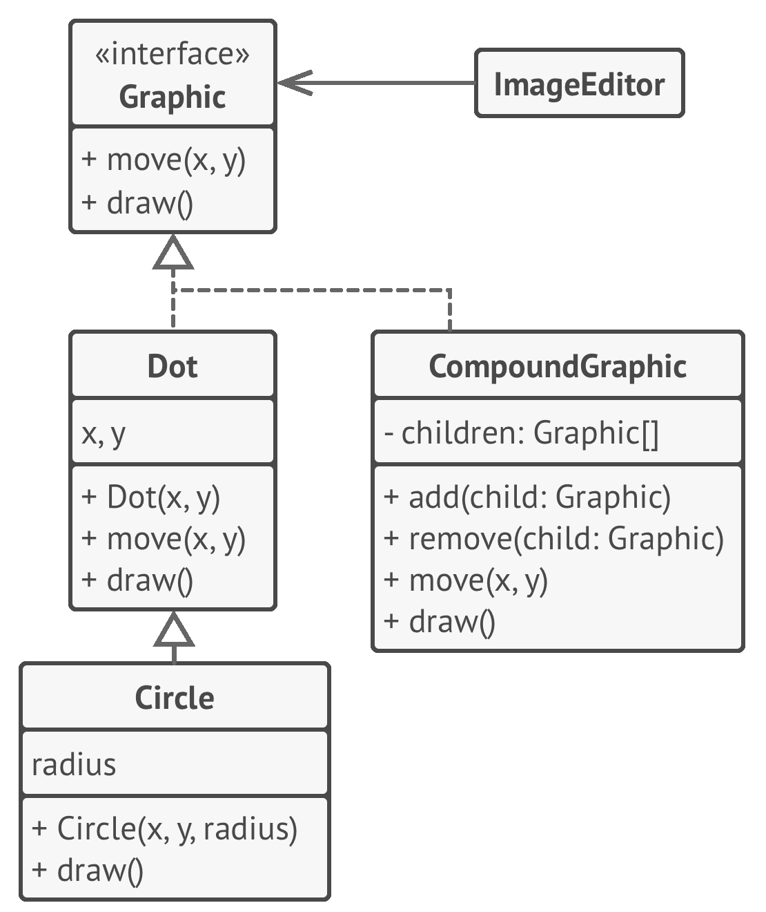

# 🌿 Composite

Real world example

> Every organization is composed of employees. Each of the employees has the same features i.e. has a salary, has some responsibilities, may or may not report to someone, may or may not have some subordinates etc.

In plain words

> Composite pattern lets clients treat the individual objects in a uniform manner.

Wikipedia says

> In software engineering, the composite pattern is a partitioning design pattern. The composite pattern describes that a group of objects is to be treated in the same way as a single instance of an object. The intent of a composite is to "compose" objects into tree structures to represent part-whole hierarchies. Implementing the composite pattern lets clients treat individual objects and compositions uniformly.

**Programmatic Example**

Taking our employees example from above. Here we have different employee types

```php
interface Employee
{
    public function __construct(string $name, float $salary);
    public function getName(): string;
    public function setSalary(float $salary);
    public function getSalary(): float;
    public function getRoles(): array;
}

class Developer implements Employee
{
    protected $salary;
    protected $name;
    protected $roles;

    public function __construct(string $name, float $salary)
    {
        $this->name = $name;
        $this->salary = $salary;
    }

    public function getName(): string
    {
        return $this->name;
    }

    public function setSalary(float $salary)
    {
        $this->salary = $salary;
    }

    public function getSalary(): float
    {
        return $this->salary;
    }

    public function getRoles(): array
    {
        return $this->roles;
    }
}

class Designer implements Employee
{
    protected $salary;
    protected $name;
    protected $roles;

    public function __construct(string $name, float $salary)
    {
        $this->name = $name;
        $this->salary = $salary;
    }

    public function getName(): string
    {
        return $this->name;
    }

    public function setSalary(float $salary)
    {
        $this->salary = $salary;
    }

    public function getSalary(): float
    {
        return $this->salary;
    }

    public function getRoles(): array
    {
        return $this->roles;
    }
}
```

Then we have an organization which consists of several different types of employees

```php
class Organization
{
    protected $employees;

    public function addEmployee(Employee $employee)
    {
        $this->employees[] = $employee;
    }

    public function getNetSalaries(): float
    {
        $netSalary = 0;

        foreach ($this->employees as $employee) {
            $netSalary += $employee->getSalary();
        }

        return $netSalary;
    }
}
```

And then it can be used as

```php
// Prepare the employees
$john = new Developer('John Doe', 12000);
$jane = new Designer('Jane Doe', 15000);

// Add them to organization
$organization = new Organization();
$organization->addEmployee($john);
$organization->addEmployee($jane);

echo "Net salaries: " . $organization->getNetSalaries(); // Net Salaries: 27000
```

<br>
<br>


```python
"""
Composite Design Pattern

Intent: Lets you compose objects into tree structures and then work with these
structures as if they were individual objects.
"""


from __future__ import annotations
from abc import ABC, abstractmethod
from typing import List


class Component(ABC):
    """
    The base Component class declares common operations for both simple and
    complex objects of a composition.
    """

    @property
    def parent(self) -> Component:
        return self._parent

    @parent.setter
    def parent(self, parent: Component):
        """
        Optionally, the base Component can declare an interface for setting and
        accessing a parent of the component in a tree structure. It can also
        provide some default implementation for these methods.
        """

        self._parent = parent

    """
    In some cases, it would be beneficial to define the child-management
    operations right in the base Component class. This way, you won't need to
    expose any concrete component classes to the client code, even during the
    object tree assembly. The downside is that these methods will be empty for
    the leaf-level components.
    """

    def add(self, component: Component) -> None:
        pass

    def remove(self, component: Component) -> None:
        pass

    def is_composite(self) -> bool:
        """
        You can provide a method that lets the client code figure out whether a
        component can bear children.
        """

        return False

    @abstractmethod
    def operation(self) -> str:
        """
        The base Component may implement some default behavior or leave it to
        concrete classes (by declaring the method containing the behavior as
        "abstract").
        """

        pass


class Leaf(Component):
    """
    The Leaf class represents the end objects of a composition. A leaf can't
    have any children.

    Usually, it's the Leaf objects that do the actual work, whereas Composite
    objects only delegate to their sub-components.
    """

    def operation(self) -> str:
        return "Leaf"


class Composite(Component):
    """
    The Composite class represents the complex components that may have
    children. Usually, the Composite objects delegate the actual work to their
    children and then "sum-up" the result.
    """

    def __init__(self) -> None:
        self._children: List[Component] = []

    """
    A composite object can add or remove other components (both simple or
    complex) to or from its child list.
    """

    def add(self, component: Component) -> None:
        self._children.append(component)
        component.parent = self

    def remove(self, component: Component) -> None:
        self._children.remove(component)
        component.parent = None

    def is_composite(self) -> bool:
        return True

    def operation(self) -> str:
        """
        The Composite executes its primary logic in a particular way. It
        traverses recursively through all its children, collecting and summing
        their results. Since the composite's children pass these calls to their
        children and so forth, the whole object tree is traversed as a result.
        """

        results = []
        for child in self._children:
            results.append(child.operation())
        return f"Branch({'+'.join(results)})"


def client_code(component: Component) -> None:
    """
    The client code works with all of the components via the base interface.
    """

    print(f"RESULT: {component.operation()}", end="")


def client_code2(component1: Component, component2: Component) -> None:
    """
    Thanks to the fact that the child-management operations are declared in the
    base Component class, the client code can work with any component, simple or
    complex, without depending on their concrete classes.
    """

    if component1.is_composite():
        component1.add(component2)

    print(f"RESULT: {component1.operation()}", end="")


if __name__ == "__main__":
    # This way the client code can support the simple leaf components...
    simple = Leaf()
    print("Client: I've got a simple component:")
    client_code(simple)
    print("\n")

    # ...as well as the complex composites.
    tree = Composite()

    branch1 = Composite()
    branch1.add(Leaf())
    branch1.add(Leaf())

    branch2 = Composite()
    branch2.add(Leaf())

    tree.add(branch1)
    tree.add(branch2)

    print("Client: Now I've got a composite tree:")
    client_code(tree)
    print("\n")

    print("Client: I don't need to check the components classes even when managing the tree:")
    client_code2(tree, simple)
```

```python
from abc import ABC, abstractmethod


class FormElement(ABC):
    @abstractmethod
    def render(self):
        pass


class InputBox(FormElement):
    def __init__(self, name, value):
        self.name = name
        self.value = value

    def render(self):
        output = f'<input name="{self.name}" value="{self.value}">\n'
        return output


class Button(FormElement):
    def __init__(self, name, value):
        self.name = name
        self.value = value

    def render(self):
        output = f'<button title="{self.name}" data="{self.value}">\n'
        return output


class CompositeFormElement(FormElement):
    def __init__(self):
        self.children = []

    def add_child(self, child: FormElement):
        self.children.append(child)

    def remove_child(self, child):
        self.children.remove(child)

    def render(self):
        return "\n".join([child.render() for child in self.children])


class FieldSet(CompositeFormElement):
    def __init__(self, title):
        super().__init__()
        self.title = title

    def render(self):
        output = (
            f"<fieldset><legend>{self.title}</legend>\n{super().render()}</fieldset>\\n"
        )
        return output


class Form(CompositeFormElement):
    def __init__(self, name):
        super().__init__()
        self.name = name

    def render(self):
        output = f'<form name="{self.name}">\n{super().render()}\n</form>\\n'
        return output


def main():
    form = Form("form1")
    button1 = Button("but1", "5")
    button2 = Button("but2", "50")
    input1 = InputBox("in1", "Placeholder")
    fieldset1 = FieldSet("f1")
    fieldset1.add_child(button2)
    fieldset1.add_child(input1)

    form.add_child(button1)
    form.add_child(fieldset1)
    output = form.render()
    print(output)


if __name__ == "__main__":
    main()
```

------

We also used this in our resource monitoring system:

Resources and Metrics have `getStatus()` method.
For a metric, it depends on the integral value; its a leaf node.
For a resource, if any/all/some children are critical, then it is critical.