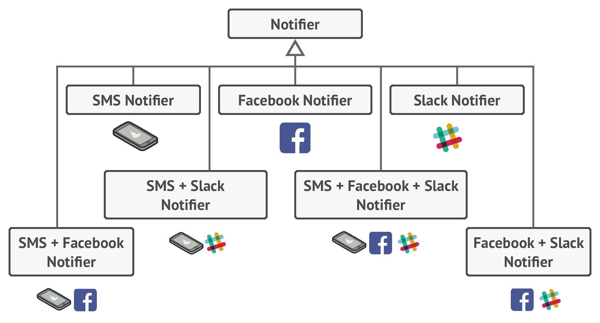
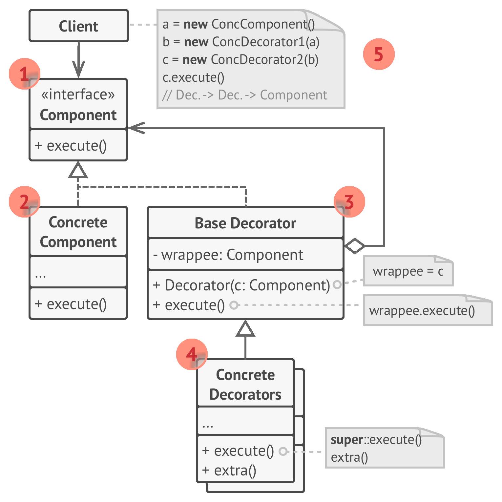

# ☕ Decorator

Real world example

> Imagine you run a car service shop offering multiple services. Now how do you calculate the bill to be charged? You pick one service and dynamically keep adding to it the prices for the provided services till you get the final cost. Here each type of service is a decorator.

In plain words

> Decorator pattern lets you dynamically change the behavior of an object at run time by wrapping them in an object of a decorator class.

Wikipedia says

> In object-oriented programming, the decorator pattern is a design pattern that allows behavior to be added to an individual object, either statically or dynamically, without affecting the behavior of other objects from the same class. The decorator pattern is often useful for adhering to the Single Responsibility Principle, as it allows functionality to be divided between classes with unique areas of concern.

**Programmatic Example**

Lets take coffee for example. First of all we have a simple coffee implementing the coffee interface

```php
interface Coffee
{
    public function getCost();
    public function getDescription();
}

class SimpleCoffee implements Coffee
{
    public function getCost()
    {
        return 10;
    }

    public function getDescription()
    {
        return 'Simple coffee';
    }
}
```

We want to make the code extensible to allow options to modify it if required. Lets make some add-ons (decorators)

```php
class MilkCoffee implements Coffee
{
    protected $coffee;

    public function __construct(Coffee $coffee)
    {
        $this->coffee = $coffee;
    }

    public function getCost()
    {
        return $this->coffee->getCost() + 2;
    }

    public function getDescription()
    {
        return $this->coffee->getDescription() . ', milk';
    }
}

class WhipCoffee implements Coffee
{
    protected $coffee;

    public function __construct(Coffee $coffee)
    {
        $this->coffee = $coffee;
    }

    public function getCost()
    {
        return $this->coffee->getCost() + 5;
    }

    public function getDescription()
    {
        return $this->coffee->getDescription() . ', whip';
    }
}

class VanillaCoffee implements Coffee
{
    protected $coffee;

    public function __construct(Coffee $coffee)
    {
        $this->coffee = $coffee;
    }

    public function getCost()
    {
        return $this->coffee->getCost() + 3;
    }

    public function getDescription()
    {
        return $this->coffee->getDescription() . ', vanilla';
    }
}
```

Lets make a coffee now

```php
$someCoffee = new SimpleCoffee();
echo $someCoffee->getCost(); // 10
echo $someCoffee->getDescription(); // Simple Coffee

$someCoffee = new MilkCoffee($someCoffee);
echo $someCoffee->getCost(); // 12
echo $someCoffee->getDescription(); // Simple Coffee, milk

$someCoffee = new WhipCoffee($someCoffee);
echo $someCoffee->getCost(); // 17
echo $someCoffee->getDescription(); // Simple Coffee, milk, whip

$someCoffee = new VanillaCoffee($someCoffee);
echo $someCoffee->getCost(); // 20
echo $someCoffee->getDescription(); // Simple Coffee, milk, whip, vanilla
```

<br>
<br>
<br>
<br>
<br>


```python
"""
Decorator Design Pattern

Intent: Lets you attach new behaviors to objects by placing these objects inside
special wrapper objects that contain the behaviors.
"""


class Component():
    """
    The base Component interface defines operations that can be altered by
    decorators.
    """

    def operation(self) -> str:
        pass


class ConcreteComponent(Component):
    """
    Concrete Components provide default implementations of the operations. There
    might be several variations of these classes.
    """

    def operation(self) -> str:
        return "ConcreteComponent"


class Decorator(Component):
    """
    The base Decorator class follows the same interface as the other components.
    The primary purpose of this class is to define the wrapping interface for
    all concrete decorators. The default implementation of the wrapping code
    might include a field for storing a wrapped component and the means to
    initialize it.
    """

    _component: Component = None

    def __init__(self, component: Component) -> None:
        self._component = component

    @property
    def component(self) -> str:
        """
        The Decorator delegates all work to the wrapped component.
        """

        return self._component

    def operation(self) -> str:
        self._component.operation()


class ConcreteDecoratorA(Decorator):
    """
    Concrete Decorators call the wrapped object and alter its result in some
    way.
    """

    def operation(self) -> str:
        """
        Decorators may call parent implementation of the operation, instead of
        calling the wrapped object directly. This approach simplifies extension
        of decorator classes.
        """
        return f"ConcreteDecoratorA({self.component.operation()})"


class ConcreteDecoratorB(Decorator):
    """
    Decorators can execute their behavior either before or after the call to a
    wrapped object.
    """

    def operation(self) -> str:
        return f"ConcreteDecoratorB({self.component.operation()})"


def client_code(component: Component) -> None:
    """
    The client code works with all objects using the Component interface. This
    way it can stay independent of the concrete classes of components it works
    with.
    """

    # ...

    print(f"RESULT: {component.operation()}", end="")

    # ...


if __name__ == "__main__":
    # This way the client code can support both simple components...
    simple = ConcreteComponent()
    print("Client: I've got a simple component:")
    client_code(simple)
    print("\n")

    # ...as well as decorated ones.
    #
    # Note how decorators can wrap not only simple components but the other
    # decorators as well.
    decorator1 = ConcreteDecoratorA(simple)
    decorator2 = ConcreteDecoratorB(decorator1)
    print("Client: Now I've got a decorated component:")
    client_code(decorator2)
```

```python
from abc import ABC, abstractmethod


class DataSource(ABC):
    def __init__(self, data_source=None):
        self.data_source = data_source

    @abstractmethod
    def write(self, content):
        if self.data_source is not None:
            self.data_source.write(content)

    @abstractmethod
    def read(self, path):
        content = "hellos"
        if self.data_source is not None:
            content = self.data_source.read(path)
        return content


class BasicDataSource(DataSource):
    def write(self, content):
        super().write(content)
        print("Writing using BasicDataSource: " + content)

    def read(self, path):
        content = super().read(path)
        print("Reading using BasicDataSource")
        return content


class EncryptedDataSource(DataSource):
    def write(self, content):
        content = "Encrypted :" + content
        super().write(content)
        print("Writing using EncryptedDataSource")

    def read(self, path):
        content = super().read(path)
        print("Reading using EncryptedDataSource")
        return "decrypted: " + content


class CompressedDataSource(DataSource):
    def write(self, content):
        content = "Compressed :" + content
        super().write(content)
        print("Writing using CompressedDataSource")

    def read(self, path):
        content = super().read(path)
        print("Reading using CompressedDataSource")
        return "decompressed: " + content


def main():
    ds = BasicDataSource()
    ds = CompressedDataSource(ds)
    ds = EncryptedDataSource(ds)
    ds.write("asa")


if __name__ == "__main__":
    main()
```

```python
from abc import ABC, abstractmethod


class Notifier(ABC):
    def __init__(self, notifier=None):
        self.notifier = notifier

    @abstractmethod
    def notify(self, target):
        if self.notifier is not None:
            self.notifier.notify(target)


class SMSNotifier(Notifier):
    def notify(self, target):
        super().notify(target)
        print("Notifying through SMS")


class EmailNotifier(Notifier):
    def notify(self, target):
        super().notify(target)
        print("Notifying through Email")


class SlackNotifier(Notifier):
    def notify(self, target):
        super().notify(target)
        print("Notifying through Slack")


def main():
    ds = SMSNotifier()
    ds = EmailNotifier(ds)
    ds = SlackNotifier(ds)
    ds.notify("as")


if __name__ == "__main__":
    main()
```

```python
from abc import ABC, abstractmethod


class TextProcessor(ABC):
    def __init__(self, processor=None):
        self.processor = processor

    @abstractmethod
    def process(self, text):
        if self.processor is not None:
            text = self.processor.process(text)
        return text


class AbusiveFilter(TextProcessor):
    def process(self, text):
        text = super().process(text)
        return f"NonAbusive({text})"


class MarkdownToHtml(TextProcessor):
    def process(self, text):
        text = super().process(text)
        return f"HTML({text})"


class TagFilter(TextProcessor):
    def process(self, text):
        text = super().process(text)
        return f"TagFiltered({text})"


def main():
    ds = AbusiveFilter()
    ds = MarkdownToHtml(ds)
    ds = TagFilter(ds)
    result = ds.process("asa")
    print(result)
```
