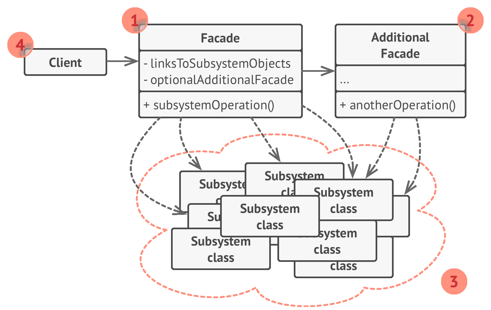
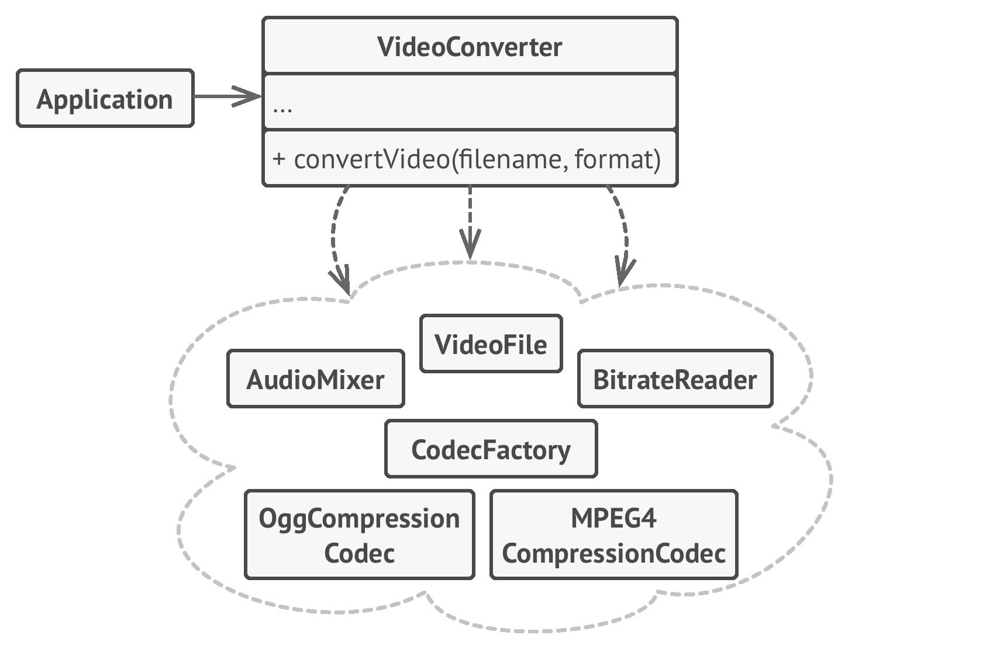

# 📦 Facade

Real world example

> How do you turn on the computer? "Hit the power button" you say! That is what you believe because you are using a simple interface that computer provides on the outside, internally it has to do a lot of stuff to make it happen. This simple interface to the complex subsystem is a facade.

In plain words

> Facade pattern provides a simplified interface to a complex subsystem.

Wikipedia says

> A facade is an object that provides a simplified interface to a larger body of code, such as a class library.

**Programmatic Example**

Taking our computer example from above. Here we have the computer class

```php
class Computer
{
    public function getElectricShock()
    {
        echo "Ouch!";
    }

    public function makeSound()
    {
        echo "Beep beep!";
    }

    public function showLoadingScreen()
    {
        echo "Loading..";
    }

    public function bam()
    {
        echo "Ready to be used!";
    }

    public function closeEverything()
    {
        echo "Bup bup bup buzzzz!";
    }

    public function sooth()
    {
        echo "Zzzzz";
    }

    public function pullCurrent()
    {
        echo "Haaah!";
    }
}
```

Here we have the facade

```php
class ComputerFacade
{
    protected $computer;

    public function __construct(Computer $computer)
    {
        $this->computer = $computer;
    }

    public function turnOn()
    {
        $this->computer->getElectricShock();
        $this->computer->makeSound();
        $this->computer->showLoadingScreen();
        $this->computer->bam();
    }

    public function turnOff()
    {
        $this->computer->closeEverything();
        $this->computer->pullCurrent();
        $this->computer->sooth();
    }
}
```

Now to use the facade

```php
$computer = new ComputerFacade(new Computer());
$computer->turnOn(); // Ouch! Beep beep! Loading.. Ready to be used!
$computer->turnOff(); // Bup bup buzzz! Haah! Zzzzz
```

<br>


```python
"""
Facade Design Pattern

Intent: Provides a simplified interface to a library, a framework, or any other
complex set of classes.
"""


from __future__ import annotations


class Facade:
    """
    The Facade class provides a simple interface to the complex logic of one or
    several subsystems. The Facade delegates the client requests to the
    appropriate objects within the subsystem. The Facade is also responsible for
    managing their lifecycle. All of this shields the client from the undesired
    complexity of the subsystem.
    """

    def __init__(self, subsystem1: Subsystem1, subsystem2: Subsystem2) -> None:
        """
        Depending on your application's needs, you can provide the Facade with
        existing subsystem objects or force the Facade to create them on its
        own.
        """

        self._subsystem1 = subsystem1 or Subsystem1()
        self._subsystem2 = subsystem2 or Subsystem2()

    def operation(self) -> str:
        """
        The Facade's methods are convenient shortcuts to the sophisticated
        functionality of the subsystems. However, clients get only to a fraction
        of a subsystem's capabilities.
        """

        results = []
        results.append("Facade initializes subsystems:")
        results.append(self._subsystem1.operation1())
        results.append(self._subsystem2.operation1())
        results.append("Facade orders subsystems to perform the action:")
        results.append(self._subsystem1.operation_n())
        results.append(self._subsystem2.operation_z())
        return "\n".join(results)


class Subsystem1:
    """
    The Subsystem can accept requests either from the facade or client directly.
    In any case, to the Subsystem, the Facade is yet another client, and it's
    not a part of the Subsystem.
    """

    def operation1(self) -> str:
        return "Subsystem1: Ready!"

    # ...

    def operation_n(self) -> str:
        return "Subsystem1: Go!"


class Subsystem2:
    """
    Some facades can work with multiple subsystems at the same time.
    """

    def operation1(self) -> str:
        return "Subsystem2: Get ready!"

    # ...

    def operation_z(self) -> str:
        return "Subsystem2: Fire!"


def client_code(facade: Facade) -> None:
    """
    The client code works with complex subsystems through a simple interface
    provided by the Facade. When a facade manages the lifecycle of the
    subsystem, the client might not even know about the existence of the
    subsystem. This approach lets you keep the complexity under control.
    """

    print(facade.operation(), end="")


if __name__ == "__main__":
    # The client code may have some of the subsystem's objects already created.
    # In this case, it might be worthwhile to initialize the Facade with these
    # objects instead of letting the Facade create new instances.
    subsystem1 = Subsystem1()
    subsystem2 = Subsystem2()
    facade = Facade(subsystem1, subsystem2)
    client_code(facade)
```
