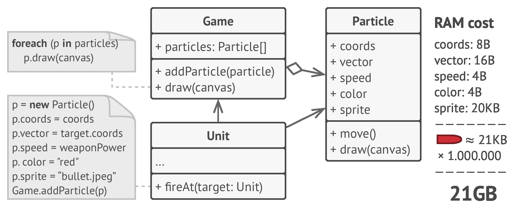
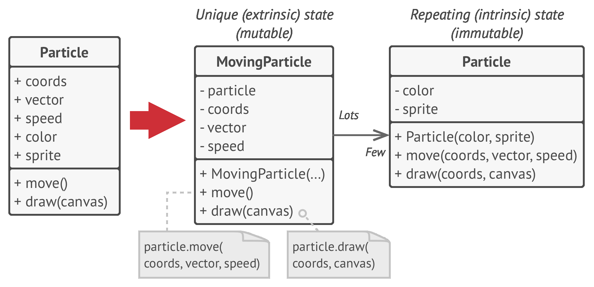
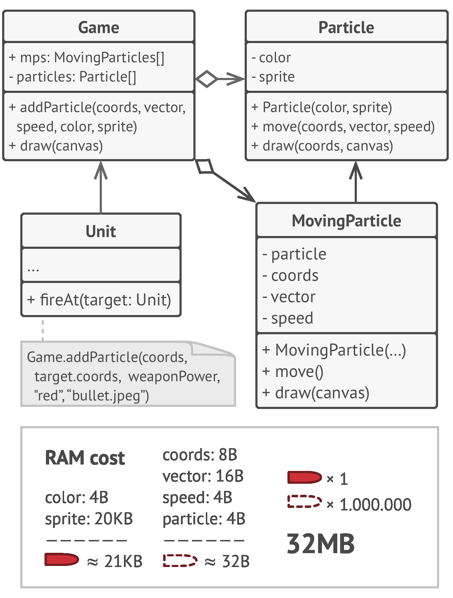
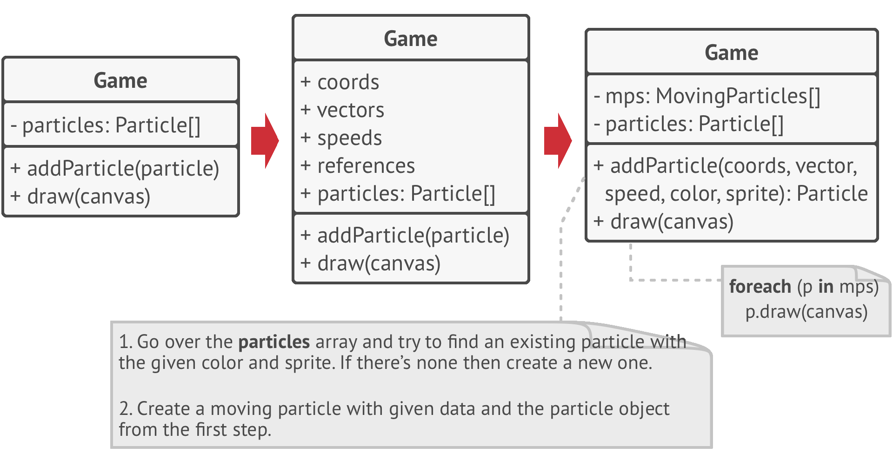
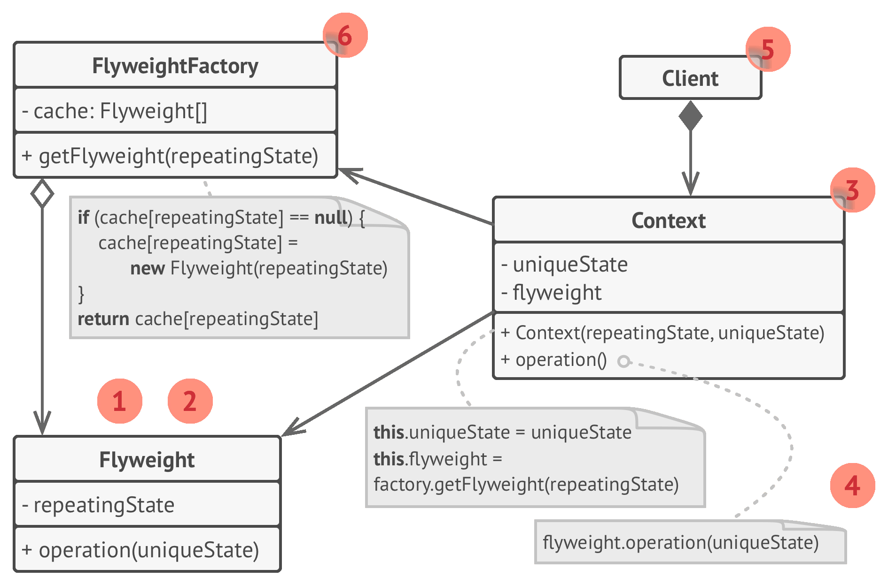

# 🍃 Flyweight

Real world example

> Did you ever have fresh tea from some stall? They often make more than one cup that you demanded and save the rest for any other customer so to save the resources e.g. gas etc. Flyweight pattern is all about that i.e. sharing.

In plain words

> It is used to minimize memory usage or computational expenses by sharing as much as possible with similar objects.

Wikipedia says

> In computer programming, flyweight is a software design pattern. A flyweight is an object that minimizes memory use by sharing as much data as possible with other similar objects; it is a way to use objects in large numbers when a simple repeated representation would use an unacceptable amount of memory.

**Programmatic example**

Translating our tea example from above. First of all we have tea types and tea maker

```php
// Anything that will be cached is flyweight.
// Types of tea here will be flyweights.
class KarakTea
{
}

// Acts as a factory and saves the tea
class TeaMaker
{
    protected $availableTea = [];

    public function make($preference)
    {
        if (empty($this->availableTea[$preference])) {
            $this->availableTea[$preference] = new KarakTea();
        }

        return $this->availableTea[$preference];
    }
}
```

Then we have the `TeaShop` which takes orders and serves them

```php
class TeaShop
{
    protected $orders;
    protected $teaMaker;

    public function __construct(TeaMaker $teaMaker)
    {
        $this->teaMaker = $teaMaker;
    }

    public function takeOrder(string $teaType, int $table)
    {
        $this->orders[$table] = $this->teaMaker->make($teaType);
    }

    public function serve()
    {
        foreach ($this->orders as $table => $tea) {
            echo "Serving tea to table# " . $table;
        }
    }
}
```

And it can be used as below

```php
$teaMaker = new TeaMaker();
$shop = new TeaShop($teaMaker);

$shop->takeOrder('less sugar', 1);
$shop->takeOrder('more milk', 2);
$shop->takeOrder('without sugar', 5);

$shop->serve();
// Serving tea to table# 1
// Serving tea to table# 2
// Serving tea to table# 5
```

<br>
<br>
<br>
<br>
<br>


```python
"""
Flyweight Design Pattern

Intent: Lets you fit more objects into the available amount of RAM by sharing
common parts of state between multiple objects, instead of keeping all of the
data in each object.
"""


import json
from typing import Dict


class Flyweight():
    """
    The Flyweight stores a common portion of the state (also called intrinsic
    state) that belongs to multiple real business entities. The Flyweight
    accepts the rest of the state (extrinsic state, unique for each entity) via
    its method parameters.
    """

    def __init__(self, shared_state: str) -> None:
        self._shared_state = shared_state

    def operation(self, unique_state: str) -> None:
        s = json.dumps(self._shared_state)
        u = json.dumps(unique_state)
        print(f"Flyweight: Displaying shared ({s}) and unique ({u}) state.", end="")


class FlyweightFactory():
    """
    The Flyweight Factory creates and manages the Flyweight objects. It ensures
    that flyweights are shared correctly. When the client requests a flyweight,
    the factory either returns an existing instance or creates a new one, if it
    doesn't exist yet.
    """

    _flyweights: Dict[str, Flyweight] = {}

    def __init__(self, initial_flyweights: Dict) -> None:
        for state in initial_flyweights:
            self._flyweights[self.get_key(state)] = Flyweight(state)

    def get_key(self, state: Dict) -> str:
        """
        Returns a Flyweight's string hash for a given state.
        """

        return "_".join(sorted(state))

    def get_flyweight(self, shared_state: Dict) -> Flyweight:
        """
        Returns an existing Flyweight with a given state or creates a new one.
        """

        key = self.get_key(shared_state)

        if not self._flyweights.get(key):
            print("FlyweightFactory: Can't find a flyweight, creating new one.")
            self._flyweights[key] = Flyweight(shared_state)
        else:
            print("FlyweightFactory: Reusing existing flyweight.")

        return self._flyweights[key]

    def list_flyweights(self) -> None:
        count = len(self._flyweights)
        print(f"FlyweightFactory: I have {count} flyweights:")
        print("\n".join(map(str, self._flyweights.keys())), end="")


def add_car_to_police_database(
    factory: FlyweightFactory, plates: str, owner: str,
    brand: str, model: str, color: str
) -> None:
    print("\n\nClient: Adding a car to database.")
    flyweight = factory.get_flyweight([brand, model, color])
    # The client code either stores or calculates extrinsic state and passes it
    # to the flyweight's methods.
    flyweight.operation([plates, owner])


if __name__ == "__main__":
    """
    The client code usually creates a bunch of pre-populated flyweights in the
    initialization stage of the application.
    """

    factory = FlyweightFactory([
        ["Chevrolet", "Camaro2018", "pink"],
        ["Mercedes Benz", "C300", "black"],
        ["Mercedes Benz", "C500", "red"],
        ["BMW", "M5", "red"],
        ["BMW", "X6", "white"],
    ])

    factory.list_flyweights()

    add_car_to_police_database(
        factory, "CL234IR", "James Doe", "BMW", "M5", "red")

    add_car_to_police_database(
        factory, "CL234IR", "James Doe", "BMW", "X1", "red")

    print("\n")

    factory.list_flyweights()
```

**BEFORE**

```python
class Bullet:
    def __init__(self, sprite, texture, velocity, position, src, dst):
        self.sprite = sprite
        self.texture = texture
        self.velocity = velocity
        self.position = position
        self.src = src
        self.dst = dst

    def render():
        pass


class Game:
    def render_bullet(self, sprite, texture, velocity, position, src, dst):
        bullet = Bullet(sprite, texture, velocity, position, src, dst)
        bullet.render()
```

**AFTER**

```python
class BulletIntrinsic:
    def __init__(self, sprite, texture):
        self.sprite = sprite
        self.texture = texture

    def render(velocity, position, src, dst):
        pass


class BulletIntrinsicFactory:
    def __init__(self):
        self.cache = {}

    def get_new_bullet(self, sprite, texture):
        key = (sprite, texture)
        if key in self.cache:
            return self.cache[key]
        new_object = BulletIntrinsic(sprite, texture)
        self.cache[key] = new_object
        return new_object


class Bullet:
    def __init__(self, sprite, texture, velocity, position, src, dst):
        self.intrinsic = BulletIntrinsicFactory.get_new_bullet(sprite, texture)
        self.sprite = self.intrinsic.sprite
        self.texture = self.intrinsic.texture
        self.velocity = velocity
        self.position = position
        self.src = src
        self.dst = dst

    def render():
        pass
```
