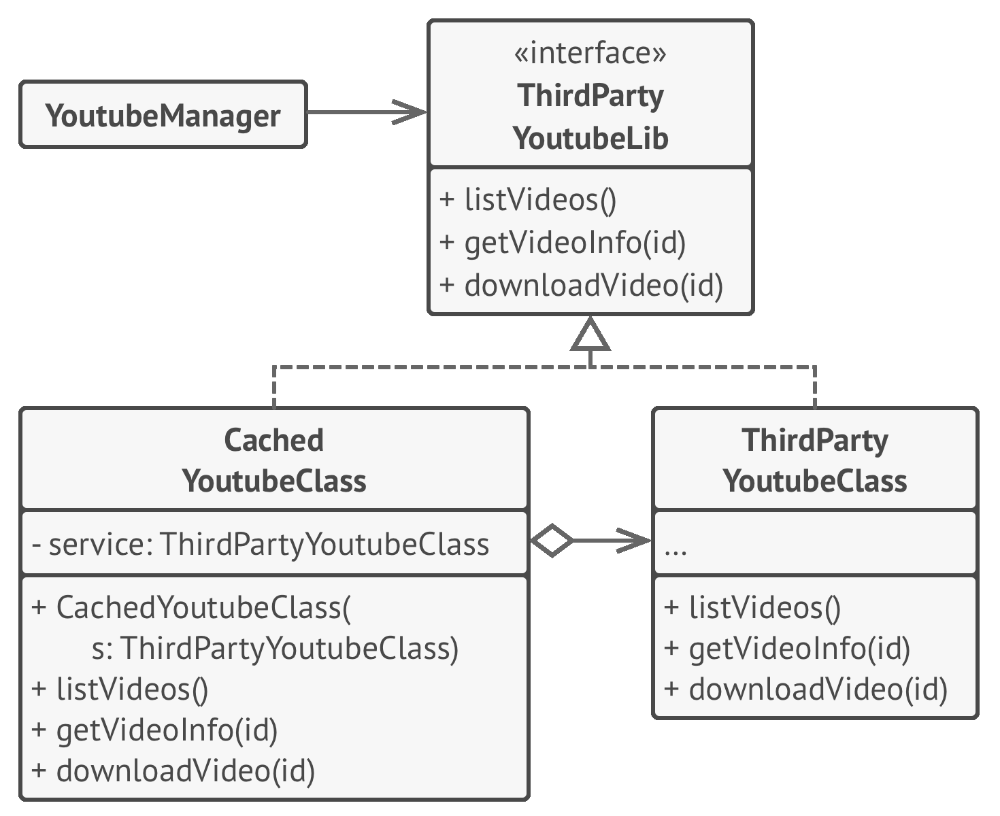

# 🎱 Proxy

Real world example

> Have you ever used an access card to go through a door? There are multiple options to open that door i.e. it can be opened either using access card or by pressing a button that bypasses the security. The door's main functionality is to open but there is a proxy added on top of it to add some functionality. Let me better explain it using the code example below.

In plain words

> Using the proxy pattern, a class represents the functionality of another class.

Wikipedia says

> A proxy, in its most general form, is a class functioning as an interface to something else. A proxy is a wrapper or agent object that is being called by the client to access the real serving object behind the scenes. Use of the proxy can simply be forwarding to the real object, or can provide additional logic. In the proxy extra functionality can be provided, for example caching when operations on the real object are resource intensive, or checking preconditions before operations on the real object are invoked.

**Programmatic Example**

Taking our security door example from above. Firstly we have the door interface and an implementation of door

```php
interface Door
{
    public function open();
    public function close();
}

class LabDoor implements Door
{
    public function open()
    {
        echo "Opening lab door";
    }

    public function close()
    {
        echo "Closing the lab door";
    }
}
```

Then we have a proxy to secure any doors that we want

```php
class SecuredDoor
{
    protected $door;

    public function __construct(Door $door)
    {
        $this->door = $door;
    }

    public function open($password)
    {
        if ($this->authenticate($password)) {
            $this->door->open();
        } else {
            echo "Big no! It ain't possible.";
        }
    }

    public function authenticate($password)
    {
        return $password === '$ecr@t';
    }

    public function close()
    {
        $this->door->close();
    }
}
```

And here is how it can be used

```php
$door = new SecuredDoor(new LabDoor());
$door->open('invalid'); // Big no! It ain't possible.

$door->open('$ecr@t'); // Opening lab door
$door->close(); // Closing lab door
```

Yet another example would be some sort of data-mapper implementation. For example, I recently made an ODM (Object Data Mapper) for MongoDB using this pattern where I wrote a proxy around mongo classes while utilizing the magic method `__call()`. All the method calls were proxied to the original mongo class and result retrieved was returned as it is but in case of `find` or `findOne` data was mapped to the required class objects and the object was returned instead of `Cursor`.

<br>

```python
"""
Proxy Design Pattern

Intent: Provide a surrogate or placeholder for another object to control access
to the original object or to add other responsibilities.
"""


from abc import ABC, abstractmethod


class Subject(ABC):
    """
    The Subject interface declares common operations for both RealSubject and
    the Proxy. As long as the client works with RealSubject using this
    interface, you'll be able to pass it a proxy instead of a real subject.
    """

    @abstractmethod
    def request(self) -> None:
        pass


class RealSubject(Subject):
    """
    The RealSubject contains some core business logic. Usually, RealSubjects are
    capable of doing some useful work which may also be very slow or sensitive -
    e.g. correcting input data. A Proxy can solve these issues without any
    changes to the RealSubject's code.
    """

    def request(self) -> None:
        print("RealSubject: Handling request.")


class Proxy(Subject):
    """
    The Proxy has an interface identical to the RealSubject.
    """

    def __init__(self, real_subject: RealSubject) -> None:
        self._real_subject = real_subject

    def request(self) -> None:
        """
        The most common applications of the Proxy pattern are lazy loading,
        caching, controlling the access, logging, etc. A Proxy can perform one
        of these things and then, depending on the result, pass the execution to
        the same method in a linked RealSubject object.
        """

        if self.check_access():
            self._real_subject.request()
            self.log_access()

    def check_access(self) -> bool:
        print("Proxy: Checking access prior to firing a real request.")
        return True

    def log_access(self) -> None:
        print("Proxy: Logging the time of request.", end="")


def client_code(subject: Subject) -> None:
    """
    The client code is supposed to work with all objects (both subjects and
    proxies) via the Subject interface in order to support both real subjects
    and proxies. In real life, however, clients mostly work with their real
    subjects directly. In this case, to implement the pattern more easily, you
    can extend your proxy from the real subject's class.
    """

    # ...

    subject.request()

    # ...


if __name__ == "__main__":
    print("Client: Executing the client code with a real subject:")
    real_subject = RealSubject()
    client_code(real_subject)

    print("")

    print("Client: Executing the same client code with a proxy:")
    proxy = Proxy(real_subject)
    client_code(proxy)
```

```python
class VideoDownloader():
    def download(self, url):
        # Download video
        pass


class CachedVideoDownloader():
    def __init__(self, downloader):
        self.downloader = downloader
    
    def download(self, url):
        # Check if it exists in cache or not
        self.downloader.download(url)
        pass
```


```python
class Person():
    def get_name(self):
        pass


class RMIPerson():
    # Remote Method Invocation
    def __init__(self, person, remote_address):
        self.person = person
        self.remote_address = remote_address

    def get_name(self):
        # Send method and argument details to the remote machine
        pass
```