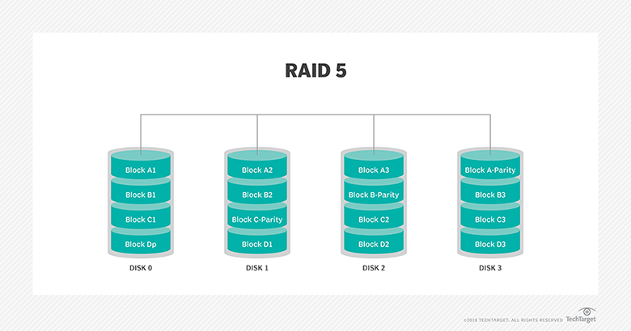

**Redundant Array of Independent Disks**

- **RAID 0**:

  - `Striping` - Half of the file gets written to disk 1, and other half to disk 2.
  - Since both of them are completely independent, it doubles the performance.
  - But there is no redundancy, so if one drive fails, then data is lost.
    

- **RAID 1**:

  - All the file gets written to both the disks. Basically duplication.
  - If one hard drive fails because of defect or old-age, just replace with a new one.
  - There is backup, but we'll have to double up the space without doubling the effective capacity.
    

- **RAID 5**:
  - Does striping as in RAID 0.
  - But also manages redundancy by employing `parity`.
  - In practice, size of parity = O(log(data_size)).
  - Only 1 disk failure can be tolerated.
  - 2 simultaneous disk failures are supported in RAID6.  
    

**Parity**

- Basically storing some data which captures the _essence_ of the original data, such that if 1 piece of the data is missing, it can be recovered.
- Example:
  - Data = [1, 5, 10, 20].
  - Parity = 1 + 5 + 10 + 20 = 36.
  - Lets say one number is missing. We can recompute by `36 - sum(remaining)`.
  - The size of the data is 4\*sizeof(int). The size of the parity is sizeof(int).
- It is synonymous with `error-correction codes`. There are various error-correction algorithms.
