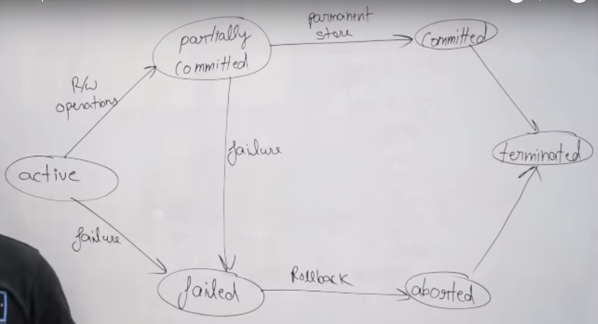

- **Transaction:** A set of operations that should either all be done or none of the operations should happen (**All or nothing**).
- We need transactions because an OS can do a context-switch any time.  

  

# ACID
## Atomicity

- Each transaction is all or nothing.
- Can be implemented using journalling or shadow paging.

### Journalling

- Lets say a transation T1 has 10 operations O1...O10.
- And T1 will be modifying 5 cells - C1...C5.
- Then first we will write the following in some log on disk:

  ```
  T1
  O1...O10
  C1...C5
  ```
- After log write is finished, we will start writing new values to the database, and then delete the journal file at the end.
- If the db crashes, it will check if the journal file exists on restart; if yes then it will first restore the state C1...C5, and then will reapply the operations O1...O10.

### Write-Ahead logging

- Slightly different from journalling.
- Lets say a transation T1 has 10 operations O1...O10.
- And T1 will be modifying 5 cells - C1...C5.
- Then first we will write the following in some log on disk:

  ```
  T1
  O1...O10
  C1...C5
  C1` - C5` (New values)
  Commit=False
  ```
- After log write is finished, we will start writing to the database, and then write `Commit=True`.
- If the db crashes, it will check if the log file has an uncommitted entry on restart; if yes then it will attempt to again write the new values `C1' - C5'`.
- Prevents recomputation of transactions on restart since the new values are already written in the log file itself.
- Also no need to restore the old entries, since we will be directly overwriting the new ones.

### Shadow Paging

- Database is divided into pages of fixed size.
- A shadow page table is also maintained.
- The changes for a transaction are always first applied to the shadow table.
- After that the pointer to the primary table changes to point to the shadow table.
- This is not used that much. Logging based solutions are much more dominant.

#### Disadvantages of shadow-paging: 
- **Commit overhead**: The commit of a single transaction using shadow paging requires multiple blocks to be output -- the current page table, the actual data and the disk address of the current page table. Log-based schemes need to output only the log records.
- **Data fragmentation**: Shadow paging causes database pages to change locations (therefore, no longer contiguous.
- **Garbage collection**: Each time that a transaction commits, the database pages containing the old version of data changed by the transactions must become inaccessible. Such pages are considered to be garbage since they are not part of the free space and do not contain any usable information. Periodically it is necessary to find all of the garbage pages and add them to the list of free pages. This process is called garbage collection and imposes additional overhead and complexity on the system.


## Consistency

- Any transaction will bring the database from one valid state to another.<br>
  Example - Integrity constraints, foreign keys, Not NULL, field max size etc.

## Isolation

- Executing transactions concurrently has the same results as if the transactions were executed serially.
- The effects of an incomplete transaction are not visible to other transactions.
- Preventing `Read-Write`/`Write-Write` and all such anomalies.
- Read the isolation file for more details.

## Durability

- Once a transaction has been committed, it will remain so.
- Basically use a permanent storage device rather than just on RAM.