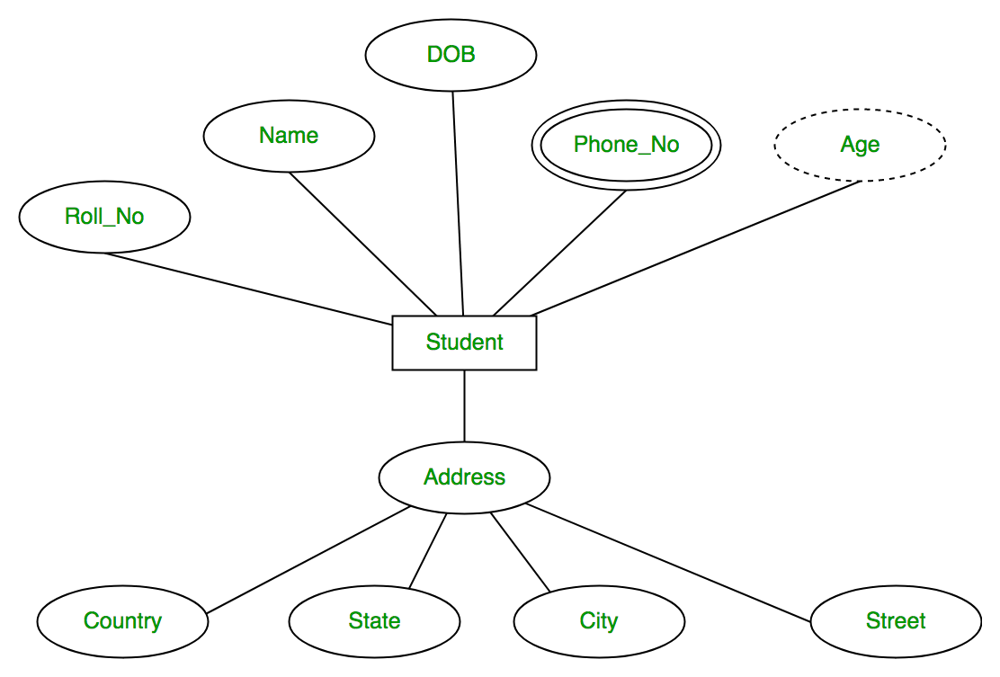

# Data vs Information

- **Data** -> Raw facts; all the data that the database has. Eg. Text, Image, Video etc. 
- **Information** -> The data that you need at a moment. Today you might need one portion of the data; tomorrow some other portion.
- What is data and what is Information depends on the observer.
- For example, in a database there is information about train journeys for the last 30 years.
- But you might be interested in just today's journeys; so only that portion is info; the rest is data.

# Disadvantages of file system

- **Data redundancy** -> Same data stored in multiple files.
- **Data inconsistency** -> Mostly due to redundancy. Changed data in one file; forgot to change in other file.
- **Difficulty in accessing data** -> For every new type of query, we have to write new code.
- **Data isolation** -> Data might be dependent on the technologies being used.
- **Security** -> Will have to depend on the particular file system security framework.
- **Atomicity** -> No concept of transactions. Might lead to inconsistent state in case of power loss.
- **Concurrency** -> No support of concurrent accesses.
- **Integrity** -> No support for integrity constraints.

# OLAP vs OLTP

# ER Diagram

## Entity

- A thing or object in the real world that is distinguishable from other entities based on some attributes.
- It can be tangible(Person) or intangible(Account).
- **Entity-Set:** The set of all the entities.
- In ER Diagram, entities cannot be described; only the entity set can be described!!
- Entity can only be described in the db table.
- One entity means one instance/row/tuple in the entity table.
- Represented by a rectangle in the ER diagram.

## Attributes

- Differentiate between instances of entities.
- An attribute can only hold a fixed set of values, which is called **domain**.
- Drawn as an ellipse in ER diagram, and a column in the table.
- Types:
  - **Simple vs Composite**: Composite can be divided further. For example -> Name (First/Middle/Last), Address(Line 1/ Line 2...).
  - In ER diagram, identified as *ellipse connected to ellipse*.
  - In table, there will be no *name* column; only *fname*, *mname*, *lname*.
  - **Single vs Multi-valued**: Example -> Mobile number. Must avoid multi-valued to satisfy 1NF.
  - Drawn as double ellipse.
  - **Stored vs Derived**: Must avoid derived to minimize redundancy. Example -> Age
  - Drawn as a dotted ellipse.

## Relationships

- An associationg between 2 entities.
- Just as an entity, a relationship cannot be represented in an ER diagram.
- Only relationship set can be drawn.
- A relationship is an instance/row/tuple of a relationship table.
- Can be either modelled as a separate table, or as foreign key constraint in one of the entity set.
- Every relationship has:
  - **Name**
  - **Degree**: The number of entities participating in the relationship; ranges from 1 to infinite.
  - **Cardinality Ratio/ Participation Constraints**: Entity 1 can be associated to how many of Entity 2 ??
- Example of degree 1 (Unary) -> *Student* **manages** *Student*.  
   
- Example of degree 2 (Binary) -> *Teacher* **teaches** *Student*.  
  
- Example of degree 3 (Ternary):  
  
- For degree > 2, it can only be modelled as a separate table; not as a foreign key.
- Cardinality ratio can be of the form:
  - **1:1**: Meaning one entity in first set maps to **0 or 1** entity in other set and vice-versa. For example, Person <-> Aadhar card.
  - **1:M** Meaning one entity in first set maps to **<=** M entities in other set. For example, Person -> Mobile phone.
  - **M:N**: For example, Teacher <-> Student. One teacher teaches multiple students. One student can have multiple teachers.
- **Participation Constraints**: Used to specify min/max cardinalities. That is, the min/max number of times an entity can take part in the relationship.
- For example, take a relationship `Project <-> Employee`.
- Now lets say that in the real world, one project must have atleast 3 and max 15 employees.
- Also, 1 employee can be in min 0 and max 2 projects.
- Meaning that every project must be in atleast 3 and at max 15 rows in the relationship table.
- And employee can either be absent or at max 2 rows in the relationship table.
- **Total/Partial Participation**: When its possible that at least one entity is not participating in a relationship at all, its said to be partial participation.
- In the above example its possible that an employee is not mapped to any project, that is, its totally absent from the relationship table.
- Therfore, Employee has partial participation.
- In other words, if min cardinality is 0, its partial participation.
- Total participation is drawn by a double line.

  
  

