# Read-Write anomalies/conflicts

## 1. Unrepeatable-Read / Read-Write Conflict
- When during the course of a transaction, a row is retrieved twice and the values within the row differ between reads.
- Breaks the isolation promise (The transaction realizes there is some other transaction in the system too!).

## 2. Dirty-Read / Write-Read Conflict
- When a transaction reads uncommitted (in-memory) data being modified by some other transaction.
- If the other transaction fails and decides to rollback after the first transaction had commited, the first transaction will be in trouble.
- IMHO, not very different from Read-Write case. The 2 have the same problems.

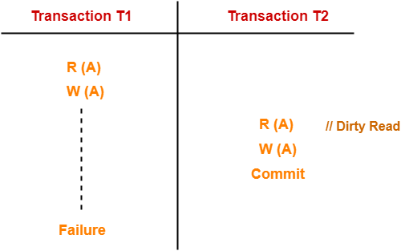  

## 3. Phantom-Read
- Transaction 1 reads some data.
- Transaction 2 deletes that data.
- Transaction 1 tries to read but cannot.
- Isolation promise broken again.
- This is somewhat similar to the Unrepeatable read conflict.

## 4. Lost-Update / Write-Write Conflict
- When a write from one transaction in overwritten by some other transaction concurrently, thereby negating the first write.

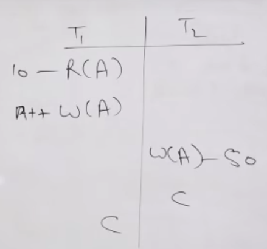

- Note that in the above image, the write done by T2 is called **Blind write**, i.e. writing before reading.
- Consider a scenario where there are 2 transactions T1 and T2.
- T1 wants to write **A=10** and **B=20**.
- T2 wants to write **A=30** and **B=40**.
- But in the following schedule, the final value of A and B would be **A=30** and **B=20**.
- This is wrong because in isolation, either `(A, B) = 10, 20` or `(A, B) = (30, 40)`.

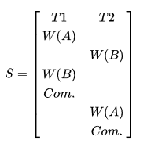

## 5. Write Skew Conflict
- This is the only anomaly that differentiates **serializable** isolation level from **snapshot isolation**.
- When 2 transactions (T1 and T2) concurrently read an overlapping data set (e.g. values V1 and V2), concurrently make disjoint updates (e.g. T1 updates V1, T2 updates V2), and finally concurrently commit, neither having seen the update performed by the other.
- As an example, imagine imagine V1 and V2 are two balances held by a single person, Phil.
- The bank will allow either V1 or V2 to run a deficit, provided the total held in both is never negative (i.e. V1 + V2 ≥ 0).
- Both balances are currently $100. Phil initiates two transactions concurrently, T1 withdrawing $200 from V1, and T2 withdrawing $200 from V2.
- If the database guaranteed serializable transactions, the simplest way of coding T1 is to deduct $200 from V1, and then verify that V1 + V2 ≥ 0 still holds, aborting if not.
- T2 similarly deducts $200 from V2 and then verifies V1 + V2 ≥ 0.
- Since the transactions must serialize, either T1 happens first, leaving V1 = -$100, V2 = $100, and preventing T2 from succeeding (since V1 + (V2 - $200) is now -$200), or T2 happens first and similarly prevents T1 from committing.
- If the database is under snapshot isolation(MVCC), however, T1 and T2 operate on private snapshots of the database: each deducts $200 from an account, and then verifies that the new total is zero, using the other account value that held when the snapshot was taken.
- Since neither update conflicts, both commit successfully, leaving V1 = V2 = -$100, and V1 + V2 = -$200.
- Another example:
- Imagine that we have a table of 100 entities `Marble - {id, color}`, half of them black(ID 1-50) and other half white (ID 51-100).
- Suppose 1 transaction is run to convert all the white marbles to black.
- Simultaneously, another transaction T2 is run to convert all black to white.
- If `snapshot isolation` level is on, then T1 will convert ID 51-100 into black and T2 will convert ID 1-50 into white.
- Thus the final state would be - Black(ID 51-100) + White(ID 1-50).
- Under absolute serialization, only one transaction would have ran at a time, thus, either leaving all marbles as black or all marbles as white.

# Schedules

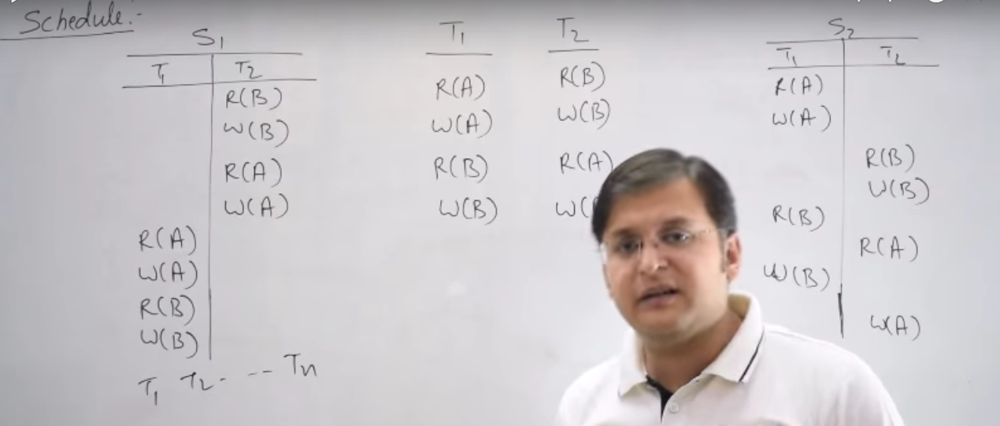

- A schedule is a specific ordering of operations of multiple transactions happening concurrently.
- There can be multiple schedules of the same set of transactions.
- It is just a way to depict a specific case of concurrent execution of multiple transactions.
- The Y-scale denotes time (increasing time in downwards direction).
- At one time only one operation (of any transaction) is possible (we assume single-core processor).
- So at time=0, either T1-I1(instruction 1 of transaction 1) can happen or T2-I1 or T3-I1..
- Lets say that transaction T1 has n1 instructions, T2 has n2 instructions and so on...
- Then the total size of schedule(time units) will always be equal to `(n1 + n2 + ...)`.
- The total number of operation ordering possible would be `(n1+n2+n3...)!`
- However, we cannot reorder operations among a single transcation.
- T1-I1 must happen before T1-I2 no matter what.
- Therefore, total number schedules possible is:

`(n1 + n2 + n3 + ....)! / (n1!* n2! * n3!)`

- **Serial schedule:** A schedule where all the operations of a transaction execute consecutively in a serial way.
- A serial schedule has no conflicts; every transaction is completely isolated.
- However, it also does not have any concurrency.

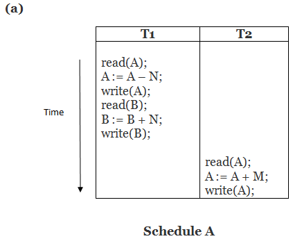

- The total number of serial schedules possible is = `T!`, where `T = Number of transactions`.
- Hence, total number of non-serial schedules = 

`[(n1 + n2 + n3 + ....nt)! / (n1!* n2! * n3! .. * nt!)] - T!`

- **Serializability**: If a schedule is serializable, it means that its functionally equivalent to a serial schedule.  
   Meaning that the final state of the DB would be the same as the state after some serial schedule.  
   Meaning, that there can never be isolation problems in that schedule. It is ***consistent***.

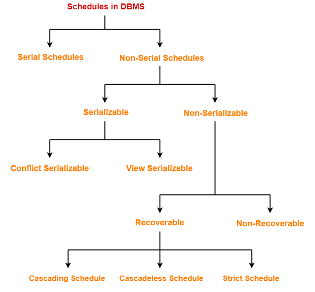

## 1. Conflict Serializability

- We try to convert the schedule to a serial schedule by repeatedly swapping *non-conflicting* instructions of the 2 transactions.
- 2 instructions are conflicting if they are operating on the same data item and one of them is a *write()* operation.
- That is `T1: read(A)` and `T2: read(A)` is non-conflicting, all the rest of the permutations are conflicting.

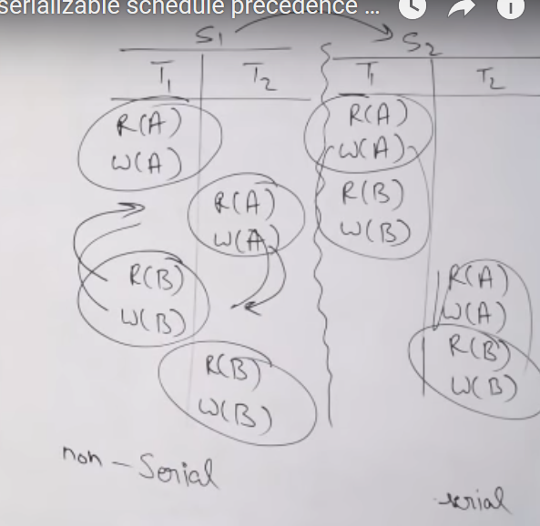

- Given a schedule, how to find if they are conflict-serializable??
- Basically we make a graph with a transaction as the vertex.
- If any instruction from T1 is conflicting with a later instruction from T2, then add a directed edge from T1->T2.
- Employ this algo for every instruction one-by-one from top-to-bottom for every transaction.
- If there is a cycle in this graph, it means its not conflict serializable.
- If there is no cycle, then the topological sort order would determine the transaction order of the equivalent serial schedule.
- The graph so formed is also called as the **Precedence Graph**.
- See [this](https://youtu.be/QkROSmKbVFQ) for demo.

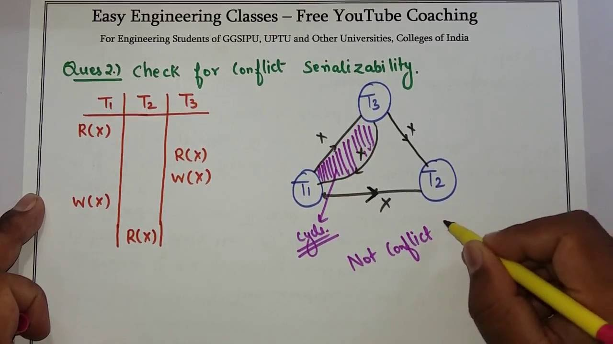  
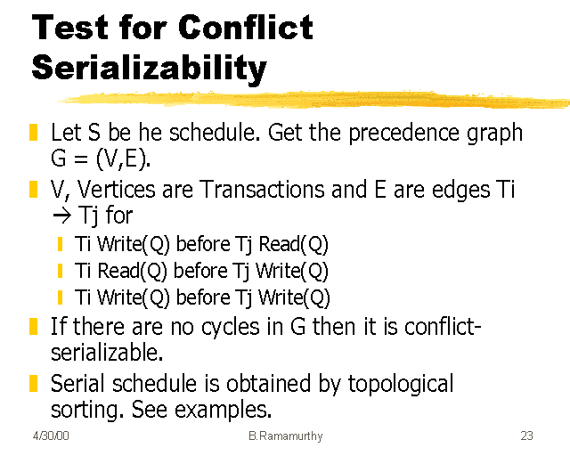  
  
## 2. View Serializability

- Its a weaker form of conflict serializability.
- Every conflict serializable schedule is a view serializable but the reverse is not true.
- Both conflict and view serializable schedules are definitely consistent.
- However, the schedules that are neither conflict nor view serializable need not be inconsistent.
- How to check if a schedule is view-serializable??
- We can first check if its conflict serializable. If it is, then it is also view serializable.
- Otherwise, if it does not have even 1 blind write, then it can never be view serializable.
- If it has atleast 1 blind write, then it might or might not be view serializable.
- Further testing includes testing view equivalency of the input schedule with each of the T! serial schedules, where T is the number of transactions:
  - For every data time 'X', if the *first-read* of X in input schedule is in transaction Ti, then the first read of X in the serial schedule should also be in the same transaction Ti.
  - Same rule as above, but for *final-write*.
  - The order of intermediate reads and writes should also be the same in both the schedules.
  - See [this](https://youtu.be/FJteasXARxg) for demo. 

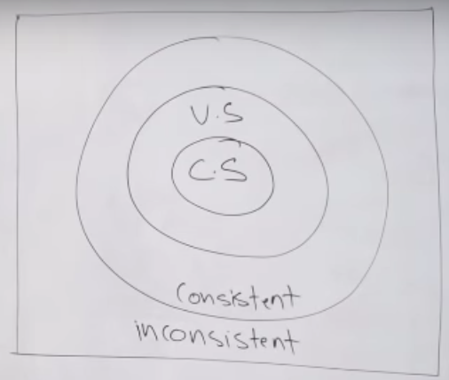

## 3. Recoverable Schedule

- Lets say transaction T2 does a dirty-read on a some variable from transaction T1 and commits.
- After that due to some error, T1 has to rollback. Meaning that the results of T2 will be incorrect causing db to be in an inconsistent state.
- This is called an irrecoverable schedule.
- Just consistency is not enough, we need recoverabilty also! It is a mandatory criteria for a DB.
- How to check if schedule is recoverable?
  - 1. If there is no dirty read.
  - 2. If there is a dirty read, but the commit order is same as the read order. Meaning T1 commits before T2.

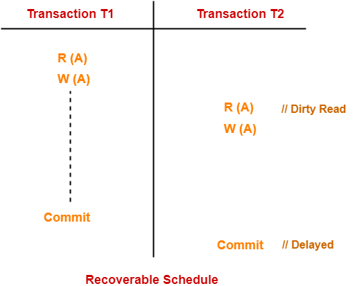  
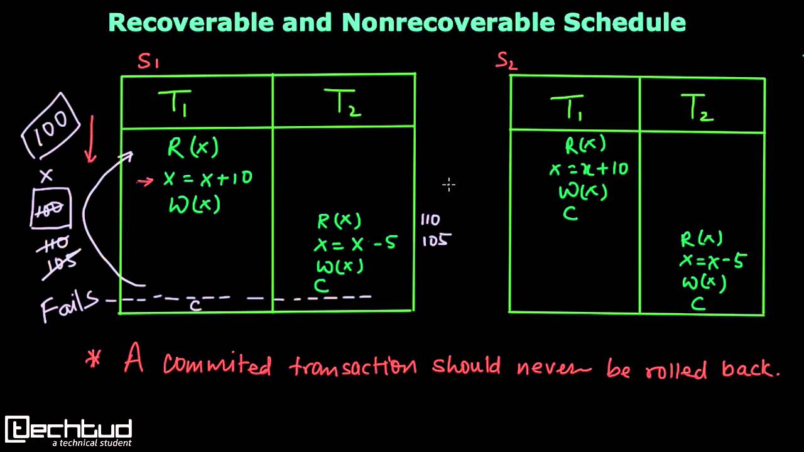  

## 4. Cascadeless Schedule

- When there are no *cascading rollbacks*.
- In cascading rollbacks, due to transaction T1 doing a rollback, T2 and T3 also have to rollback due to dirty read.
- A schedule is Cascadeless only if there are no dirty reads.
- Its an optional property for a DB; just for efficiency.
- A cascadeless schedule is always recoverable, but reverse is not true.

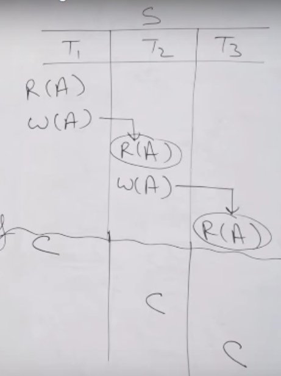  
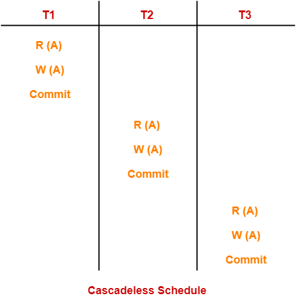  

## 5. Strict Schedule

- Transaction 2 should read/write on X only after T1 has finished working on X and committed.
- Basically, almost-serial schedules.
- Evert serial schedule is strict.

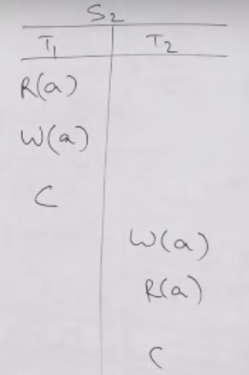  
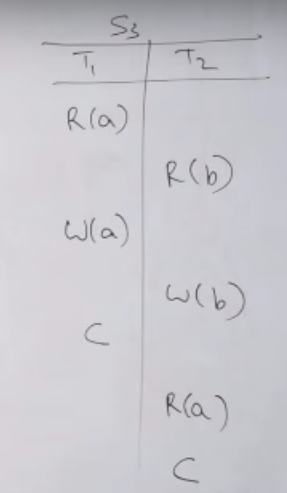  
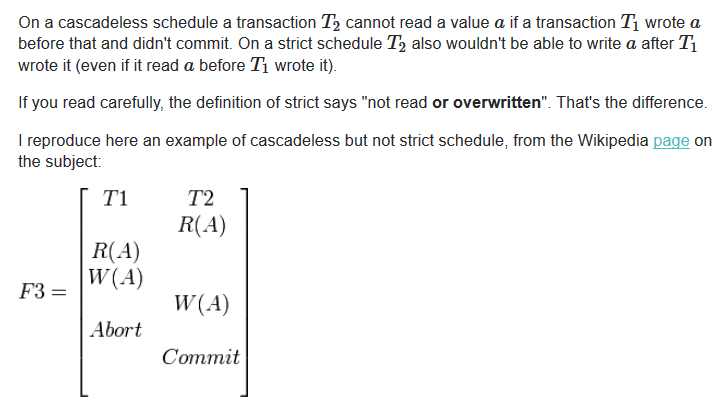  

# Concurrency Control Techniques

- Till now we learnt how to check if a schedule is serializable, recoverable etc.
- But now we will learn how to generate such schedules.

## 1. Timestamping protocol

- Basic idea is to order transactions using their entry time into the system.
- Conflits are resolved based on the transaction order.
- The timestamp of transaction T1 is denoted by `TS(T1)`.
- If T2 enters after T1, then `TS(T2) > TS(T1)`.
- In general, our aim is to make sure to have an equivalent effect of first transaction happening first.
- Every data item also has 2 timestamps associated with it: 
  - **WTS(X)**: The timestamp of the transaction that most recently updated X.
  - **RTS(X)**: The timestamp of the transaction that most recently read X.
- The rules are as follows:
-  Request for `Read(Q)` by transaction `Ti`:
  - If `TS(Ti) < WTS(Q)` => A more recent transaction has overwritten Q => Ti must rollback.
  - Else => Operation allowed => `RTS(Q) = max( RTS(Q), TS(Ti) )`
- Request for `Write(Q)`:
  - If `TS(Ti) < RTS(Q)` => A more recent transaction has read Q => Ti must rollback.
  - If `TS(Ti) < WTS(Q)` => A more recent transaction has overwritten Q => Ti must rollback (or ignored in case of Thomas Write Rule).
- **Properties:**
  - Will result in a **conflict-serializable** (and thus view serializable) schedule.
  - Dirty reads possible; meaning **recoverability** (and thus cascadelessness) not guaranteed.
  - A transaction either proceeds or rollbacks immediately; meaning **no deadlock possible**.
  - Possibility of **starvation**; if the same transaction is being rolled back again and again.
- **Thomas Write Rule:** In the case where Ti wants to `Write(Q)`, but `WTS(Q) > TS(Ti)`, then instead of rolling back Ti, we can just ignore this write.
- Schedules generated using Thomas Write Rule are view serializable but not conflict serializable (See [this](https://youtu.be/uLcEOs24Q3s) for example).

## 2. Lock-Based protocols
- 2 kinds of locks:
  - **Shared-Lock**: `LockS(Q)`; Q can have multiple shared locks at a time.
  - **Exclusive-Lock**: `LockX(Q)`; Q can have only 1 exclusive lock at a time. No other simultaneous shared/exclusive lock possible.

### 2.1 Two-Phase Locking (2PL)
- Why to use 2PL??
  - If we do too much locking, then concurrency will suffer. Will also result in non-serializable schedules.
  - Need to maintain a balanced between concurrency and consistency.
  - That is why we use 2PL.

#### 2.1.1 Basic 2PL
- In 2PL, once a transaction releases its first lock, it cannot acquire any more locks.
- So there is a *growing* and *shrinking* phase.
- Ensures conflict/view serializability.
- The serialization order is the order of reaching lock-point.
- Does not ensure recoverability/cascadelessness.
- Deadlock possible. Example:  

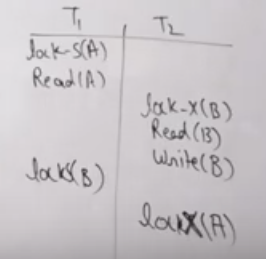

#### 2.1.2 Conservative/Static 2PL
- All the locks will will have to be acquired in the beginning itself.
- This is same as *one-shot* solution to deadlock (attacking hold-n-wait).
- If cannot obtain the next lock, then just rollback and try again.
- Meaning that livelock is possible.
- Can release at any time.
- No deadlock possible.
- Conflict/view serializability ensured.
- Still does not ensure recoverability/cascadelessness.
- Is not easy to implement practically as transaction might not now what locks it needs.

#### 2.1.3 Rigorous 2PL
- All the locks are held until the end of transaction.
- That is, there is no *growing phase*.
- Ensures conflict/view serializability as well as recoverability and cascadelessness.
- Suffers from **deadlock** and concurrency inefficiency.
- In real-life, deadlock is not that much of a problem; recoverability is a major problem though.

#### 2.1.4 Strict 2PL
- Almost similar to rigorous 2PL.
- But we can unlock shared locks before the end of the transaction.
- Improves the concurrency.
- Most transactions are read-heavy; therefore practically useful.

### 2.2. Tree-Based Locking Protocol
- We impose a **partial ordering** for all data items.
- If Di -> Dj, then in any transaction, Di must be accessed before Dj.
- We form a DAG/tree:  
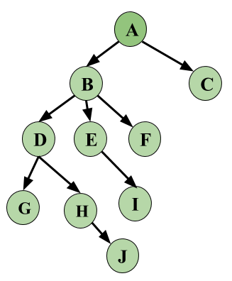  

- Rules:
  - Only exclusive locks allowed.
  - First lock by a transaction Ti may be on any data item.
  - Subsequent locks by Ti can only be on an item Q only if Q's parent is also locked by Ti.
  - Data items can be unlocked at any time (Parent can be unlocked before child).
  - If a data item Q has been locked and unlocked by Ti, it can never be locked again by Ti. 
- No deadlock, but starvation possible.
- Ensure conflict/view serializability but not recoverability/cascadelessness.
- Freedom to unlock anytime improves concurrency.
- Disadvantage is that the transaction might not know what data items to access in the start.

## Optimistic Protocols

- Rather than trying to control/limit concurrent access to multiple entities, we rather let it happen and itervene only when we detect a write conflict.
- One way to implement this is by having a `version` column in every table.
- Whenever a row is updated, the version number is incremented.
- Lets say T1 read a row R1 having version 1.
- T2 comes and starts reading R1 before T1 was done.
- Now T2 write on R1 and commits before T1 while increasing the version to `2`.
- The row and its version are updated in a single transaction.
- When T1 tries to commit, it checks that the version that it read (1) is not equal to current version (2), meaning that some other transaction update the row in between. Hence T1 will have to rollback/retry.
- Note that while writing, an exclusive lock is held on the row just for a short while.
- But it mostly avoids the use of locks generally.
- Optimistic locking is useful in the case of read-heavy loads, which is true for a large majority of real-life cases.
- https://stackoverflow.com/questions/17431338/optimistic-locking-in-mysql
- https://dba.stackexchange.com/questions/28879/how-to-correctly-implement-optimistic-locking-in-mysql/28890#28890
- https://stackoverflow.com/questions/28279606/optimistic-lock-with-a-version-field-vs-snapshot-isolation-level
- https://stackoverflow.com/questions/21421188/oracle-equivalent-of-sql-server-snapshot-isolation

# Deadlock prevention using Timestamping

## Wait-Die

- 2 transactions T1 and T2 contending for the same resource.
- Lets say T1 is holding the resource and T2 wants to acquire.
- 2 scenarios possible:
  - **T2 is older** `( TS(T2) < TS(T1) )`: T2 will wait for T1 to finish.
  - **T2 is younger** `( TS(T2) > TS(T1) )`: T2 gets rollbacked and restarted with random delay with the same timestamp.
- Either the older transaction waits or the younger one is killed.
- *Non-preemptive* because the older one is not killing off or preempting the resource from the younger one in the first case.

## Wound-Wait

- The same 2 scenarios possible:
  - **T2 is older** `( TS(T2) < TS(T1) )`: T1 is rollbacked and restarted with delay with same timestamp.
  - **T2 is younger** `( TS(T2) > TS(T1) )`: T2 will wait.
- Either the younger one is killed or it waits.
- The older transaction never waits.
- *Preemptive* because the older one is killing off or preempting the resource from the younger one in the first case.

# Isolation Levels

- All the modern databases provide a number of **isolation levels** to tweak the isolation strictness.
- Note that the more strict an isolation level is, in general the more inefficient it will be due to reduced concurrency.
- The choice of isolation level is driven by the guarantees your application requires from the database.
- Full ACID isolation is only provided by serializable isolation; all other isolation levels provide a lesser degree of protection for transactions.
- Following are some of them in the order of highest concurrency to slowest:

## 1. Serializable 

- This is the highest isolation level.
- Can be implemented using protocols like 2-phase or timestamping.
- Range locks are maintained during a `SELECT ... WHERE ...` clause to prevent phantom reads.

## 2. Snapshot isolation

- It is not regarded as a conventional isolation model as it was invented recently.
- Any statement in a transaction always will effectively see the db state as it was when the transaction started.
- It does this by MVCC(Multiversion Concurrency Control).
- Every write to a data item creates a new version of that.
- It uses timestamping and incremental transaction ids to maintain order.
- MVCC ensures a transaction never has to wait to read a database object by maintaining several versions of the object.
- Each version of object P has both a Read Timestamp (RTS) and a Write Timestamp (WTS) which lets a particular transaction Ti read the most recent version of the object which precedes the transaction's Read Timestamp RTS(Ti).
- If transaction T1 wants to write to object P, and there is also another transaction T2 happening to the same object, then RTS(T1) must precede RTS(Tk), i.e., RTS(Ti) < RTS(Tk), for the write to succeed.
- A write cannot complete if there are other outstanding transactions with an earlier read timestamp to the same object.
- Like standing in line at the store, you cannot complete your checkout transaction until those in front of you have completed theirs.
- To restate; every object (P) has a Timestamp (TS), however if T1 wants to write to an object, if `TS(Ti) < RTS(P)`, then the transaction is aborted and restarted. (This is because a later transaction already depends on the old value.)
- Otherwise, Ti creates a new version of object P and sets the read/write timestamp TS of the new version to the timestamp of the transaction TS=TS(Ti).[2]
- The drawback to this system is the cost of storing multiple versions of objects in the database.
- On the other hand, reads are never blocked, which can be important for workloads mostly involving reading values from the database. 
- Is isolation guarantees are almost as good as serializable.
- However, suffers from **write-skew** anomalies.

## 3. Repeatable Read

- If a transaction read a value v1 of a data item Q in 1 statement, then it will always read the same value in all the future statements of that transaction.
- Range locks are not implemented; meaning phantom reads are possible.
- Write skews are also possible just like in the snapshot isolation case.
- This is useful in case we are generating some business reports; if there are unrepeatable reads, it might lead to inconsistent reports.

## 4. Read committed

- Only values that are committed will be read by any statement of any transaction.
- However, may cause unrepeatable reads between 2 statements if some other transaction updated the same value within that time.

## 5. Read uncommitted

- The lowest level of isolation.
- Even dirty reads are allowed.
- No isolation techniques used.

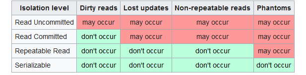  
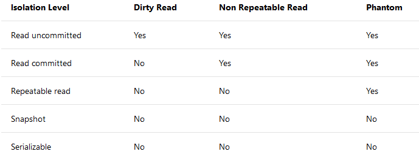