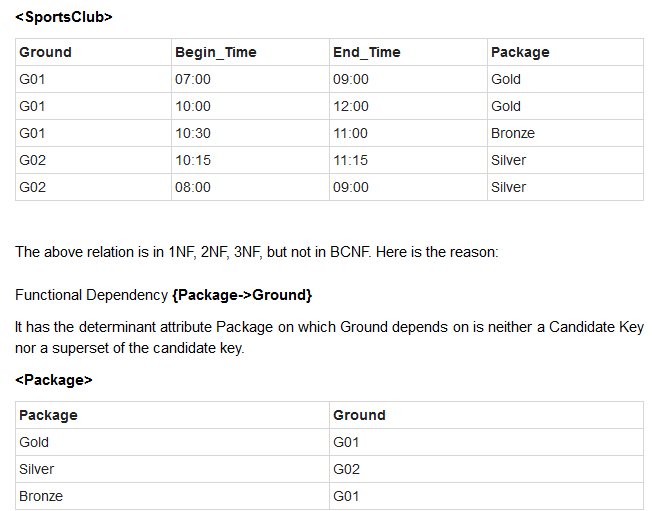
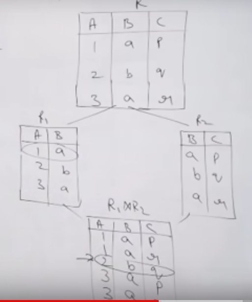

# Normalization

- Database normalization is the process of organizing the attributes of the database to reduce or eliminate data redundancy (having the same data but at different places).
- Data redundancy unnecessarily increases the size of the database as the same data is repeated in many places.
- Inconsistency problems also arise during insert, delete and update operations.


## Normal forms

### First Normal Form (1NF)

- Every attribute should be single-valued.  
  

### Second Normal Form (2NF)

- Satisfy 1NF.
- **No partial dependencies**.
- Example:  


| Customer ID | Store ID | Store City |
| ------------| ---------| -----------|
| 1           | 1        | A          |
| 1           | 2        | A          |
| 2           | 1        | A          |
| 2           | 3        | B          |

- Candidate Key: `{Customer ID, Store ID}`.
- Partial dep: `{Store ID -> Store City}`.
- To convert it to second normal form, we will decompose the relation as :

```
(Customer ID, Store ID)
(Store ID, Store City)
```

- Put simply, a relation is in 2NF if it is in 1NF and every non-prime attribute of the relation is dependent on the **whole** of every candidate key.
- Note that it does not put any restriction on the non-prime to non-prime attribute dependency. That is addressed in Third normal form.
- If a relation has only singleton candidate keys (every candidate key consists of only 1 attribute), then it is always in 2NF.
- Also, if a relation has no non-prime attribute, then also it is in 2NF.
- Read the example [here](https://en.wikipedia.org/wiki/Second_normal_form).

### Third Normal Form (3NF)

- Satisfy 2NF.
- **No transitive dependencies**.
- All the non-prime attributes must depend on a full candidate key only.
- If all attributes are prime, then the relation is always in 3NF.
- Read the example [here](https://en.wikipedia.org/wiki/Third_normal_form).

### Boyce-Codd Normal Form (BCNF)

- Satisfies 3NF.
- In every dependency `A -> B`, A must be a superkey.
- If a table satisfies 3NF and has **no overlapping candidate keys**, then it is also in BCNF.
- If there are overlapping candidate keys, it may or may not be in BCNF.
- Which implies that if a 3NF table has just 1 candidate key, it is already in BCNF.
- Every binary Relation ( a relation with only 2 attributes ) is always in BCNF.
  > "Every non-key attribute must provide a fact about the key, the whole key, and nothing but the key."
- Example:

> Your pizza can have exactly three topping types:
>
> - one type of cheese
> - one type of meat
> - one type of vegetable
>
> So we order two pizzas and choose the following toppings:
>
>     Pizza    Topping     Topping Type
>     -------- ----------  -------------
>     1        mozzarella  cheese
>     1        pepperoni   meat
>     1        olives      vegetable
>     2        mozzarella  meat
>     2        sausage     cheese
>     2        peppers     vegetable
>
> Wait a second, mozzarella can't be both a cheese and a meat! And
> sausage isn't a cheese!
>
> We need to prevent these sorts of mistakes, to make mozzarella
> _always_ be cheese. We should use a separate table for this, so we write down that fact in only one place.
>
>     Pizza    Topping
>     -------- ----------
>     1        mozzarella
>     1        pepperoni
>     1        olives
>     2        mozzarella
>     2        sausage
>     2        peppers
>
>     Topping     Topping Type
>     ----------  -------------
>     mozzarella  cheese
>     pepperoni   meat
>     olives      vegetable
>     sausage     meat
>     peppers     vegetable
>
> ---
>
> That was the explanation that an 8 year-old might understand. Here is
> the more technical version.
>
> _BCNF acts differently from 3NF only when there are multiple overlapping candidate keys._
>
> The reason is that the functional dependency `X -> Y` is of course
> true if `Y` is a subset of `X`. So in any table that has only one
> candidate key and is in 3NF, it is already in BCNF because there is no
> column (either key or non-key) that is functionally dependent on
> anything besides that key.
>
> Because each pizza must have exactly one of each topping type, we know
> that (Pizza, Topping Type) is a candidate key. We also know
> intuitively that a given topping cannot belong to different types
> simultaneously. So (Pizza, Topping) must be unique and therefore is
> also a candidate key. So we have two overlapping candidate keys.
>
> I showed an anomaly where we marked mozarella as the wrong topping
> type. We know this is wrong, but the rule that makes it wrong is a
> dependency `Topping -> Topping Type` which is not a valid dependency
> for BCNF for this table. It's a dependency on something other than a
> whole candidate key.
>
> So to solve this, we take Topping Type out of the Pizzas table and
> make it a non-key attribute in a Toppings table.

  
[Source](https://stackoverflow.com/a/8438829/1925388)

### Fourth Normal Form

- Satisfies BCNF.
- A table is in 4NF if and only if, for every one of its non-trivial _multivalued dependencies_ `X --> Y`, X is a superkey, that is, X is either a candidate key or a superset thereof.
- **Multivalued dependency:**

  - A multivalued dependency exists when there are at least three attributes (like X,Y and Z) in a relation and for a value of X there is a well defined set of values of Y and a well defined set of values of Z. However, the set of values of Y is independent of set Z and vice versa.
  - If the column headings in a relational database table are divided into three disjoint groupings X, Y, and Z, then, in the context of a particular row, we can refer to the data beneath each group of headings as x, y, and z respectively.
  - A multivalued dependency `X --> Y` signifies that if we choose any x actually occurring in the table (call this choice x<sub>c</sub>), and compile a list of all the x<sub>c</sub>yz combinations that occur in the table, we will find that x<sub>c</sub> is associated with the same y entries regardless of z. So essentially the presence of z provides no useful information to constrain the possible values of y.
  - A functional dependency is a special case of multivalued dependency. In a functional dependency X → Y, every x determines exactly one y, never more than one.
  - Example:

| Restaurant       | Pizza Variety | Delivery Area |
| ---------------- | ------------- | ------------- |
| A1 Pizza         | Thick Crust   | Springfield   |
| A1 Pizza         | Thick Crust   | Shelbyville   |
| A1 Pizza         | Thick Crust   | Capital City  |
| A1 Pizza         | Stuffed Crust | Springfield   |
| A1 Pizza         | Stuffed Crust | Shelbyville   |
| A1 Pizza         | Stuffed Crust | Capital City  |
| Elite Pizza      | Thin Crust    | Capital City  |
| Elite Pizza      | Stuffed Crust | Capital City  |
| Vincenzo's Pizza | Thick Crust   | Springfield   |
| Vincenzo's Pizza | Thick Crust   | Shelbyville   |
| Vincenzo's Pizza | Thin Crust    | Springfield   |
| Vincenzo's Pizza | Thin Crust    | Shelbyville   |

- Each row indicates that a given restaurant can deliver a given variety of pizza to a given area.
- The table has no non-key attributes because its only key is `{Restaurant, Pizza Variety, Delivery Area}`.
- Therefore it meets all normal forms up to BCNF.
- If we assume, however, that pizza varieties offered by a restaurant are not affected by delivery area (i.e. a restaurant offers all pizza varieties it makes to all areas it supplies), then it does not meet 4NF.
- The problem is that the table features two non-trivial multivalued dependencies on the `{Restaurant}` attribute (which is not a superkey). The dependencies are:
  - `{Restaurant} --> {Pizza Variety}`
  - `{Restaurant} --> {Delivery Area}`
- These non-trivial multivalued dependencies on a non-superkey reflect the fact that the varieties of pizza a restaurant offers are independent from the areas to which the restaurant delivers.
- This state of affairs leads to redundancy in the table: for example, we are told three times that A1 Pizza offers Stuffed Crust, and if A1 Pizza starts producing Cheese Crust pizzas then we will need to add multiple rows, one for each of A1 Pizza's delivery areas. -
- There is, moreover, nothing to prevent us from doing this incorrectly: we might add Cheese Crust rows for all but one of A1 Pizza's delivery areas.
- To eliminate the possibility of these anomalies, we must place the facts about varieties offered into a different table from the facts about delivery areas, yielding two tables that are both in 4NF:

| Restaurant       | Pizza Variety |
| ---------------- | ------------- |
| A1 Pizza         | Thick Crust   |
| A1 Pizza         | Stuffed Crust |
| Elite Pizza      | Thin Crust    |
| Elite Pizza      | Stuffed Crust |
| Vincenzo's Pizza | Thick Crust   |
| Vincenzo's Pizza | Thin Crust    |

| Restaurant       | Delivery Area |
| ---------------- | ------------- |
| A1 Pizza         | Springfield   |
| A1 Pizza         | Shelbyville   |
| A1 Pizza         | Capital City  |
| Elite Pizza      | Capital City  |
| Vincenzo's Pizza | Springfield   |
| Vincenzo's Pizza | Shelbyville   |


## Lossless-Join Decomposition

- While normalization, if we decompose a relation R into 2 new relations R1 and R2, we should get exactly R back after joining R1 and R2.
- Its join-lossless if:
  - Union[attr(R1), attr(R2)] = attr(R)
  - Intersection[attr(R1), attr(R2)] != {} (Should not be empty-set)
  - If R3 = Intersection[attr(R1), attr(R2)], then either `R3 -> R1` or `R3 -> R2`.
    That is, the common attributes should uniquely identify a row in either of the 2 child tables.
    This is to avoid duplicate rows while joining R1 and R2 to again form R.
- That is, if we join R1 and R2, we should get R exactly back, no extra rows, no missing rows.



## Dependency Preserving Decomposition

- While normalization, if we decompose a relation R into R1 and R2, and R has a set of functional dependencies 'F', R1 has 'F1' and R2 has 'F2.
- Then (Union(F1, F2))+ = (F)+. 

## Normalization Summary

- Second Normal Form:
  - `p -> np` not allowed.
  - `p` means prime attribute, `np` means non-prime.
- Third Normal Form:
  - `p -> np` not allowed.
  - `np -> np`not allowed.
- BCNF:
  - Only `SK -> x` allowed.
  - `SK` means any Super-Key, `x` means anything.
  - In every dependency, the LHS must be a super-key.
  - Very easy to check.
  - That means all these not allowed:
    - `p -> np`.
    - `np -> np`.
    - `p -> p`.
    - `np -> p`.