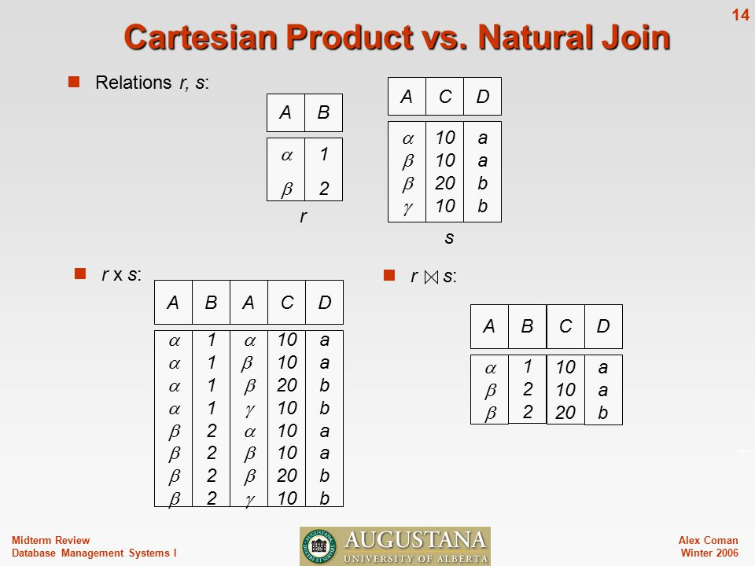
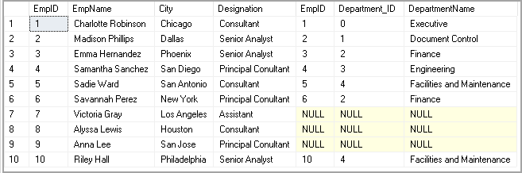
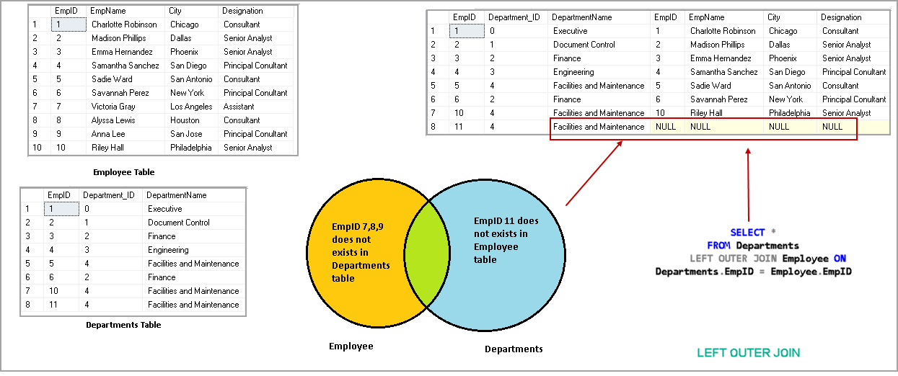
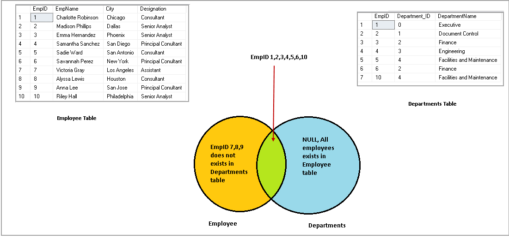
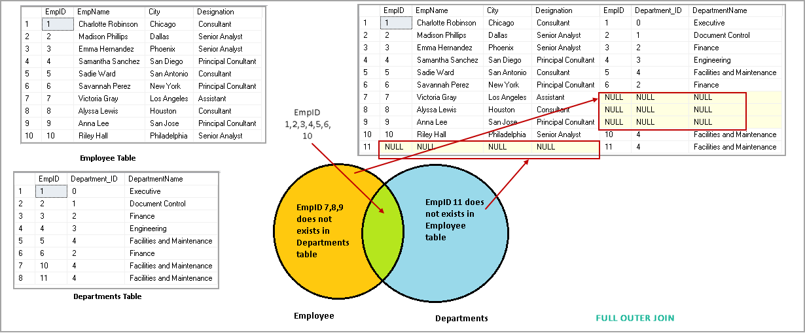
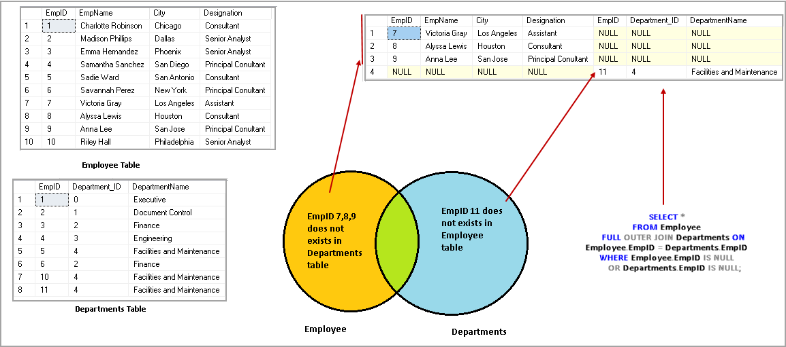
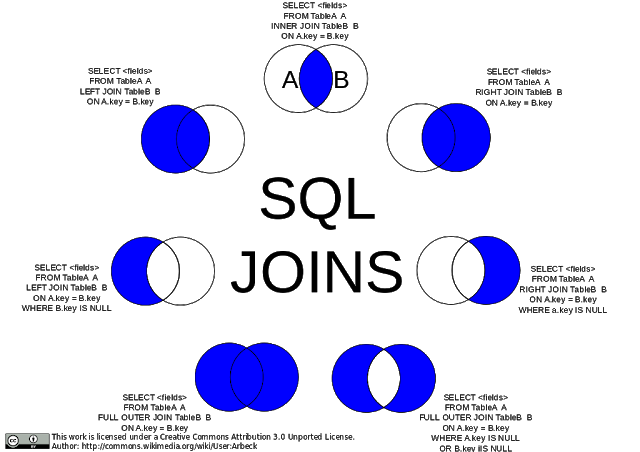

# Links
- Fantastic crash-course: https://sqlbolt.com

# Procedural vs Non-Procedural
- Languages can either be procedural or non-procedural.
- Procedural means we need to specify **how to do**. Example -> C, Java etc.
- Non-procedural means we just need to specify **what to do**. Example -> Prolog, LISP.
- Relational algebra is procedural, whereas relational calculus is non-procedural.
- SQL is 90% relational algebra.

# Relational algebra

- Operands are relations.
- Has multiple operators, like `select`, `project`.

## Select
- Used to choose a particular row(s) using attribute predicates.
- Example: `select(Student, id < 10 && age < 24)`.
- Note that its a unary operator.
- The predicate is not considered to be an operand.
- The output relation will not have any name.


## Project
- Used to choose a particular column(s).
- `project(Student, {id, name})`.
- Unary operator.

## Union
- Used to take union of 2 relations.
- No duplicates in the result.
- `C = Union(A, B)`
- Binary operator.
- The 2 input tables must have exactly the same attribute domains.

## Difference
- Used to take set-difference of 2 relations.
- `C = Difference(A, B)`
- Binary operator.
- The 2 input tables must have exactly the same attribute domains.

## Cartesian-Product
- Used to join 2 relations.
- If tuple 1 is having x rows and tuple 2 y rows, then the product will have x*y rows.
- `C = Product(A, B)`
- The 2 input tables can have different attribute domains.

## Natural-Join
- Used to join 2 relations, but without redundant rows.
- Redundant rows are the rows in which the common attributes have different value.
- Joining is same as first taking cartesian product and then removing all the redundant rows.
- Also called as just `Join`.
- `C = Join(A, B)`

  

## Outer-Joins
- Same as inner join, but tries to still keep the rows from the parent columns which would have been lost otherwise.
### Left-Outer Join
- Keeps the rows from the left input relation.
- If a redundant row r1 from relation 1 is there is in the output, it will have NULL in the columns of relation 2.

  
  

### Right-Outer Join
- Same as left-outer join, but preserves the right input relation's redundant rows.

### Full Outer Join
- Preserves both sides' redundant rows.
- The union of left and right outer joins will also give full outer join.

  
  
  
  
  

More examples:
 - <https://www.geeksforgeeks.org/sql-join-set-1-inner-left-right-and-full-joins/)>.
 - <https://www.geeksforgeeks.org/sql-join-cartesian-join-self-join/>.

A not-so-simple way to get the max of a some attribute in a relation:
```sql
(Select marks from Student) MINUS (SELECT s1.marks from Student as s1, Student as s2 where s1.marks < s2.marks)
```


# SQL

- It provides some features on top of relational algebra.
- DDL (Data Definition Language):
 - **Integrity constraints**: Not NULL, foreign key etc.
 - **VIEW definition:** Sorting result wrt some attribute.
 - **Authorization**: Read-only, write-only to specific users.
- DML (Data Manipulation Language):
  - `SELECT`, `INSERT` etc.
  - **Transaction management:** commit, roll back etc.

## SELECT

- Its not the same as `Select` in relational algebra!!.
- Its more like a combination of `Select` and `Project`.
- ```sql
  SELECT C1, C2 ... Cn
  FROM R1, R2, R3... Rn
  WHERE P1 and P2 and Pn...
   ```
- `SELECT (column) FROM (tables) WHERE (conditions)`.
- The `SELECT` part does projection and `WHERE` part does the selection if we are talking about relational algebra.
- The `WHERE` part is not mandatory.
- Allows duplicates in input as well as ouput.
- Inputs can be multiple tables.
- Output is always a single unnamed table.
- How to rename:
  - `SELECT * FROM STUDENT as NEW_STUDENT`.
  - `SELECT marks*0.01 as new_marks from STUDENT`

## Join
- Always prefer `JOIN USING ...` instead of `NATURAL_JOIN` as its more explicit. Also, if in future more common keys are added, it will lead to wrong results!

### USING vs ON
- `ON` is a more general version of `USING`.
- `USING` is useful when both tables share a column of the exact same name on which they join.
- For example:
```sql
SELECT ... FROM film JOIN film_actor USING (film_id) WHERE ...
```

```sql
SELECT * FROM world.City JOIN world.Country ON (City.CountryCode = Country.Code) WHERE ...
```
- An additional nice treat is that one does not need to fully qualify the joining columns:
```sql
SELECT film.title, film_id -- film_id is not prefixed
FROM film
JOIN film_actor USING (film_id)
WHERE ...
```
- To illustrate, to do the above with ON, we would have to write:
```sql
SELECT film.title, film.film_id -- film.film_id is required here
FROM film
JOIN film_actor ON (film.film_id = film_actor.film_id)
WHERE ...
```
- As for `select *`, the joining column appears in the result set twice with ON while it appears only once with `USING`

### WHERE vs ON
- `WHERE` and `ON` does not make a difference in inner joins, however they are different in outer joins.

## Pattern matching
- `LIKE '%KUMAR'`. -> `%` matches any number of characters.
- `LIKE '___123'` -> `_` matches just 1 character.
- `'val1' = 'val2'` -> Exact matching.

## ORDER BY
- Todo