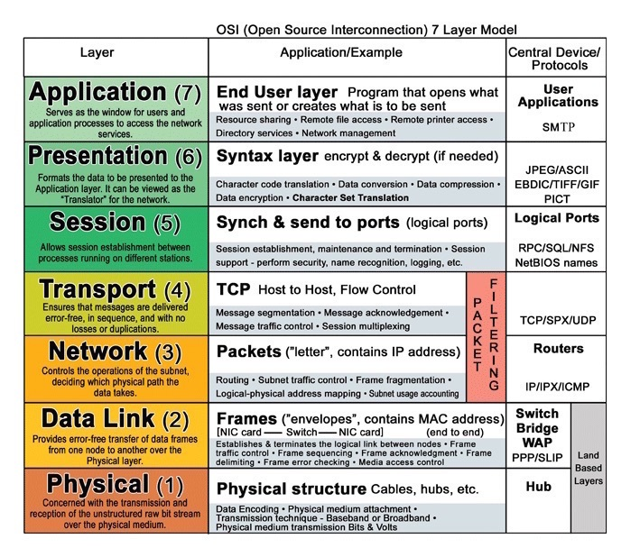

# Networking



## Physical Layer

- This is where electrical signals or light pulses or radio waves actually transmit information from place to place.
- The physical layer doesn't really have protocols, but instead has standards for voltages, frequencies, and other physical properties.
- You can transmit information directly this way, but you need a lot of power or a dedicated line, and without higher layers you won't be able to share bandwidth.

## Link layer

- This layer covers communication with devices that share a physical communications medium.
- Here, protocols like **Ethernet**, **802.11a/b/g/n**, and Token Ring specify how to handle multiple concurrent accesses to the physical medium and how to direct traffic to one device instead of another.
- In a typical home network, this is how your computer talks to your home router.

## Network layer

- In the majority of cases, this is dominated by **Internet Protocol (IP)**.
- This is where the magic of the Internet happens, and you get to talk to a computer halfway around the world, without needing to know where it is.
- Routers handle directing your traffic from your local network to the network where the other computer lives, where its own link layer handles getting the packets to the right computer.
- IP is not a reliable protocol. Reliability comes from Transport layer (if TCP is used).

## Transport layer

- Transmission of segments, so applications on both endpoints can exchange messages with given reliability guarantees.
- IP is an unreliable protocol.
- TCP handles packet ordering, error-control, flow-control, congestion-control etc.
- Example - TCP, UDP, ICMP

## Application layer

- We can talk to a computer somewhere around the world, but that computer is running lots of different programs.
- How should it know which one to deliver your message to?
- These are things that application-layer protocols handle.
- For web traffic, this is the **HyperText Transfer Protocol (HTTP)**.
- There are thousands of application-layer protocols: SMTP, IMAP, and POP3 for email; XMPP, IRC, ICQ for chat; Telnet, SSH, RDP for remote administration; etc.
- It has no role whatsoever in setting up the connection, it is only application specific.
- It assumes that you know how to find the route to the webserver ( courtesy IPv4 ) and have setup a connection and can transfer data reliably ( courtesy TCP ). - It is only concerned with the data that you exchange; what is its URL, what is its type, where to find it.

## API layer

- Above the application layer, Application Programming Interfaces (APIs) govern communication with web applications like Quora, Twitter, and Facebook.

---

# HTTP

- HTTP is a method for encoding and transporting data between a client and a server.
- It is a request/response protocol: clients issue requests and servers issue responses with relevant content and completion status info about the request.
- HTTP is self-contained, allowing requests and responses to flow through many intermediate routers and servers that perform load balancing, caching, encryption, and compression.

A basic HTTP request consists of a verb (method) and a resource (endpoint). Below are common HTTP verbs:

| Verb   | Description                                               | Idempotent\* | Safe | Cacheable                               |
| ------ | --------------------------------------------------------- | ------------ | ---- | --------------------------------------- |
| GET    | Reads a resource                                          | Yes          | Yes  | Yes                                     |
| POST   | Creates a resource or trigger a process that handles data | No           | No   | Yes if response contains freshness info |
| PUT    | Creates or replace a resource                             | Yes          | No   | No                                      |
| PATCH  | Partially updates a resource                              | No           | No   | Yes if response contains freshness info |
| DELETE | Deletes a resource                                        | Yes          | No   | No                                      |

\*Can be called many times without different outcomes.

---

# TCP

- TCP is a connection-oriented protocol over an IP network.
- Connection is established and terminated using a handshake.
- All packets sent are guaranteed to reach the destination in the original order and without corruption through:
  - Sequence numbers and checksum fields for each packet.
  - Acknowledgement packets and automatic retransmission.
  - If the sender does not receive a correct response, it will resend the packets.
  - If there are multiple timeouts, the connection is dropped. TCP also implements flow control(back-pressure) and congestion control.
  - These guarantees cause delays and generally result in less efficient transmission than UDP.
- To ensure high throughput, web servers can keep a large number of TCP connections open, resulting in high memory usage.
- It can be expensive to have a large number of open connections between web server threads and say, a memcached server.
- Connection pooling can help in addition to switching to UDP where applicable.
- TCP is useful for applications that require high reliability but are less time critical.
- Some examples include web servers, database info, SMTP, FTP, and SSH.
- Use TCP over UDP when:
  - You need all of the data to arrive intact.
  - You want to automatically make a best estimate use of the network throughput.

---

# UDP

- UDP is connectionless.
- Datagrams (analogous to packets) are guaranteed only at the datagram level.
- Datagrams might reach their destination out of order or not at all.
- UDP does not support congestion control.
- Without the guarantees that TCP support, UDP is generally more efficient.
- UDP can broadcast, sending datagrams to all devices on the subnet.
- This is useful with DHCP because the client has not yet received an IP address, thus preventing a way for TCP to stream without the IP address.
- UDP is less reliable but works well in real time use cases such as VoIP, video chat, streaming, and realtime multiplayer games.
- Use UDP over TCP when:
  - You need the lowest latency.
  - Late data is worse than loss of data.
  - You want to implement your own error correction.

---

# RPC

- In an RPC, a client causes a procedure to execute on a different address space, usually a remote server.
- The procedure is coded as if it were a local procedure call, abstracting away the details of how to communicate with the server from the client program. - Remote calls are usually slower and less reliable than local calls so it is helpful to distinguish RPC calls from local calls.
- Popular RPC frameworks include:
  - [Protobuf](https://developers.google.com/protocol-buffers/)
  - [Thrift](https://thrift.apache.org/)
  - [Avro](https://avro.apache.org/docs/current/)
- RPC is a request-response protocol:
  - **Client program** - Calls the client stub procedure. The parameters are pushed onto the stack like a local procedure call.
  - **Client stub procedure** - Marshals (packs) procedure id and arguments into a request message.
  - **Client communication module** - OS sends the message from the client to the server.
  - **Server communication module** - OS passes the incoming packets to the server stub procedure.
  - **Server stub procedure** - Unmarshalls the results, calls the server procedure matching the procedure id and passes the given arguments.
  - The server response repeats the steps above in reverse order.
- RPC is focused on exposing behaviors.
- RPCs are often used for performance reasons with internal communications, as you can hand-craft native calls to better fit your use cases.

Sample RPC calls:

```
GET /someoperation?data=anId

POST /anotheroperation
{
  "data":"anId";
  "anotherdata": "another value"
}
```

- Choose a native library (aka SDK) when:
  - You know your target platform.
  - You want to control how your "logic" is accessed.
  - You want to control how error control happens off your library.
  - Performance and end user experience is your primary concern.

**Limitations**

- RPC clients become tightly coupled to the service implementation.
- A new API must be defined for every new operation or use case.
- It can be difficult to debug RPC.
- You might not be able to leverage existing technologies out of the box.
- For example, it might require additional effort to ensure RPC calls are properly cached on caching servers such as Squid.

---

# Representational state transfer (REST)

- REST is an architectural style enforcing a client/server model where the client acts on a set of resources managed by the server.
- The server provides a representation of resources and actions that can either manipulate or get a new representation of resources.
- All communication must be **stateless** and **cacheable**.

There are four qualities of a RESTful interface:

- **Identify resources (URI in HTTP)** - use the same URI regardless of any operation.
- **Change with representations (Verbs in HTTP)** - use verbs, headers, and body.
- **Self-descriptive error message (status response in HTTP)** - Use status codes, don't reinvent the wheel.
- **[HATEOAS](http://restcookbook.com/Basics/hateoas/) (HTML interface for HTTP)** - your web service should be fully accessible in a browser.

Sample REST calls:

```
GET /someresources/anId

PUT /someresources/anId
{"anotherdata": "another value"}
```

- REST is focused on exposing data.
- It minimizes the coupling between client/server and is often used for public HTTP APIs.
- REST uses a more generic and uniform method of exposing resources through URIs, [representation through headers](https://github.com/for-GET/know-your-http-well/blob/master/headers.md), and actions through verbs such as GET, POST, PUT, DELETE, and PATCH.
- Being stateless, REST is great for horizontal scaling and partitioning.

**Disadvantages**

- With REST being focused on exposing data, it might not be a good fit if resources are not naturally organized or accessed in a simple hierarchy. For example, returning all updated records from the past hour matching a particular set of events is not easily expressed as a path. With REST, it is likely to be implemented with a combination of URI path, query parameters, and possibly the request body.
- REST typically relies on a few verbs (GET, POST, PUT, DELETE, and PATCH) which sometimes doesn't fit your use case. For example, moving expired documents to the archive folder might not cleanly fit within these verbs.
- Fetching complicated resources with nested hierarchies requires multiple round trips between the client and server to render single views, e.g. fetching content of a blog entry and the comments on that entry. For mobile applications operating in variable network conditions, these multiple roundtrips are highly undesirable.
- Over time, more fields might be added to an API response and older clients will receive all new data fields, even those that they do not need, as a result, it bloats the payload size and leads to larger latencies.

### RPC and REST calls comparison

| Operation                       | RPC                                                                                       | REST                                                         |
| ------------------------------- | ----------------------------------------------------------------------------------------- | ------------------------------------------------------------ |
| Signup                          | **POST** /signup                                                                          | **POST** /persons                                            |
| Resign                          | **POST** /resign<br/>{<br/>"personid": "1234"<br/>}                                       | **DELETE** /persons/1234                                     |
| Read a person                   | **GET** /readPerson?personid=1234                                                         | **GET** /persons/1234                                        |
| Read a person’s items list      | **GET** /readUsersItemsList?personid=1234                                                 | **GET** /persons/1234/items                                  |
| Add an item to a person’s items | **POST** /addItemToUsersItemsList<br/>{<br/>"personid": "1234";<br/>"itemid": "456"<br/>} | **POST** /persons/1234/items<br/>{<br/>"itemid": "456"<br/>} |
| Update an item                  | **POST** /modifyItem<br/>{<br/>"itemid": "456";<br/>"key": "value"<br/>}                  | **PUT** /items/456<br/>{<br/>"key": "value"<br/>}            |
| Delete an item                  | **POST** /removeItem<br/>{<br/>"itemid": "456"<br/>}                                      | **DELETE** /items/456                                        |

---

# Latency vs Throughput

- Latency is the time required to perform some action or to produce some result.
- Latency is measured in units of time -- hours, minutes, seconds, nanoseconds or clock periods.
- Throughput is the number of such actions executed or results produced per unit of time.
- This is measured in units of whatever is being produced (cars, motorcycles, I/O samples, memory words, iterations) per unit of time.
- The term "memory bandwidth" is sometimes used to specify the throughput of memory systems.
- A simple example:

```
An assembly line is manufacturing cars. It takes eight hours to manufacture a car and that the factory produces one hundred and twenty cars per day.

The latency is: 8 hours.

The throughput is: 120 cars / day or 5 cars / hour.
```

# What happens when you Google

Read [this](https://github.com/alex/what-happens-when)