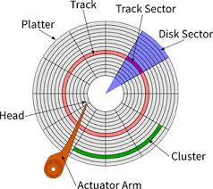

  

In case of multiple IO requests, the disk scheduling algo must decide which request must be executed first.

- **Seek Time**: The time required to move the head to the desired track.

# First Come First Serve (FCFS)
- Inefficient seek/waiting/response times.
- For example:
  - Input = [98, 183, 41, 122, 14]
  - Initial position = Track 53
  - Distance travelled by head = (98-53) + (183-98) + (183-41) + (122-41) + ... = 632

# Shortest Scan Time First (SSTF)
- Services the request which is closest to the head's current position.
- Tie is broken in the direction of movement (because it takes time to reverse direction).
- Efficient seek moves.
- High variance in waiting/response times (Very important for Real-time systems).
- Can lead to starvation.
- Overhead to find the next closest request.
- Can be implemented using a BST.

# SCAN (Elevator algorithm)
- The head starts from one end and travels to the other end servicing all the requests in between.
- No starvation.
- Higher seek moves than SSTF.
- Less variance in average waiting time.
- High waiting time for locations just visited by head.
- Travel till the end even if there are no more requests.

# C-SCAN
- Similar to SCAN, just that the head service the requests only in one direction.
- It returns back directly without servicing any requests.
- Results in significantly less waiting time.
- In SCAN, imagine a request came to the first end just after the head started moving from first end.
- That request will be served after the head goes to the other head and returns servicing all the requests in between.
- Imagine it takes 1 hour from one end to another. So, this request will be served in 2 hours.
- However, in C-SCAN, it will take 1 hour.
- So, the worst-case average waiting time is reduced.

# LOOK
- Same as SCAN but the head reverses direction as soon as it sees no more requests.

# C-LOOK
- Same as LOOK, just that the request are served only in one direction.