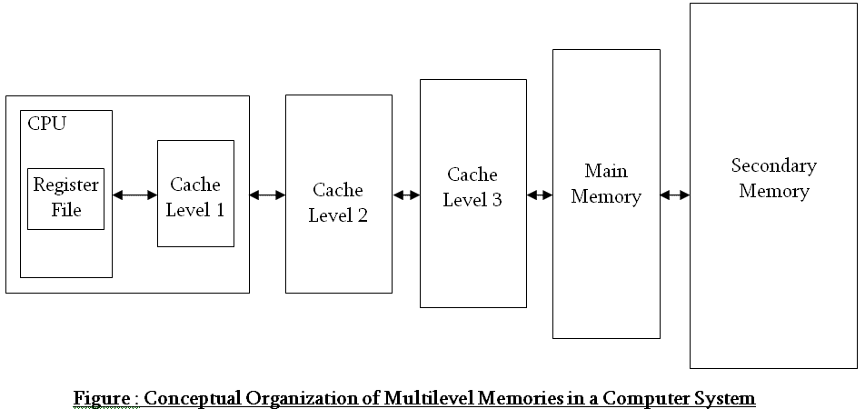

- The bigger the size of the memory is, the more is the access time, and less is the cost per unit.
# Locality of reference
- If instruction I1 is executing right now, then most probably I2, I3 ... will be executed shortly.
- So, we can prefetch those instructions from secondary to main memory, or from main memory to cache even.

- As an analogy, consider that you have shop in the city centre; it will be very small in size as the land cost is high. So, most of the goods will be stored in the city periphery in some godown. We will only keep the most frequently used/sold goods in the shop.
- Lets say the main memory can only store a total of 100 instructions at a time. Lets say there are 10 processes, each of them having 20 instructions, that is total 200 instructions. Now, instead of loading only 5 full processes at a time (which will lead to delay for other processes), we can instead load 10 instructions, or 50% of all the processes and execute them all in a preemptive round robin fashion, ensuring that all the processes are being executed at a time.
- Lets say memory has instructions 1-5 of process 1 and it has executed all of them; now instead of just loading the 6th instruction, it can load, say the next 10 instructions at once, as we know that due to locality of reference, these will be executed next most likely.
- Note that localilty of reference will not be valid everytime, as there can be `GOTO` (if/else) statements which causes one instruction to jump to another far-off instruction directly.
- **Hit ratio**: Lets say we will get a cache hit 90% of the time (ie. hit ratio = 90%). Then `Average access time = 0.9*t1 + 0.1*t2`, where t1 is the cache access time and t2 is the main memory access time.

# Memory allocation

## Contiguous vs Non-contiguous allocation
- Whenever we bring process from secondary to main memory, we can either bring the whole process (all instructions) together in the main memory.
- Or we can divide the process into partitions and put these partitions in different places in the main memory.
- Contiguous memory allocation suffers from external fragmentation.
- Non-contiguous suffers from internal fragmentation.
- **External fragmentation**: When we cannot allocate a process even though the total available space is more than required by process.
- **Internal fragmentation**: When the memory block allocated to a process is slightly bigger than the process; thus wasting some space.
- External fragmentation is **far more severe** than internal (think GB vs MB).
- Contiguous is analogous to an array and non-contiguous to a linked list.
- Contiguous is faster than non-contiguous as there is no indirection.

  
  
  
  
  

|            Case           | External Fragmentation | Internal Fragmentation |                                           Notes                                           |   |
|:-------------------------:|:----------------------:|:----------------------:|:-----------------------------------------------------------------------------------------:|:-:|
|     Contiguous + Fixed    |          True          |          True          |                                                                                           |   |
|   Contiguous + Variable   |          True          |          False         | Segmentation (basically every segment can be considered as a separate contiguous process) |   |
|   Non-contiguous + Fixed  |          False         |          True          |                                           Paging                                          |   |
| Non-contiguous + Variable |          False         |          False         |                                       Confirm please                                      |   |
|   Paging + Segmentation   |          True          |          True          |                                       Confirm please                                      |   |