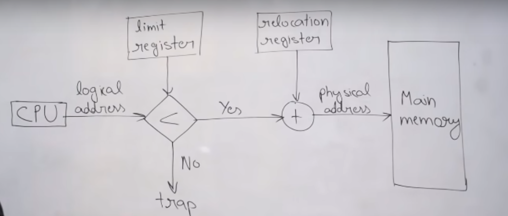

# Fixed vs Variable partitioning for Contiguous

- In fixed, the process is divided into fixed-size partitions; all the partitions can have different sizes, but those sizes can never be changed. The sizes are system-dependent fixed at the time of manufacturing.
- In variable, we will not do any partitioning as such. If a process requires 4 units, we'll allocate it exactly 4 units.
- However, in fixed partitioning, if the process requires 3 units and we only have a block of 4 units available, then we'll get internal fragmentation of 1 kb.
- Variable-sized contiguous partitioning has no internal fragmentation at all!!

# Allocation algorithms for Contiguous

- **First-Fit**: Allocate the first memory block to the process which is bigger than the process.
- **Best-Fit**: Allocate the smallest memory block to the process which is bigger than the process.
- **Worst-Fit**: Allocate the biggest memory block to the process which is bigger than the process.

- **Important**: In fixed-size partitioning, best fit is the most efficient (least internal fragmentation), whereas in variable, the worst one is actually the most efficient. This is so because if we allocate the biggest block first, there is less external fragmentation.

- Base register contains value of smallest physical address.
- Limit register contains range of logical addresses – each logical address must be less than the limit register.
- Note that this logic is only possible in case of contiguous allocation.
- Say a process has 100 instructions. So, the CPU will always generate 'logical addresses', ie numbers from 0 to 99. However, physically the process might be stored at location 500. So, the OS has to first translate from, lets say, 29 to 529.
