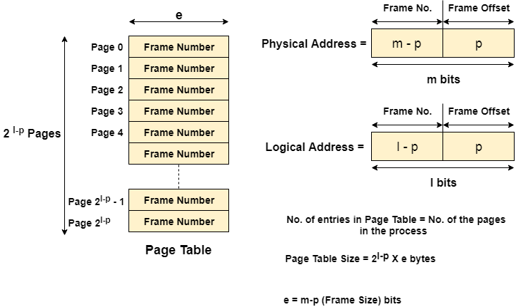

# Non Contiguous

- The secondary and main memory both are divided into fixed-size partitions. The partition is called a 'page' on secondary and 'frame' on main memory.
- Page and frame usually have the same size (4 kb).
- Since secondary memory is more than main, naturally the number of pages will be much higher than the number of frames.
- Lets say a process has 3 pages; they can loaded onto main memory in different non-contiguous frames.
- So how will the OS know the address of the next page??
- We can either store frames as a linked list. That is, every frame will have a pointer to the frame containing the next page of that process.
- Or we can store a mapping of page number to frame number. This is called paging.

# Paging

- **Page Table**: A mapping from page number to frame number. Every process has its own page table.
- Page table base address is stored in 'PTBR' (Page Table Base Register).
- In this case a logical address will be of the form `<Page, offset>` and physical address of the form `<Frame, offset>` where 'Page' and 'Frame' means page number and corresponding frame number. Offset means the instruction offset which will be the same (Instruction 10 in a page will still be instruction 10 in the corresponding frame).
- Paging suffers from internal fragmentation and performance (indirection due to page table).
- Note that a page table is not a hash table. It is just an array; `pt[i]` gives the frame number of page number i.
- Note that every process has its own page table!!

 
 
 

- **Frame Number**: The frame number corresponding to the frame.
- **Present/Absent bit**: Whether a particular page you are looking for is present or absent. In case if it is not present, that is called **Page Fault**. It is set to 0 if the corresponding page is not in memory.
- **Protection bit**: What kind of protection you want on that page. So, these bit for the protection of the page frame (read, write etc).
- **Referenced bit**: Whether this page has been referred in the last clock cycle or not. It is set to 1 by hardware when the page is accessed.
- **Caching enabled/disabled** – Some times we need the fresh data. Let us say the user is typing some information from the keyboard and your program should run according to the input given by the user. In that case, the information will come into the main memory. Therefore main memory contains the latest information which is typed by the user. Now if you try to put that page in the cache, that cache will show the old information. So whenever freshness is required, we don't want to go for caching or many levels of the memory.The information present in the closest level to the CPU and the information present in the closest level to the user might be different. So we want the information has to be consistency, which means whatever information user has given, CPU should be able to see it as first as possible. That is the reason we want to disable caching. So, this bit enables or disable caching of the page.
- **Modified/Dirty bit**: The dirty bit allows for a performance optimization. A page on disk that is paged in to physical memory, then read from, and subsequently paged out again does not need to be written back to disk, since the page has not changed. However, if the page was written to after it is paged in, its dirty bit will be set, indicating that the page must be written back to the backing store. This strategy requires that the backing store retain a copy of the page after it is paged in to memory. When a dirty bit is not used, the backing store need only be as large as the instantaneous total size of all paged-out pages at any moment. When a dirty bit is used, at all times some pages will exist in both physical memory and the backing store.

## Translational Look Aside Buffer

- It is nothing but a cache for page table.
- It mostly compensates for the page table indirection performance hit.
- Every process has its own TLB.

 

## Page Fault

- The page table lookup may fail for two reasons:

  - There is no translation available for the virtual address (logical address), meaning that virtual address is invalid. 
    This will typically occur because of a programming error, and the operating system must take some action to deal with the problem. 
    On modern operating systems, it will cause a segmentation fault signal being sent to the offending program.
  - The page is currently not resident in physical memory. This is known as a **Page fault**. 
    This will occur if the requested page has been moved out of physical memory to make room for another page. 
    In this case the page is paged out to a secondary store located on a medium such as a hard disk drive (this secondary store, or "backing store", is often called a "swap partition" if it is a disk partition, or a swap file, "swapfile" or "page file" if it is a file). 
    When this happens the page needs to be taken from disk and put back into physical memory. 
    A similar mechanism is used for memory-mapped files, which are mapped to virtual memory and loaded to physical memory on demand.

- Whenever a page fault occurs, we will need to load the necessary page onto a frame.

- When physical memory is not full this is a simple operation; the page is written back into physical memory, the page table and TLB are updated, and the instruction is restarted.
- However, when physical memory is full, one or more pages in physical memory will need to be paged out to make room for the requested page. The page table needs to be updated to mark that the pages that were previously in physical memory are no longer there, and to mark that the page that was on disk is now in physical memory. The TLB also needs to be updated, including removal of the paged-out page from it, and the instruction restarted. Which page to page out is the subject of page replacement algorithms.

## Numericals

- To understand more about paging, lets solve some numericals:

### Problem 1

- Logical address space = 24 bits.
- Physical address space = 16 bits.
- Page size = 1 KB.

Find the maximum possible memory taken by all the page table entries.

**SOLUTION**:

- Nothing is mentioned, so we'll assume byte-addressing.
- That is, one memory unit can store 1 byte of data.
- Total secondary memory = 2^24 * 1 bytes = 16 MB
- Total main memory = 2^16 * 1 bytes = 64 KB
- Page size = Frame size = 1 KB = 2*10 bytes
- Number of pages = Total secondary memory / Page size = 2^24 / 2^10 = 2^14 pages
- Number of frames = Total primary memory / Page size = 2^16 / 2^10 = 2^6 frames
- In total, all page tables have 2^14 entries (assuming all the pages are loaded onto memory at once, which will rarely happen though).
- Size of 1 entry = 6 bits = almost 1 byte.
- Total max possible memory taken by all the page table entries = 2^14 * (almost 1) bytes = 2^14 bytes = 16 KB.
- In general, `total memory = num_pages * log(num_frames) bytes`

### Problem 2

- Logical address space = 32 bits.
- Total main memory size = 64 MB.
- Page size = 4 KB.
- 2-byte addressable (ie. word size = 2 bytes)

Find the maximum possible memory taken by all the page table entries.

**SOLUTION**:

- Be careful about the word-size!! Its 2 bytes in this case.
- That is, one memory unit can store 2 byte of data.
- Total secondary memory = 2^32 * 2 bytes = 8 GB
- Total main memory = 64 MB
- Page size = Frame size = 4 KB = 2*12 bytes
- Number of pages = Total secondary memory / Page size = 8 GB / 4 KB = 2^21 pages
- Number of frames = Total primary memory / Page size = 64 MB / 4 KB = 2^14 frames
- In total, all page tables have 2^21 entries.
- Size of 1 entry = 14 bits = almost 2 bytes.
- Total max possible memory taken by all the page table entries = 2^21 * (almost 2) bytes = 2^22 bytes = 4 MB.

### Problem 3

- Logical address space = 40 bits.
- Total main memory = 256 MB.
- Page size = 4 KB.

Find the maximum possible memory taken by a process of 4 MB.

**SOLUTION**:

- Nothing is mentioned, so we'll assume byte-addressing.
- Total secondary memory = 2^40 bytes.
- Total main memory = 256 MB
- Page size = Frame size = 4 KB = 2*12 bytes
- Number of pages = Total secondary memory / Page size = 2^40 / 4K = 2^28 pages
- Number of frames = Total main memory / Page size = 256M / 4K = 64 * 2^10 = 2^16 frames
- Max size of all page table entries = 2^28 * (16 bits) = 2^29 bytes = 512 MB
- Number of pages of process = 4MB / 4KB = 2^10
- Size of process page table = Num pages * 16 bits = 2^11 bytes = 2 KB

# Segmentation

- Rather than dividing processes into pages naively, we can divide the process into variable-sized partitions which contains related instructions.
- Such as a function code can be stored in a separate segment.
- These variable-sized partitions are called segments.
- Just like a page table, we can have a segment table.

## Segmentation without paging

- Associated with each segment is information that indicates where the segment is located in memory; the segment base.
- When a program references a memory location the offset is added to the segment base to generate a physical memory address.
- An implementation of virtual memory on a system using segmentation without paging requires that entire segments be swapped back and forth between main memory and secondary storage.
- When a segment is swapped in, the operating system has to allocate enough contiguous free memory to hold the entire segment.
- Often external fragmentation results if there is not enough contiguous memory even though there may be enough in total.

## Segmentation with paging

- Instead of an actual memory location the segment information includes the address of a page table for the segment.
- When a program references a memory location the offset is translated to a memory address using the page table.
- A segment can be extended simply by allocating another memory page and adding it to the segment's page table.
- An implementation of virtual memory on a system using segmentation with paging usually only moves individual pages back and forth between main memory and secondary storage, similar to a paged non-segmented system.
- Pages of the segment can be located anywhere in main memory and need not be contiguous.
- This usually results in a reduced amount of input/output between primary and secondary storage and reduced memory fragmentation.

# Thrashing

- When a process does not have much locality of reference, it causes too many page faults.
- Lets say each page has 100 instructions and this is the instruction sequence - [P1, I1] - [P2, I2] -> [P4, I5] -> [P1, I4] -> ...
- In this case, it will cause 5 page faults for 5 instructions, leading to very slow performance.
- It can also occur when the RAM is full, and the OS tries to load even more pages because of being idle due to so many page faults.
- Can be solved my monitoring the rate of page faults and allocating more pages to the faulting processes.

# Inverted Page Table

- Instead of wasting a lot of space by storing page tables of multiple processes, we can just store 1 global inverted page table.
- A page table is an array where `pt[i]` gives the frame address of page i.
- An inverted page table is an array where `ipt[i]` gives the [processId, pageAddress] corresponding to the page of a process.
- We also need the processId because just mentioning 'page1' is not enough. All processes have page 1 :p.
- The number of total entries in all page tables = Number of pages.
- The number of entries in inverted page table = Number of frames.
- Since number of frames will be significantly less than pages, we'll be saving a lot of space.
- But there is a disadvantage in that searching for a page->frame mapping will take linear time.
- This can be easily solved by introducing hashing.

  

# Multilevel Page Table

- Lets say we have a 32-bit addressing scheme.
- Lets say the number of pages of a process = 2^20.
- So the page size would have 2^20 entries.
- Instead of storing all of this, we can divide the page table into 2 levels.
- First level page table will have 2^10 entries; one entry covering 2^10 second-level tables.
- For finding a particular page number, we'll first search in the first page table, which will give us the address of the second page-table.
- We'll then load only that particular second-level page table onto the memory.
- So the total space used = Size(Level-1) + Size(Level-2) = 2*10 + 2*10 = 2*11 instead of 2^20.
- As a smaller example, consider that we have a hash table of 32 entries.
- But we can only store a max of 15 entries in the memory at once.
- We can divide it into 8 tables of 4 entries each.
- We can also create another parent table of 8 entries where keys are [0, 4, 8, ... 28] and values are the addresses to the respective hash tables.
- At all times, this parent table will always be in main memory.
- Lets say we want to find data for 7. We can access entry 4 and load the table containing entries [4, 5, 6, 7].
- We can then page out this second level hash table.
- Thus the total number of entries in memory at one time = 8 + 4 = 12.

  
  

# Virtual memory

- Any technique due to which we are able to run process whose size is even larger than the main memory.
- We only need just 1 instruction at a time; no need to bring the entire process at once!
- **Paging vs Virtual Memory**:
  - Paging is just a technique to allow non-contiguous memory allocation.
  - However, in *Demand Paging*, we store only a portion of the process in the main memory at once.
  - So demand paging is a technique used to implement virtual memory.
  - But, lets say we decide to load all of the process in the memory everytime.
  - This will be still called paging, but we will not be able to execute a process larger than the main memory.