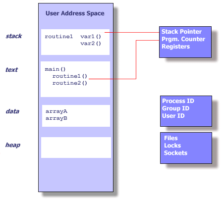

# Types of OS

## Multiprogramming

- More than 1 processes in main memory which are ready to execute.
- If one process requires I/O, CPU will context-switch to different process.
- At one time, only 1 process will run by the CPU.
- Will require process scheduling algos.
- Memory fragmentation, paging and other stuff.

## Multitasking

- Like multiprogramming, but with time-sharing.
- CPU will context-switch forcefully even if the process is not doing I/O.
- CPU switches context so quickly that we cannot notice.
- Having multiple processes is useful as it makes the system more responsive.

## Multiprocessing

- More than 1 processor or more than 1 core in processor. Basically more than 1 'processing units'.
- Can be assymetric (master-slave) or symmetric.
- NOTE: Even in case of single processing unit system, having multiple threads is useful in certain cases.
- For example, in a server, we dont want to spend the entire time on a single request at once!
- Or when 1 thread is waiting for IO; other can still continue to respond to user.
- But if all the threads are completely CPU intensive, then there is not much point multithreading on a single core machine.

Source - 'Knowledge Gate' channel on Youtube.

## Fork system call

A fork statement creates a new process which will resume the execution post the fork statement.  
Note that it results in a new child **process**, not a thread!

```python
pid = fork()
if pid == 0:
    print('Inside child!')
if pid > 0:
    print('Inside parent')
else:
    print('Error!!')
print('hello')
# Will print hello 2 times.
'''
Parent
    |-- Parent
    |-- Child
'''
```

```python
fork()
fork()
print('hello')
# Will print 4 times.
'''
Parent
    |-- Parent
        |-- Parent
        |-- Child2
    |-- Child1
        |-- Child1
        |-- Child2
'''
```

## Process vs Threads

- **System calls**: No system call in case of (user-level) threads.
- **Data sharing**: Threads share the same data and code, and have separate copies of stack and registers. Processes have a copy of everything. This also results in faster context switching.
- **Blocking**: Parent process blocking (for example in case of IO request) will not result in the child process blocking. However, in case of threads, even if one thread request for IO, all the sibling threads will get blocked too. This is because the OS considers all the threads as a single process. 



## User-level vs Kernel-level threads

- **System calls**: Kernel level are managed using system calls; user level by user level libraries/API.
- **Speed**: Kernel level threads are slower. Context switching is also slower.
- **Blocking**: In user-level, if one thread blocks, all others are blocked.

## Volatile keyword

- It means that the variable will not be cached at all.
- A read of that variable by thread 1 will always get the most written written value.
- It also means that only int and long objects are locked (synchronized).

## Thread join()

- Used to pause execution until another thread completes.

```java
public static void main(String args[]) 
{ 
    Thread t1 = new Thread();
    Thread t2 = new Thread(); 

    // starts second thread after first one is dead.
    t1.start(); 
    t1.join(); 
    t2.start(); 
} 
```

## Parallelism vs Concurrency

- Parallelism means actually having multiple processing units. Meaning 2 tasks being done on 2 physical cores.
- Concurrency just means an illusion of parallel progress. Its same as preemption basically. If we have 5 threads, but only 1 physical core, its concurrency.


## Thread `implements Runnable` vs `extends Thread`.
- Thread can be created using 2 ways.
- The `implements Runnable` way is better as we can still extend class with other classes.
- In Java, multiple inheritence is not allowed, so if we extend class using `extends Thread`, we cannot extend it anymore.
- Also, in case of runnable, we can choose not to create a thread for a task:
  `if (numberCores > 4) myExecutor.excute(myRunnable); else myRunnable.run()`
