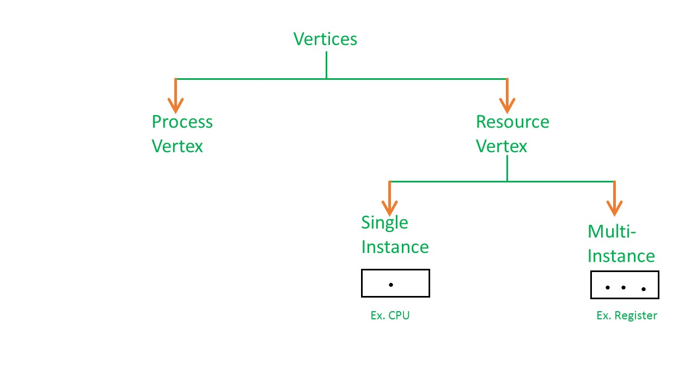
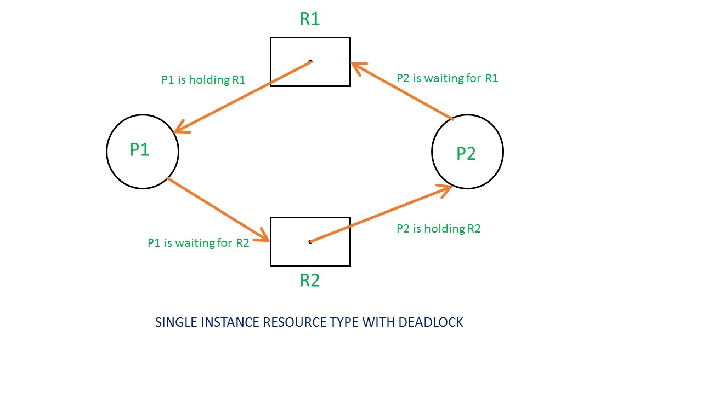
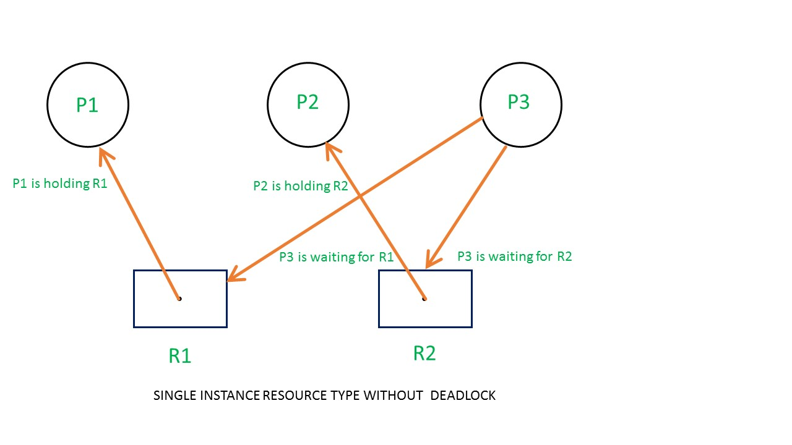
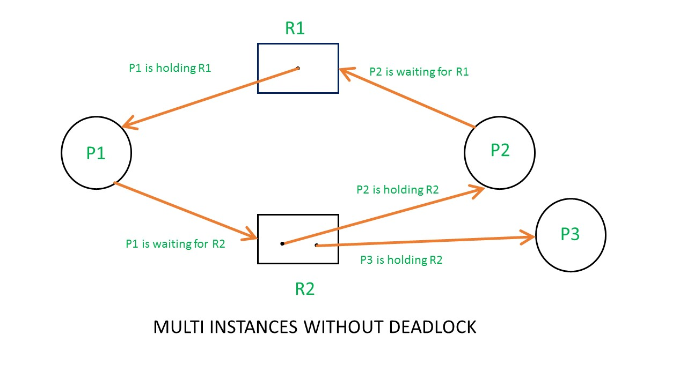
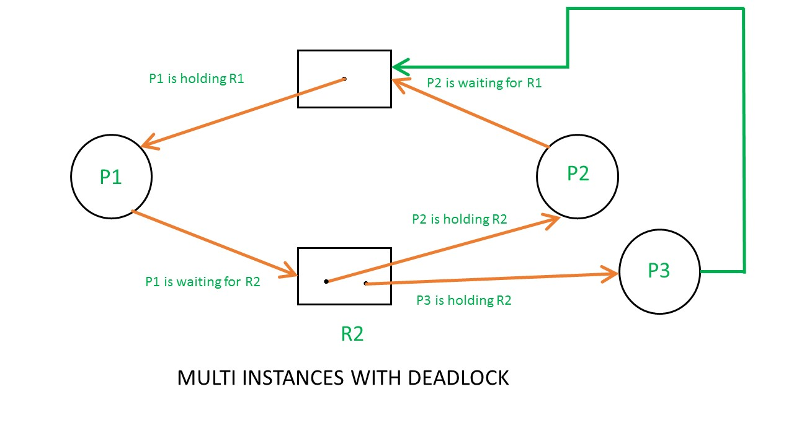
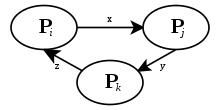
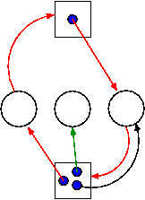

# Basics

- In a multiprogramming system, multiple processes might want to access the same resource.
- At that instance, a process might enter a waiting state.
- If 2 processes stays in the waiting state indefinitely because of each other, it is called deadlock.
- It can be determined as the presence of a cycle in the Resource Allocation Graph.
- In case of a single-instance resource type graph, cycle is a necessary and sufficient condition for deadlock.
- In case of a multi-instance resource type graph, cycle is necessary but not sufficient.

  
  
  
  
  
  

- In case of a single-instance resource type graph, the RAG can be simplified by removing all resources and replacing an edge of the type `p1 -> r1 -> p2` with `p1 -> p2`. This is called a **Wait-For graph.**

  

# Resource contention

- In computer science, resource contention is a conflict over access to a shared resource such as random access memory, disk storage, cache memory, internal buses or external network devices.
- A resource experiencing ongoing contention can be described as oversubscribed.
- Resolving resource contention problems is one of the basic functions of operating systems.
- Various low-level mechanisms can be used to aid this, including locks, semaphores, mutexes and queues.
- The other techniques that can be applied by the operating systems include intelligent scheduling, application mapping decision, and page coloring.
- Access to resources is also sometimes regulated by queuing; in the case of computing time on a CPU the controlling algorithm of the task queue is called a scheduler.
- Failure to properly resolve resource contention problems may result in a number of problems, including deadlock, livelock, and thrashing.
- Resource contention results when multiple processes attempt to use the same shared resource.
- Access to memory areas is often controlled by semaphores, which allows a pathological situation called a deadlock, when different threads or processes try to allocate resources already allocated by each other.
- A deadlock usually leads to a program becoming partially or completely unresponsive. 

# Necessary conditions for deadlock

## 1. Mutual Exclusion
At least one resource is held in a non-shareable mode.

## 2. Hold and Wait
At least one process is holding a resource and simultaneously waiting for another resource held by another process. 

## 3. No preemption
Resources cannot be preempted; that is the OS cannot take away resources from a process.

## 4. Circular Wait
There must exist a set {p0, p1,.....pn} of waiting processes such that p0 is waiting for a resource which is held by p1, p1 is waiting for a resource which is held by p2,..., pn-1 is waiting for a resource which is held by pn and pn is waiting for a resource which is held by p0.

**Note**: These 4 conditions are necessary but not sufficient conditions!!

# Handling deadlocks

## 1. Ignore
Just ignore. :p
If deadlock happens once in a hundred years, no point in bothering.

## 2. Detection and Recovery

### 2.1 Detection

- In case of single-instance, just check for cycles in the directed graph.
- In case of multi-instance, we can have the following algorithm:
  - Look for a process that might be able to terminate (i.e., all its request arcs can be satisfied).
  - If one is found pretend that it does terminate (erase all its arcs), and repeat step 1.
  - If any processes remain, they are deadlocked.

  

- We can also use Banker's algorithm in case of multi-instance.

### 2.2 Recovery

- **Preemption** - Perhaps you can temporarily preempt a resource from a process. Not likely.
- **Rollback** - Database (and other) systems take periodic checkpoints. If the system does take checkpoints, one can roll back to a checkpoint whenever a deadlock is detected. Somehow must guarantee forward progress.
- **Kill processes** - Can always be done but might be painful. For example some processes have had effects that can't be simply undone. Print, launch a missile, etc. 

## 3. Avoidance
- Let's see if we can tiptoe through the tulips and avoid deadlock states even though our system does permit all four of the necessary conditions for deadlock.  
- An optimistic resource manager is one that grants every request as soon as it can. To avoid deadlocks with all four conditions present, the manager must be smart not optimistic. 
- We can use Banker's algorithm

## 4. Prevention by violating 4 necessary conditions.

### 4.1 Attacking Mutual Exclusion
- Idea is to use spooling instead of mutual exclusion.
- Not possible for many kinds of resources

### 4.2 Attacking Hold and Wait
- Require each processes to request all resources at the beginning of the run. This is often called 'One Shot'.
- Each process must relinquish existing resources before requesting new ones.
- Process can hold a resource only for a fixed time.

### 4.3 Attacking No Preempt
- Normally not possible.
- That is, some resources are inherently preemptable (e.g., memory).
- For those deadlock is not an issue. Other resources are non-preemptable, such as a robot arm.
- It is normally not possible to find a way to preempt one of these latter resources.

### 4.4 Attacking Circular Wait
- Establish a fixed ordering of the resources and require that they be requested in this order.
- So if a process holds resources #34 and #54, it can request only resources #55 and higher.
- It is easy to see that a cycle is no longer possible.
- Used in Dining Philosopher problem.

# Livelock

- When a certain action to resolve deadlock leads to yet another deadlock; ad infinitum..
- For example, in case of dining philosopher problem, we can solve deadlock as follows:
- The philosophers put down a fork after waiting ten minutes for the other fork to become available and wait a further ten minutes before making their next attempt.
- This scheme eliminates the possibility of deadlock (the system can always advance to a different state) but still suffers from the problem of livelock.
- If all five philosophers appear in the dining room at exactly the same time and each picks up the left fork at the same time the philosophers will wait ten minutes until they all put their forks down and then wait a further ten minutes before they all pick them up again. 