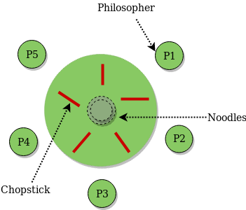

- K philosophers seated around a circular table with one chopstick between each pair of philosophers.
- There is one chopstick between each philosopher.
- A philosopher may eat if he can pickup the two chopsticks adjacent to him.
- One chopstick may be picked up by any one of its adjacent followers but not both.

# Solution 1

- Use 5 semaphores; one for each fork.

```python
def philosopher(idx):
    while True:
        wait(chopstick[idx])
        wait(chopstick[(idx+1) % 5])
        # Eat -> Critical Section
        signal(chopstick[idx])
        signal(chopstick[(idx+1) % 5])
```

- Unfortunately, this suffers from race conditions; consider the following case:
- Philosopher 1 picks up fork 1 but them preempts.
- Philosopher 2 picks up fork 2 but them preempts.
- So on till fork 5.

# Solution 2

-  We can use a global mutex while picking both forks.

```python
def philosopher(idx):
    while True:
        wait(anyonePickingFork)
        wait(chopstick[idx])
        wait(chopstick[(idx+1) % 5])
        signal(anyonePickingFork)
        # Eat -> Critical Section
        signal(chopstick[idx])
        signal(chopstick[(idx+1) % 5])
```

- But lets say there are 1000 philosophers. When philosopher 1 is picking forks, why should the rest of far-off philosophers wait??
- This is not optimal in terms of degree of parallelism.

# Solution 3

- Just for any one philosopher, change the order of picking up forks. That is, make him pick i+1 then i.
- This is same as the resource ordering solution for deadlocks.
- We are just ordering forks (fork1, fork2 ... ). And each philosopher will pick up the lower ordered fork.